# The Uni Black Book

> **The definitive reference for Uni DB** — an embedded, object-store-backed graph database with OpenCypher queries, columnar analytics, vector search, CRDTs, and logic programming.

---

## Table of Contents

- [Part I: Executive Summary & Vision](#part-i-executive-summary--vision)
- [Part II: Architecture Deep Dive](#part-ii-architecture-deep-dive)
- [Part III: Identity Model & Data Types](#part-iii-identity-model--data-types)
- [Part IV: Schema Design Guide](#part-iv-schema-design-guide)
- [Part V: Storage Engine](#part-v-storage-engine)
- [Part VI: Indexing Deep Dive](#part-vi-indexing-deep-dive)
- [Part VII: Cypher Query Language](#part-vii-cypher-query-language)
- [Part VIII: Cypher Extensions & Procedures](#part-viii-cypher-extensions--procedures)
- [Part IX: Graph Algorithms](#part-ix-graph-algorithms)
- [Part X: Locy Framework](#part-x-locy-framework)
- [Part XI: Transactions, Sessions & Concurrency](#part-xi-transactions-sessions--concurrency)
- [Part XII: Snapshots & Time Travel](#part-xii-snapshots--time-travel)
- [Part XIII: Auto-Compaction](#part-xiii-auto-compaction)
- [Part XIV: Python Bindings](#part-xiv-python-bindings)
- [Part XV: Configuration Reference](#part-xv-configuration-reference)
- [Part XVI: Forks](#part-xvi-forks)
- [Part XVII: Plugin Framework](#part-xvii-plugin-framework)
- [Appendices](#appendices)

---

# Part I: Executive Summary & Vision

## What Is Uni?

Uni is an **embedded, serverless graph database** that runs inside your process — no separate server, no network hops, no ops overhead. It persists to **object stores** (S3, GCS, Azure, or local filesystem), supports **OpenCypher** queries, **columnar analytics** via Apache Arrow/DataFusion, **vector similarity search**, **CRDT-based conflict-free data types**, and **Locy** — a Datalog-inspired logic programming language that extends Cypher with recursive reasoning.

Think of Uni as: **SQLite for graphs, but with the analytical power of DuckDB, the vector search of Pinecone, and the reasoning capabilities of Datalog.**

## Why Uni Exists

Traditional graph databases force you to choose:

| Trade-off | Traditional Choice | Uni's Answer |
|---|---|---|
| Embedded vs. Server | Server (Neo4j, TigerGraph) | Embedded (single process) |
| OLTP vs. OLAP | Pick one | Both (Arrow columnar + graph traversal) |
| Graph vs. Vector | Separate systems | Unified (Lance vector indexes) |
| Schema vs. Schemaless | Pick one | Both (schema-defined + overflow JSONB) |
| Simple queries vs. Reasoning | Simple pattern matching | Cypher + Locy recursive rules |
| Local vs. Cloud | Pick one | Both (local, S3/GCS/Azure, hybrid) |

## Key Differentiators

1. **Embedded/Serverless** — `Uni::open("./my-graph").build()` and you're running. No Docker, no ports, no configuration servers.
2. **Object-Store-First** — Data lives in S3/GCS/Azure. Local filesystem is just another backend. Designed for 100ms latency round trips.
3. **OpenCypher Compatible** — Standard graph query language with MATCH, CREATE, MERGE, aggregations, and path patterns.
4. **Columnar Analytics** — Apache Arrow record batches, DataFusion query engine, predicate pushdown. Run analytical queries at columnar speed.
5. **Vector Search** — HNSW, IVF-PQ, and flat indexes with L2, Cosine, and Dot distance metrics. Auto-embedding via Candle models.
6. **CRDTs** — 8 conflict-free replicated data types (GCounter, GSet, ORSet, LWWRegister, LWWMap, Rga, VectorClock, VCRegister) for merge-friendly distributed data.
7. **Locy** — Logic programming as a Cypher superset. Recursive rules, path accumulation, stratified fixpoint evaluation, hypothetical reasoning, abductive inference.
8. **LSM-Style Storage** — Write-optimized 3-tier architecture (L0 memory → L1 sorted runs → L2 compacted base) with automatic background compaction.
9. **Snapshot Isolation** — Single-writer, multi-reader with MVCC versioning. Time travel queries via `VERSION AS OF` and `TIMESTAMP AS OF`.
10. **Python-Native** — PyO3 bindings (`uni-db`) plus a Pydantic OGM (`uni-pydantic`) with type-safe models, lifecycle hooks, and async support.
11. **Polyglot Extensibility** — Five plugin loaders (Rust, WASM Component Model, Extism, Rhai, PyO3) share one capability-gated `PluginRegistry`. A scalar fn authored once runs byte-identically across Component Model + Extism; Rhai and PyO3 agree to ≤ 4 ULP. Every built-in (aggregates, CRDTs, indexes, storage, procedures) is itself a plugin. See [Part XVII](#part-xvii-plugin-framework).

## Target Use Cases

Uni excels in scenarios that combine graph structure with analytics, search, or reasoning:

- **Fraud Detection** — Model transaction networks, propagate risk scores via Locy rules, detect anomalous patterns with graph algorithms
- **RAG / Knowledge Graphs** — Store documents with vector embeddings, traverse knowledge relationships, combine vector search with graph context
- **Recommendation Engines** — Collaborative filtering via graph similarity algorithms, content-based via vector search, hybrid via Locy rules
- **Supply Chain Analysis** — Model supplier networks, trace provenance with recursive path queries, detect vulnerabilities via centrality algorithms
- **RBAC & Access Control** — Model permission hierarchies, resolve effective permissions via Locy priority rules
- **Infrastructure Monitoring** — Blast radius analysis via graph traversal, dependency mapping, impact assessment with Locy reasoning

```mermaid
graph TB
    subgraph "Uni Capability Map"
        direction TB
        A[Graph Database] --> A1[Property Graph Model]
        A --> A2[OpenCypher Queries]
        A --> A3[40+ Graph Algorithms]

        B[Analytical Engine] --> B1[Apache Arrow Columnar]
        B --> B2[DataFusion SQL Engine]
        B --> B3[Aggregations & Window Functions]

        C[Vector Search] --> C1[HNSW / IVF-PQ Indexes]
        C --> C2[Auto-Embedding via Candle]
        C --> C3[Hybrid Search with RRF]

        D[Logic Programming] --> D1[Recursive Rules]
        D --> D2[Stratified Fixpoint]
        D --> D3[Hypothetical & Abductive Reasoning]

        E[Storage Engine] --> E1[Object Store S3/GCS/Azure]
        E --> E2[LSM-Style Compaction]
        E --> E3[Snapshot Isolation & Time Travel]
    end
```

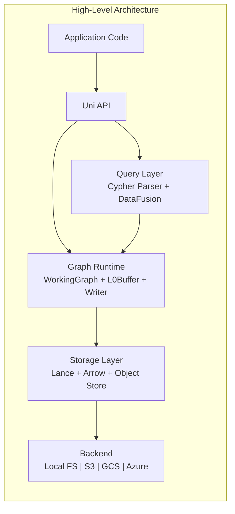

---

# Part II: Architecture Deep Dive

## Layered Design

Uni follows a strict three-layer architecture. Each layer has clear responsibilities and well-defined interfaces:

> **Cross-cutting extensibility.** A fourth, cross-cutting concern — the **Extensibility Layer** (`uni-plugin` plus its loader and built-in-source crates) — sits beside these layers. It backs UDFs and aggregates in the Query Layer, CRDTs and storage backends in the Graph Runtime / Storage layers, and procedures, hooks, and triggers across all three. Every extension, built-in or user-supplied, resolves through one `PluginRegistry`. See [Part XVII: Plugin Framework](#part-xvii-plugin-framework).

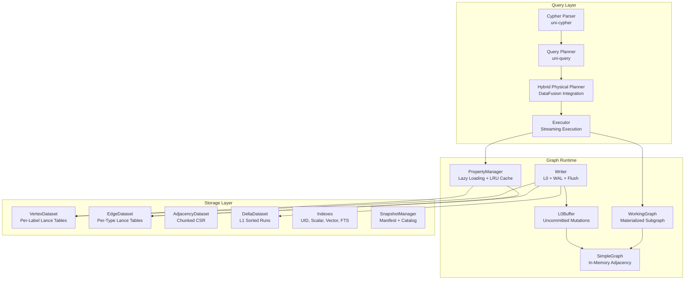

### Query Layer (`uni-cypher` + `uni-query`)

The query layer translates OpenCypher text into a streaming execution plan:

1. **Parser** (`uni-cypher`): pest-based Cypher parser that produces an AST supporting MATCH, CREATE, MERGE, WITH, RETURN, WHERE, UNWIND, DELETE, SET, REMOVE, CALL, WITH RECURSIVE, UNION, and DDL commands.
2. **Planner** (`uni-query`): Converts AST into a logical plan, extracting vector similarity calls, inverted index lookups, and pushdown predicates.
3. **Physical Planner**: Maps logical plan to DataFusion physical operators — `GraphScanExec`, `GraphTraverseExec`, `GraphVectorKnnExec`, `MutationExec`, etc.
4. **Executor**: Streams Arrow `RecordBatch` results through the DataFusion pipeline.

### Graph Runtime (`uni-common` + `uni-algo` + `uni`)

The runtime manages in-memory graph state and write coordination:

- **WorkingGraph**: A materialized subgraph loaded from storage into a `SimpleGraph` for algorithm execution.
- **L0Buffer**: In-memory buffer backed by `SimpleGraph` for uncommitted mutations. Tracks topology, properties, tombstones, versions, and timestamps.
- **Writer**: Coordinates writes through WAL → L0 → flush → L1 → compact → L2.
- **PropertyManager**: Lazy-loads vertex/edge properties from Lance with an LRU cache, with L0 overlay taking priority.

### Storage Layer (`uni-store`)

Persistent storage using Lance (Arrow-native columnar format):

- **VertexDataset**: Per-label Lance tables (`vertices_{label}`) with schema-defined columns plus JSONB overflow.
- **EdgeDataset**: Per-type Lance tables (`edges_{type}`) with endpoint VIDs and properties.
- **AdjacencyDataset**: Chunked CSR format for O(1) neighbor lookups.
- **DeltaDataset**: LSM-style L1 sorted runs with Insert/Delete operations.
- **Indexes**: UID (SHA3-256), scalar (BTree/Hash/Bitmap), vector (HNSW/IVF-PQ), full-text (BM25), inverted, JSON FTS.
- **SnapshotManager**: JSON manifests capturing consistent views of all datasets.

## Workspace Structure

```
crates/
├── uni/            # Main library crate — public API, Session, Transaction, UniBuilder
├── uni-common/     # Identity (Vid/Eid/UniId), Schema, DataType, Config, Snapshots, SimpleGraph
├── uni-store/      # Lance datasets, CSR adjacency, L0Buffer, Writer, WAL, Indexes
├── uni-algo/       # 42 graph algorithms, GraphProjection
├── uni-query/      # Query executor, DataFusion integration, pushdown, UDFs
├── uni-cypher/     # Cypher parser (pest-based), Locy parser
├── uni-crdt/       # 8 CRDT types with merge semantics
├── uni-locy/       # Locy compiler (stratify, wardedness, typecheck, orchestrator)
├── uni-cli/        # CLI (import, query, repl, snapshot)
├── uni-tck/        # OpenCypher TCK compliance tests
├── uni-locy-tck/   # Locy TCK tests
├── uni-plugin/             # Plugin framework foundation — traits, manifest, capability, registry, lifecycle
├── uni-plugin-builtin/     # Built-ins as plugins (Locy aggregates, CRDTs, collations, vector index, storage)
├── uni-plugin-apoc-core/   # APOC-analogue procedures (38 across 6 namespaces)
├── uni-plugin-custom/      # Meta-plugin: uni.plugin.declare* from Cypher
├── uni-plugin-host/        # Scheduler, declared-plugin persistence, OTel host layer
├── uni-plugin-wasm/        # WASM Component Model loader (wasmtime) + MultiVersionLinker
├── uni-plugin-wasm-rt/     # WASM instance pool / runtime
├── uni-plugin-extism/      # WASM Extism loader
├── uni-plugin-rhai/        # Rhai script loader
├── uni-plugin-pyo3/        # PyO3 live-callable loader
└── uni-plugin-conformance/ # 6-probe loader conformance suite
bindings/
├── uni-db/         # PyO3 Python bindings (sync + async)
└── uni-pydantic/   # Pydantic OGM layer
```

## Crate Dependency Graph

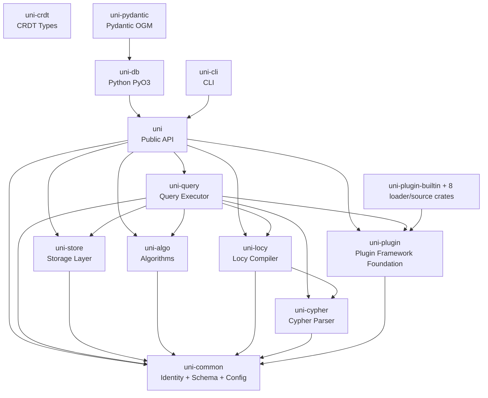

## Key Dependencies

| Crate | Purpose |
|---|---|
| `lance` | Columnar storage with versioning, vector indexes, full-text search. Pinned at `7.0.0` in the root `Cargo.toml`. **`lancedb` is not a dependency** — it was dropped; only the `lance` core crate is used |
| `arrow` / `arrow-array` | In-memory columnar data format (RecordBatch, Array types) |
| `datafusion` | Query engine — physical planning, expression evaluation, aggregation |
| `pest` / `pest_derive` | PEG parser generator powering `uni-cypher`'s Cypher and Locy grammars |
| `object_store` | S3/GCS/Azure/local filesystem abstraction |
| `pyo3` | Python bindings (FFI) |
| `candle-core` / `candle-transformers` | Native Rust ML inference for auto-embedding |
| `uni-xervo` | Embedding + generation runtime used by auto-embedding and host-side multimodal model calls |
| `sha3` | SHA3-256 hashing for UniId content addressing |
| `serde` / `rmp-serde` | MessagePack serialization for CRDTs and CypherValues |

## Write Path (End-to-End)

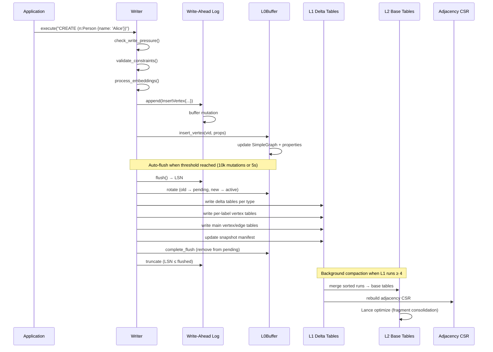

## Read Path (End-to-End)

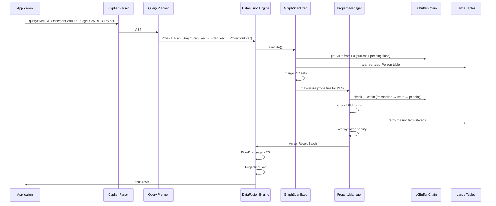

> **Plugin consultation.** When the planner meets an unknown function, aggregate, or procedure name it resolves it against the `PluginRegistry` (`scalar_fn(&QName)` / `aggregate(&QName)` / `procedure(&QName)`) rather than a hardcoded table. UDFs, Locy aggregates, and procedures from every loader enter the read path through this single lookup — see [Part XVII](#part-xvii-plugin-framework).

## Design Principles

These principles, drawn from the original design documents, guide every architectural decision in Uni:

1. **Object-Store-First**: Minimize round trips. Assume 100ms latency. Batch reads. Self-contained chunks where one read gets everything needed.
2. **Simplicity Over Generality**: Explicit constraints, fewer options. A custom `SimpleGraph` instead of a generic graph library.
3. **LSM-Style Writes**: Optimized for write-heavy workloads. Memory buffer → sorted runs → compacted base. Same proven pattern as LevelDB/RocksDB, adapted for graph data.
4. **Columnar Everything**: Arrow arrays for properties, DataFusion for query execution. Get analytical performance without a separate OLAP system.
5. **Content Addressing**: UniId (SHA3-256) provides stable references across systems and decouples identity from storage location. UID is a lookup index, not a uniqueness constraint — multiple vertices may share a UID.
6. **Optimistic Concurrency**: Transactions prepare in parallel against pinned snapshots and validate at commit (SSI/OCC, default-on since 2.0) — conflicts abort with a retriable error instead of silently losing writes. Readers never block writers and vice versa. See [Part XI](#part-xi-transactions-sessions--concurrency).

---

# Part III: Identity Model & Data Types

## Identity System Overview

Uni uses a **dual-identity** system. Each vertex has both an internal dense identifier (VID) for efficient storage and an external content-addressed identifier (UniId) for stable cross-system references.

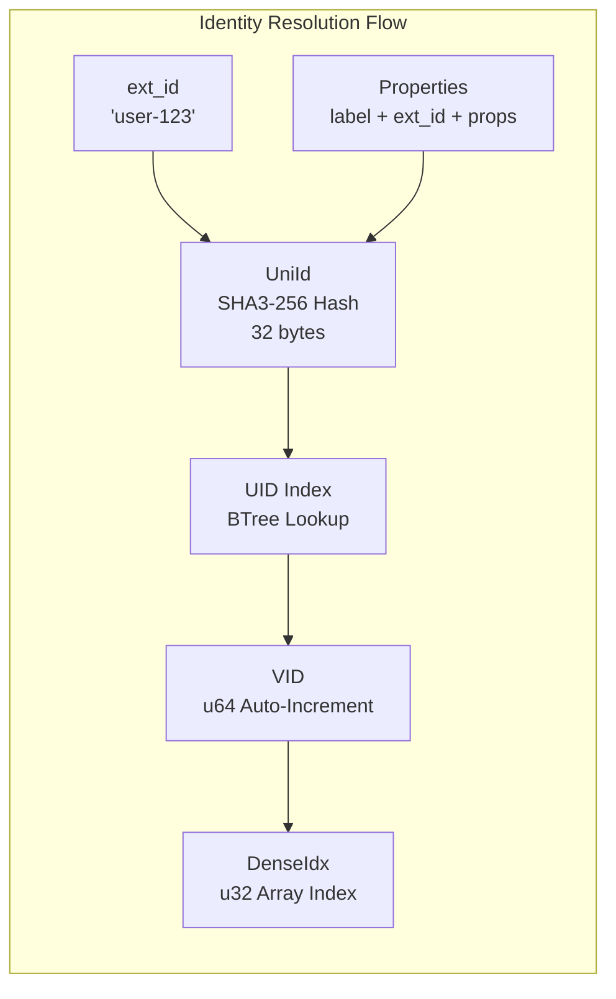

## VID (Vertex ID)

The internal vertex identifier — a 64-bit auto-incrementing integer.

| Field | Details |
|---|---|
| **Type** | `u64` |
| **Encoding** | Pure auto-increment (no embedded label/offset bits) |
| **Sentinel** | `Vid::INVALID = u64::MAX` |
| **Purpose** | O(1) array indexing during query execution |
| **Label Resolution** | Via `VidLabelsIndex` (separate in-memory bidirectional map) |

VIDs are dense, sequential, and never reused. They serve as the primary key in all Lance tables (`_vid` column) and as array offsets in CSR adjacency structures.

## EID (Edge ID)

The internal edge identifier — a 64-bit auto-incrementing integer.

| Field | Details |
|---|---|
| **Type** | `u64` |
| **Encoding** | Pure auto-increment |
| **Sentinel** | `Eid::INVALID = u64::MAX` |
| **Purpose** | Uniquely identifies edges, supports parallel edges |

Multiple edges of the same type between the same vertices are allowed — each gets a unique EID with potentially different properties.

## Edge Type ID Encoding

Edge type IDs use a 32-bit integer with a special bit flag to distinguish schema-defined from schemaless types:

```
Bit 31 = 0: Schema-defined edge type (from schema.json)
Bit 31 = 1: Schemaless edge type (dynamically assigned at runtime)

┌─────────────────────────────────────────┐
│ Bit 31 │     Bits 30..0 (local ID)      │
│  flag  │     up to 2^31 - 1 types       │
└─────────────────────────────────────────┘
```

- `is_schemaless_edge_type(id)` — checks bit 31
- `make_schemaless_id(local_id)` — sets bit 31 flag (`0x8000_0000`)
- `extract_local_id(id)` — masks off bit 31

## DenseIdx

A 32-bit index used for O(1) array access during graph algorithm execution.

| Field | Details |
|---|---|
| **Type** | `u32` |
| **Sentinel** | `DenseIdx::INVALID = u32::MAX` |
| **Purpose** | Remaps sparse VIDs to dense array positions |
| **Remapper** | `VidRemapper` maintains sparse-to-dense mapping |

When algorithms build a `GraphProjection`, VIDs (which may be sparse across the u64 range) are remapped to contiguous `DenseIdx` values for cache-friendly array access.

## UniId (Content-Addressed Identifier)

A SHA3-256 hash that provides **stable, content-addressed identity** for vertices across systems.

| Field | Details |
|---|---|
| **Type** | `[u8; 32]` (256-bit SHA3 hash) |
| **Encoding** | 53-character Base32Lower multibase string |
| **Example** | `z3asjk42...` (z prefix = Base32Lower) |
| **Computation** | `SHA3-256(label ‖ ext_id ‖ sorted_properties)` |

UniId enables:
- **Content lookup**: Find vertices by content hash (multiple vertices may share a UID)
- **Cross-system references**: IDs are stable regardless of which Uni instance created them
- **Content verification**: Detect data corruption or tampering

> **Note:** UID is a lookup index, not a uniqueness constraint. `CREATE (:Label), (:Label)` freely creates two vertices with different VIDs even if they produce the same UID.

The UID Index provides O(log N) lookup from UniId → VID via a BTree index on the hex-encoded UID column.

## ext_id (External ID)

A user-provided string primary key, unique per label. This is the most common way users reference vertices.

```cypher
// Create with ext_id
CREATE (n:Person {ext_id: 'user-123', name: 'Alice'})

// Lookup by ext_id
MATCH (n:Person {ext_id: 'user-123'}) RETURN n
```

## Complete Type System

Uni supports a rich type system mapped to Apache Arrow types for columnar storage:

### Primitive Types

| Uni Type | Arrow Type | Description |
|---|---|---|
| `String` | `Utf8` | UTF-8 text |
| `Int32` | `Int32` | 32-bit signed integer |
| `Int64` (alias: `Int`) | `Int64` | 64-bit signed integer |
| `Float32` | `Float32` | 32-bit IEEE 754 |
| `Float64` (alias: `Float`) | `Float64` | 64-bit IEEE 754 |
| `Bool` | `Boolean` | true/false |

### Temporal Types

| Uni Type | Arrow Type | Description |
|---|---|---|
| `Timestamp` | `Timestamp(Nanosecond, UTC)` | UTC timestamp with nanosecond precision |
| `Date` | `Date32` | Calendar date (days since epoch) |
| `Time` | Struct(`nanos_since_midnight: i64`, `offset_seconds: i32`) | Time of day with timezone offset |
| `DateTime` | Struct(`nanos_since_epoch: i64`, `offset_seconds: i32`, `timezone_name: Option<Utf8>`) | Full date-time with timezone |
| `Duration` | `LargeBinary` (CypherValue codec) | Time duration |
| `Btic` | `FixedSizeBinary(24)` | Binary Temporal Interval Codec — half-open interval `[lo, hi)` with per-bound granularity and certainty |

### Complex Types

| Uni Type | Arrow Type | Description |
|---|---|---|
| `CypherValue` | `LargeBinary` | MessagePack-tagged binary (any Cypher value) |
| `Bytes` | `LargeBinary` | Raw byte buffer (no codec wrapping) — images, audio, blobs |
| `Vector { dimensions }` | `FixedSizeList(Float32, N)` | Fixed-dimension embedding vector |
| `List(T)` | `List(T)` | Variable-length list of type T |
| `Map(K, V)` | `List(Struct(key: K, value: V))` | Key-value map |

### Spatial Types

| Uni Type | Arrow Type | Description |
|---|---|---|
| `Point(Geographic)` | Struct(`latitude`, `longitude`, `crs`: Float64) | WGS84 geographic coordinates |
| `Point(Cartesian2D)` | Struct(`x`, `y`, `crs`: Float64) | 2D Cartesian point |
| `Point(Cartesian3D)` | Struct(`x`, `y`, `z`, `crs`: Float64) | 3D Cartesian point |

### CRDT Types

| Uni Type | Arrow Type | Description |
|---|---|---|
| `Crdt(GCounter)` | `Binary` (MessagePack) | Grow-only counter |
| `Crdt(GSet)` | `Binary` (MessagePack) | Grow-only set |
| `Crdt(ORSet)` | `Binary` (MessagePack) | Observed-remove set |
| `Crdt(LWWRegister)` | `Binary` (MessagePack) | Last-write-wins register |
| `Crdt(LWWMap)` | `Binary` (MessagePack) | Last-write-wins map |
| `Crdt(Rga)` | `Binary` (MessagePack) | Replicated growable array |
| `Crdt(VectorClock)` | `Binary` (MessagePack) | Vector clock for causal ordering |
| `Crdt(VCRegister)` | `Binary` (MessagePack) | Vector-clock register |

## CRDT Types Deep Dive

CRDTs (Conflict-free Replicated Data Types) enable automatic, deterministic merging of concurrent updates without coordination. Every CRDT merge is **commutative**, **associative**, and **idempotent** — the order and number of merges doesn't matter.

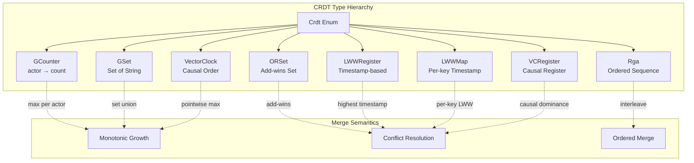

### GCounter (Grow-Only Counter)

```
Structure: HashMap<ActorId, u64>
Merge: max(self[actor], other[actor]) for each actor
Value: sum of all actor counts
```

Use case: Distributed counters (page views, event counts) where only increment is needed.

### GSet (Grow-Only Set)

```
Structure: HashSet<String>
Merge: set union
```

Use case: Tags, labels, or categories that are only added, never removed.

### ORSet (Observed-Remove Set)

```
Structure: Elements tagged with causal dots + a version vector (ORSWOT)
Merge: add-wins conflict resolution
```

Use case: Mutable sets where elements can be added and removed. If concurrent add and remove, add wins.

Since 2.2.0 the ORSet is **tombstone-free** — it uses an ORSWOT (Observed-Remove Set Without Tombstones) encoding where elements carry causal dots and removals are tracked by the version vector rather than explicit tombstones, keeping the structure compact under churn. The legacy v1 (tombstoned) wire format is still read for backward compatibility; new writes use the tombstone-free format.

### LWWRegister (Last-Write-Wins Register)

```
Structure: (value: T, timestamp: u64)
Merge: highest timestamp wins
```

Use case: Simple mutable values where "latest write wins" is acceptable.

### LWWMap (Last-Write-Wins Map)

```
Structure: HashMap<K, (V, timestamp)>
Merge: per-key highest timestamp wins
```

Use case: Property maps where individual keys can be updated independently.

### Rga (Replicated Growable Array)

```
Structure: Ordered sequence with unique position IDs
Merge: interleave by position ID ordering
Operations: insert_at(pos, value), delete_at(pos)
```

Use case: Collaborative text editing, ordered lists.

### VectorClock

```
Structure: HashMap<ActorId, u64>
Merge: pointwise maximum
Comparison: partial order (concurrent, before, after)
```

Use case: Tracking causal ordering between events from different actors.

### VCRegister (Vector-Clock Register)

```
Structure: (value: T, vector_clock: VectorClock)
Merge: causally dominant value wins; concurrent → LWW fallback
```

Use case: Values that need causal consistency rather than simple timestamp ordering.

### Serialization

All CRDT values are serialized using MessagePack with serde-tagged abbreviations:

| Tag | CRDT Type |
|---|---|
| `gc` | GCounter |
| `gs` | GSet\<String\> |
| `os` | ORSet\<String\> |
| `lr` | LWWRegister\<serde_json::Value\> |
| `lm` | LWWMap\<String, serde_json::Value\> |
| `rg` | Rga\<String\> |
| `vc` | VectorClock |
| `vr` | VCRegister\<serde_json::Value\> |

On upsert, if a property has a CRDT type, Uni automatically merges the new value with the existing one using the CRDT's merge function. Non-CRDT properties use last-write-wins (LWW) semantics.

---

# Part IV: Schema Design Guide

## Schema Concepts

Every Uni database has a **schema** that defines the structure of its graph. The schema is stored as `schema.json` at the database root and contains:

- **Labels**: Vertex categories (e.g., `Person`, `Product`, `Document`)
- **Edge Types**: Relationship categories (e.g., `KNOWS`, `PURCHASED`, `SIMILAR_TO`)
- **Properties**: Typed fields on labels and edge types
- **Indexes**: Secondary indexes for query acceleration
- **Constraints**: Uniqueness, existence, and check constraints
- **Schemaless Registry**: Dynamically-assigned edge type IDs for types not in the schema

### Schema Metadata

```rust
Schema {
    schema_version: u32,                  // Incremented on changes
    labels: HashMap<String, LabelMeta>,
    edge_types: HashMap<String, EdgeTypeMeta>,
    properties: HashMap<String, HashMap<String, PropertyMeta>>,  // label → prop → meta
    indexes: Vec<IndexDefinition>,
    constraints: Vec<Constraint>,
    schemaless_registry: SchemalessEdgeTypeRegistry,
}
```

### LabelMeta

```rust
LabelMeta {
    id: u16,                        // Unique label identifier (never reused)
    created_at: DateTime<Utc>,
    state: SchemaElementState,      // Active | Hidden | Tombstone
}
```

### EdgeTypeMeta

```rust
EdgeTypeMeta {
    id: u32,                        // Unique edge type identifier
    src_labels: Vec<String>,        // Allowed source labels (empty = any)
    dst_labels: Vec<String>,        // Allowed destination labels (empty = any)
    state: SchemaElementState,
}
```

### PropertyMeta

```rust
PropertyMeta {
    r#type: DataType,               // String, Int64, Vector{384}, Crdt(GCounter), etc.
    nullable: bool,
    added_in: u32,                  // Schema version when this property was added
    state: SchemaElementState,
    generation_expression: Option<String>,  // For computed/generated properties
}
```

## Schema Element Lifecycle

Schema elements follow a soft-delete lifecycle to enable safe evolution without data loss:

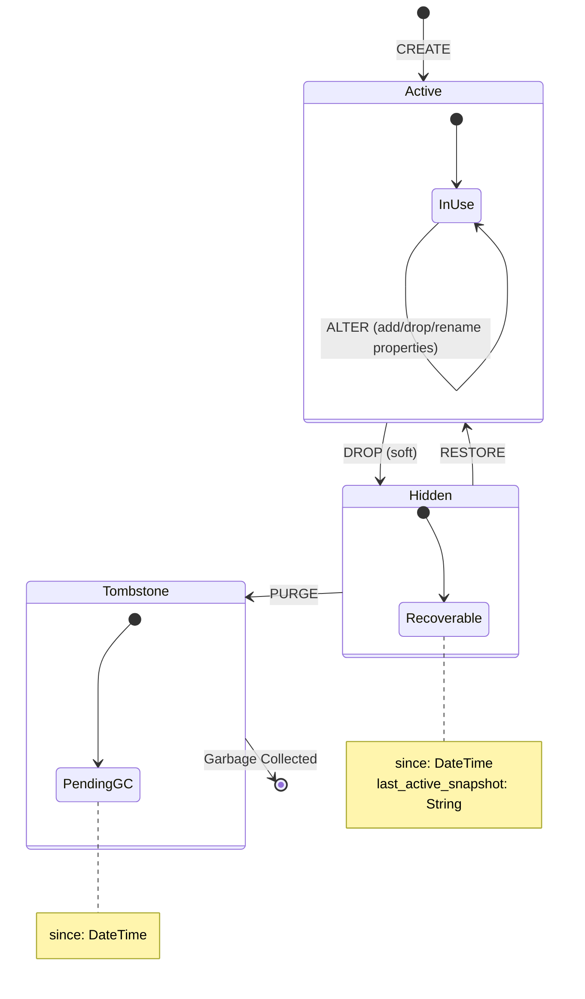

Key rules:
- **Label/type IDs are never reused** — append-only registry in `schema.json`
- **Nullable properties require no data rewrite** — existing rows return NULL
- **Defaults can be backfilled asynchronously** after schema changes
- **Property types are immutable** (since 2.5.0) — re-applying an identical schema is idempotent (the register-on-every-open pattern stays cheap), but re-declaring an existing property with a different type or vector dimension (e.g. `VECTOR(4)` → `VECTOR(8)`) raises a schema conflict error (Python: `UniSchemaError`). Use a new property name or migrate the data.

## Defining a Schema

### Rust API (SchemaBuilder)

```rust
use uni_db::{Uni, DataType, IndexType, ScalarType};

let db = Uni::open("./my-graph")
    .schema_file("schema.json")  // Load from file at build time
    .build()
    .await?;

// Or build programmatically via the fluent SchemaBuilder
db.schema()
    .label("Person")
        .property("name", DataType::String)
        .property("age", DataType::Int64)
        .property_nullable("email", DataType::String)
        .index("name", IndexType::Scalar(ScalarType::BTree))
    .label("Document")
        .property("title", DataType::String)
        .property("content", DataType::String)
        .vector("embedding", 384)
    .edge_type("KNOWS", &["Person"], &["Person"])
        .property("since", DataType::Date)
        .property("weight", DataType::Float64)
    .apply().await?;
```

### Cypher DDL

```cypher
// Create labels with properties
CREATE LABEL Person (
    name STRING,
    age INTEGER,
    email STRING UNIQUE
)

CREATE LABEL Document (
    title STRING,
    content STRING,
    embedding VECTOR(384)
)

// Create edge types with source/destination constraints
CREATE EDGE TYPE KNOWS (since DATE,
    weight FLOAT) FROM Person TO Person

CREATE EDGE TYPE AUTHORED FROM Person TO Document

// Alter existing schema
ALTER LABEL Person ADD PROPERTY phone STRING
ALTER LABEL Person DROP PROPERTY age
ALTER LABEL Person RENAME PROPERTY name TO full_name

// Drop with soft-delete
DROP LABEL IF EXISTS TempData
DROP EDGE TYPE IF EXISTS OLD_RELATION
```

### Python API

```python
from uni_db import Uni, DataType

db = Uni.open("./my-graph")

# Fluent schema builder via db.schema()
db.schema() \
    .label("Person") \
        .property("name", DataType.STRING()) \
        .property("age", DataType.INT64()) \
        .property_nullable("email", DataType.STRING()) \
        .vector("embedding", 384) \
    .done() \
    .edge_type("KNOWS", ["Person"], ["Person"]) \
        .property("since", DataType.DATE()) \
        .property("weight", DataType.FLOAT64()) \
    .apply()
```

## Vector Dimension Enforcement

Since 2.5.0 (#137), declared `VECTOR(dim)` and multi-vector `List(Vector(dim))` columns **enforce their dimensions everywhere**:

- **Write-time**: a wrong-length vector — or a list with non-numeric elements, or an empty list — written into a declared `VECTOR(dim)` column fails with a `TypeError` naming the declared and actual lengths. This applies to Cypher `CREATE`/`SET`, the bulk insert APIs, and auto-embed output (a model whose output width differs from the declared dimension fails with an error naming the embedding alias). Multi-vector columns enforce the dimension of every token vector.
- **Query-time**: `uni.vector.query` (and the dense arm of hybrid search) errors with "vector dimension mismatch" when the query vector's length differs from the declared column dimension, instead of silently returning 0 rows.
- **Flush is fail-closed**: a wrong-dimension value that somehow reaches flush errors instead of being silently nulled. WAL replay of values written by pre-2.5.0 versions nulls them with a warning log, so old databases stay recoverable.

Previously, mismatched values were silently accepted at write time and nulled at flush.

## Schema Design Best Practices

### Label Design

**One label per entity type.** Each label maps to a Lance table. Labels are the primary unit of storage organization.

<!-- doctest: skip -->
```cypher
// GOOD: Clear entity separation
CREATE LABEL Person ( name STRING, age INTEGER )
CREATE LABEL Company ( name STRING, founded DATE )

// BAD: Mega-label mixing entity types
CREATE LABEL Entity ( type STRING, name STRING, age INTEGER, founded DATE )
```

### Edge Type Modeling

**Use directional semantics** that read naturally in English. Specify source/destination label constraints when the relationship has clear domain semantics.

<!-- doctest: skip -->
```cypher
// GOOD: Clear directional semantics with constraints
CREATE EDGE TYPE WORKS_AT (since DATE) FROM Person TO Company
CREATE EDGE TYPE MANAGES FROM Person TO Person
CREATE EDGE TYPE PURCHASED (quantity INTEGER) FROM Customer TO Product

// BAD: Ambiguous direction
CREATE EDGE TYPE RELATED_TO  // Which direction means what?
```

### Property Type Selection

| Use Case | Recommended Type | Why |
|---|---|---|
| Short text (names, codes) | `String` | Indexable, searchable |
| Counts, IDs | `Int64` | Efficient comparison, aggregation |
| Measurements, scores | `Float64` | IEEE 754, aggregation-friendly |
| Timestamps | `Timestamp` | Nanosecond precision, UTC |
| Embeddings | `Vector{N}` | Fixed-size, vector-indexable |
| Distributed counters | `Crdt(GCounter)` | Merge-friendly increments |
| Tag collections | `Crdt(GSet)` | Add-only, merge-friendly |
| Mutable sets | `Crdt(ORSet)` | Add/remove with add-wins |
| Mutable scalars (distributed) | `Crdt(LWWRegister)` | Last-write-wins |
| Feature maps | `Map(String, Float64)` | Structured key-value |
| Multi-value fields | `List(String)` | Variable-length lists |

### When to Use CRDTs vs Regular Properties

Use CRDTs when:
- Multiple writers may update the same property concurrently
- You need deterministic merge semantics without coordination
- The property represents a distributed aggregate (counter, set, clock)

Use regular properties when:
- Single-writer access pattern
- Simple last-write-wins is acceptable
- You need maximum query performance (CRDTs have serialization overhead)

### Multi-Label Vertices

Vertices can carry multiple labels. Each vertex is stored in every label's table with its full label list preserved.

```cypher
// Create a vertex with multiple labels
CREATE (n:Person:Employee {name: 'Alice', employee_id: 'E001'})

// Query by any label
MATCH (n:Employee) RETURN n.name
MATCH (n:Person) RETURN n.name  // Same vertex appears in both
```

Use multi-labels when an entity naturally belongs to multiple categories. Avoid excessive labels — each additional label means the vertex is stored in one more Lance table.

## Schema Anti-Patterns

| Anti-Pattern | Problem | Solution |
|---|---|---|
| **Over-labeling** | Vertex stored in too many tables, duplicating data | Limit to 2-3 labels per vertex |
| **Mega-nodes** | Vertices with millions of edges | Introduce intermediate nodes or edge bucketing |
| **Missing indexes** | Full table scans on filtered properties | Index every property used in WHERE clauses |
| **Strings for numbers** | Can't do range queries or aggregations | Use Int64/Float64 for numeric data |
| **Large blobs as properties** | Bloats Lance tables, slows scans | Store blobs externally, keep references |
| **Schemaless everything** | Properties in overflow JSONB lose columnar benefits | Define schema for frequently-queried properties; use `strict_schema: true` to enforce |

---

# Part V: Storage Engine

## On-Disk Storage Layout

When you open or create a Uni database at a path (e.g., `./my-graph`), the following directory tree is created on disk (or in the object store):

```
my-graph/                                   # Database root (the URI you pass to Uni::open)
├── schema.json                             # Legacy schema location (may exist in older DBs)
│
└── storage/                                # All persistent data lives here
    │
    ├── catalog/                            # Metadata & snapshot management
    │   ├── schema.json                     # Authoritative schema definition
    │   ├── latest                          # File containing current snapshot UUID
    │   ├── named_snapshots.json            # { "name" → "snapshot_id" } mapping
    │   └── manifests/                      # One JSON file per snapshot
    │       ├── a1b2c3d4-....json           # SnapshotManifest (versions, counts, etc.)
    │       └── e5f6g7h8-....json
    │
    ├── wal/                                # Write-Ahead Log segments
    │   ├── 00000000000000000001_<uuid>.wal  # WAL segment (JSON-serialized mutations)
    │   ├── 00000000000000000002_<uuid>.wal  # LSN zero-padded to 20 digits
    │   └── ...                              # Lexicographic ordering = LSN ordering
    │
    ├── vertices_Person/                    # Lance table: per-label vertex data
    │   ├── _versions/                      # Lance versioning metadata
    │   ├── data/                           # Arrow IPC data files (*.lance)
    │   └── _indices/                       # Lance-managed indexes
    │
    ├── vertices_Document/                  # Another per-label table
    │   └── ...
    │
    ├── vertices/                           # Lance table: unified main vertex table
    │   └── ...                             # (all vertices regardless of label)
    │
    ├── edges/                              # Lance table: unified main edge table
    │   └── ...                             # (all edges regardless of type)
    │
    ├── deltas_KNOWS_fwd/                   # Lance table: forward edge deltas
    │   └── ...                             # (sorted by src_vid)
    │
    ├── deltas_KNOWS_bwd/                   # Lance table: backward edge deltas
    │   └── ...                             # (sorted by dst_vid)
    │
    ├── adjacency_KNOWS_fwd/                # Lance table: forward CSR adjacency
    │   └── ...                             # (row-per-vertex with neighbor lists)
    │
    ├── adjacency_KNOWS_bwd/                # Lance table: backward CSR adjacency
    │   └── ...
    │
    └── indexes/                            # Secondary indexes
        ├── uni_id_to_vid/                  # UID Index (UniId → VID mapping)
        │   ├── Person/
        │   │   └── index.lance/            # BTree on hex-encoded UID
        │   └── Document/
        │       └── index.lance/
        │
        ├── idx_Person___email/             # JSON path index (label___path)
        │   └── ...                         # Special chars → underscore
        │
        └── Person_tags_inverted/           # Inverted index (label_property_inverted)
            └── ...                         # Term → VID postings
```

### Path Construction Patterns

Table names are constructed by `LanceDbStore` methods:

```rust
LanceDbStore::vertex_table_name("Person")          // → "vertices_Person"
LanceDbStore::delta_table_name("KNOWS", "fwd")     // → "deltas_KNOWS_fwd"
LanceDbStore::delta_table_name("KNOWS", "bwd")     // → "deltas_KNOWS_bwd"
LanceDbStore::adjacency_table_name("KNOWS", "fwd") // → "adjacency_KNOWS_fwd"
```

Index paths:

```
UID Index:      storage/indexes/uni_id_to_vid/{label}/index.lance
JSON Path:      storage/indexes/idx_{label}___{safe_path}
Inverted:       storage/indexes/{label}_{property}_inverted
```

### Storage Modes

| Mode | Where Data Lives | Use Case |
|---|---|---|
| **Local** | Local filesystem at the URI path | Development, single-machine |
| **Remote** | S3/GCS/Azure at the URI (e.g., `s3://bucket/path`) | Cloud production |
| **Hybrid** | WAL + ID allocation local; bulk data in cloud | Low-latency writes + cloud durability |

In hybrid mode, the local path contains `wal/` and ID allocation state, while `storage/` tables are in the remote object store.

## LSM-Style 3-Tier Architecture

Uni's storage engine uses an **LSM-tree-inspired** design optimized for graph data. Writes go to an in-memory buffer (L0), flush to sorted runs in Lance (L1), and compact into base tables (L2).

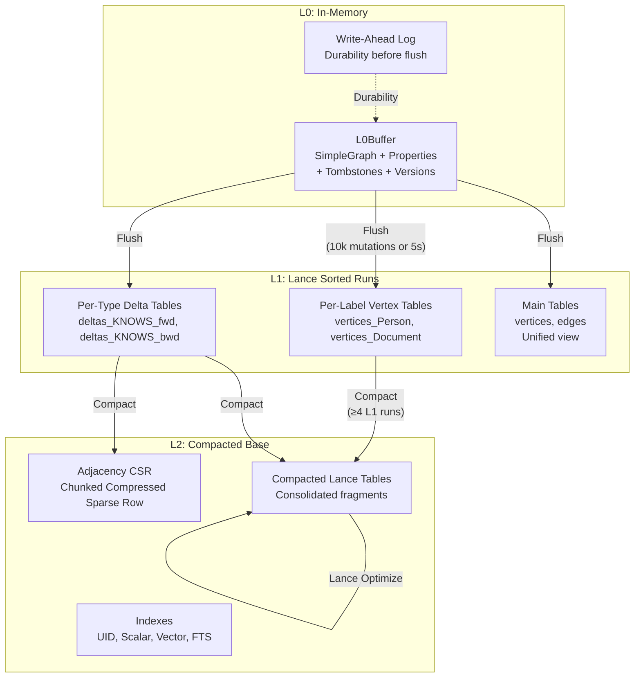

### Design Reasoning

The 3-tier design provides:

1. **Write Performance**: L0 is pure in-memory. Writes are O(1) amortized — just append to the SimpleGraph and property maps.
2. **Read Consistency**: Reads merge L0 overlay with L1/L2 storage. L0 always takes priority (newest data).
3. **Background Maintenance**: Compaction runs asynchronously, never blocking reads or writes.
4. **Crash Recovery**: WAL ensures durability. On restart, replay WAL segments since last flush.

## Vertex Storage

### Per-Label Vertex Tables (`vertices_{label}`)

Each label gets its own Lance table with typed columns:

| Column | Arrow Type | Description |
|---|---|---|
| `_vid` | UInt64 | Vertex ID (primary key) |
| `_uid` | FixedSizeBinary(32) | UniId (SHA3-256) |
| `_deleted` | Boolean | Soft-delete flag |
| `_version` | UInt64 | MVCC version number |
| `ext_id` | Utf8 (nullable) | User-provided external ID |
| `_labels` | List\<Utf8\> | All labels on this vertex |
| `_created_at` | Timestamp(ns) | Creation timestamp |
| `_updated_at` | Timestamp(ns) | Last update timestamp |
| *property columns* | *schema-defined* | One column per schema property |
| `overflow_json` | LargeBinary | JSONB for non-schema properties |

### Main Vertex Table (`vertices`)

A unified table containing all vertices regardless of label:

| Column | Arrow Type | Description |
|---|---|---|
| `_vid` | UInt64 | Primary key |
| `_uid` | FixedSizeBinary(32) | UniId |
| `ext_id` | Utf8 (nullable) | External ID |
| `labels` | List\<Utf8\> | All labels |
| `props_json` | LargeBinary | All properties as JSONB |
| `_deleted` | Boolean | Soft-delete |
| `_version` | UInt64 | MVCC version |
| `_created_at`, `_updated_at` | Timestamp(ns) | Timestamps |

The main table enables cross-label queries without scanning every per-label table.

### Overflow Properties (Schemaless)

Properties not defined in the schema are stored in the `overflow_json` column as JSONB binary. Queries against overflow properties are automatically rewritten to use Lance JSONB functions (`json_get_string`, `json_get_int`, etc.).

Read-your-writes semantics apply to schemaless properties too: direct property access and `properties(node)` consult the L0 overlay before storage, so `SET n.extra = 42` is visible immediately without an explicit flush. The same overflow properties are preserved through flush and later compaction cycles.

```cypher
// This property is in overflow_json if not in schema
MATCH (n:Person) WHERE n.nickname = 'Bob' RETURN n

// Internally rewritten to:
// ... WHERE json_get_string(overflow_json, 'nickname') = 'Bob'
```

## Edge Storage

### Delta Tables (`deltas_{edge_type}_{direction}`)

Each edge type gets **two** delta tables — one for forward direction (indexed by `src_vid`) and one for backward (indexed by `dst_vid`):

| Column | Arrow Type | Description |
|---|---|---|
| `src_vid` | UInt64 | Source vertex |
| `dst_vid` | UInt64 | Destination vertex |
| `eid` | UInt64 | Edge ID |
| `op` | UInt8 | 0=Insert, 1=Delete |
| `_version` | UInt64 | MVCC version |
| `_created_at`, `_updated_at` | Int64 (nullable) | Nanoseconds since epoch |
| *property columns* | *schema-defined* | Edge properties |
| `overflow_json` | LargeBinary | Non-schema edge properties |

**L1Entry structure** per delta row:

```rust
L1Entry {
    src_vid: Vid,
    dst_vid: Vid,
    eid: Eid,
    op: Op,            // Insert or Delete
    version: u64,
    properties: Properties,
    created_at: Option<i64>,
    updated_at: Option<i64>,
}
```

**OOM Protection**: `DEFAULT_MAX_COMPACTION_ROWS = 5,000,000` with `ENTRY_SIZE_ESTIMATE = 145 bytes` per entry.

### Main Edge Table (`edges`)

| Column | Arrow Type | Description |
|---|---|---|
| `_eid` | UInt64 | Edge ID |
| `src_vid`, `dst_vid` | UInt64 | Endpoint vertices |
| `type` | Utf8 | Edge type name |
| `props_json` | LargeBinary | All properties as JSONB |
| `_deleted`, `_version` | Boolean, UInt64 | MVCC fields |
| `_created_at`, `_updated_at` | Timestamp(ns) | Timestamps |

## Adjacency / CSR Format

The Compressed Sparse Row (CSR) format provides O(1) neighbor lookups — critical for graph traversal performance.

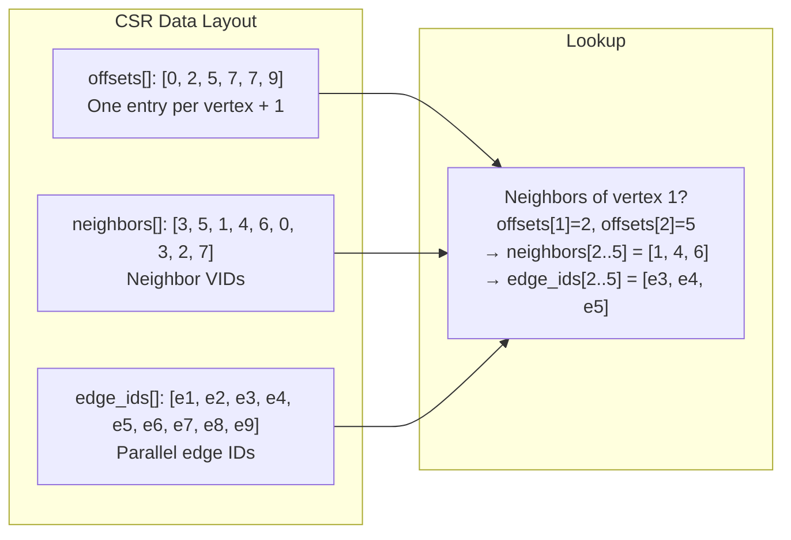

### CompressedSparseRow

```rust
CompressedSparseRow {
    offsets: Vec<u32>,        // O(1) neighbor range lookup
    neighbors: Vec<DenseIdx>, // Dense indices for algorithms
    neighbor_vids: Vec<Vid>,  // Actual VID values
    edge_ids: Vec<Eid>,       // Edge IDs parallel to neighbors
}
```

- **Lookup**: `offsets[vid]..offsets[vid+1]` gives the range into `neighbors[]` and `edge_ids[]`
- **Memory**: `offsets.len() × 4 + neighbors.len() × 4 + neighbor_vids.len() × 8 + edge_ids.len() × 8`

### MainCsr (Versioned CSR)

For MVCC support, `MainCsr` stores per-edge version metadata:

```rust
MainCsr {
    offsets: Vec<u32>,
    entries: Vec<CsrEdgeEntry>,  // neighbor_vid, eid, created_version
}
```

Each `CsrEdgeEntry` carries a `created_version` field, enabling snapshot queries without rebuilding the CSR.

### ShadowCsr (Deleted-Edge Overlay)

A deleted edge leaves the Main CSR but stays recorded in `ShadowCsr`, so snapshot and time-travel reads can resurrect it:

```rust
ShadowEdge {
    neighbor_vid: Vid,
    eid: Eid,
    edge_type: u32,
    created_version: u64,
    deleted_version: u64,
}
```

An entry is alive at `version` when `created_version <= version < deleted_version` (`get_entries_at_version`). Entries arrive from two places: `AdjacencyManager::compact`, which moves overlay tombstones into the shadow as it merges frozen segments, and `AdjacencyManager::warm`, which pushes one for every `op = 1` row it reads out of the L1 delta. The regular (non-snapshot) read path never consults it.

**Retention.** `add_deleted_edge` ignores a repeat of an `Eid` it already holds. The dedup is load-bearing rather than tidiness: unlike `warm_coalesced`, `warm` has no `has_csr` short-circuit, so each warm of the same `(edge_type, direction)` re-pushed the *entire* delete history — growth was unbounded in the number of warms, not the number of deletes. Reads already dedupe by `Eid` downstream, which is why it surfaced as memory rather than as wrong answers.

**GC bound.** `AdjacencyManager::gc_shadow(current_version)` drops entries whose `deleted_version` is at or below a floor, and is called after CSR compaction. The floor is `min(min_pinned_version, current_version)`, collapsing to `current_version` when nothing is pinned. `StorageManager::pinned_at_version` registers a `PinGuard` for the lifetime of the view it builds, and `PinnedVersions` is refcounted so the floor cannot rise while another reader still holds the same version.

The bound is that narrow for a specific reason: `StorageManager::pinned()` and `at_fork` each build a **fresh** `AdjacencyManager` with its own empty `ShadowCsr`, so those readers never consult the live one. `pinned_at_version` — the path a read-write transaction takes whenever it pins at all (`ssi_enabled`, or any ephemeral/scratch transaction) — is the only one that shares it. `SnapshotManager` cannot supply the floor because it is a manifest reader-writer and tracks no live readers.

**Observability.** `AdjacencyManager::memory_usage` adds `ShadowCsr::approx_bytes` to the main-CSR byte counter, so shadow retention is visible to the cache budget; `shadow_entry_count()` / `ShadowCsr::entry_count()` expose the raw count for retention tests and diagnostics.

### AdjacencyDataset (Persistent CSR)

Stored as a Lance table (`adjacency_{edge_type}_{direction}`) with row-per-vertex format:

| Column | Arrow Type |
|---|---|
| `src_vid` | UInt64 |
| `neighbors` | List\<UInt64\> |
| `edge_ids` | List\<UInt64\> |

## Lance Table Naming Conventions

| Entity | Table Name | Purpose |
|---|---|---|
| All Vertices | `vertices` | Cross-label vertex lookups |
| Per-Label Vertices | `vertices_{label}` | Label-specific scans with typed columns |
| All Edges | `edges` | Cross-type edge lookups |
| Forward Deltas | `deltas_{edge_type}_fwd` | Forward edge mutations (by src_vid) |
| Backward Deltas | `deltas_{edge_type}_bwd` | Backward edge mutations (by dst_vid) |
| Forward Adjacency | `adjacency_{edge_type}_fwd` | Forward CSR adjacency |
| Backward Adjacency | `adjacency_{edge_type}_bwd` | Backward CSR adjacency |

## Write Path Detailed

### Regular Writer

1. **Validate**: `check_write_pressure()` — enforce write throttle limits
2. **Embed**: `process_embeddings_for_labels()` — auto-generate vector embeddings if configured
3. **Constrain**: Validate constraints (NOT NULL, UNIQUE, EXISTS, CHECK, global ext_id uniqueness)
4. **Merge**: `prepare_vertex_upsert()` — CRDT merge for CRDT properties, LWW for others
5. **Log**: `WAL::append(mutation)` — buffer mutation for durability
6. **Buffer**: Write to L0Buffer (SimpleGraph topology + property maps + version tracking)

### L0 → L1 Flush

Triggered when `mutation_count >= auto_flush_threshold` (default: 10,000) or `auto_flush_interval` (default: 5s) elapses with `auto_flush_min_mutations` (default: 100) met:

1. Flush WAL to durable storage → capture LSN
2. Rotate L0: old → `pending_flush` list, new empty L0 → `current`
3. Collect edges and tombstones into delta runs per edge type
4. Write per-label vertex tables with indexes (`_vid`, `_uid`, `ext_id` BTree)
5. Incremental inverted index updates for custom indexes
6. Dual-write to main tables (`vertices`, `edges`)
7. Write new snapshot manifest
8. Complete flush: remove old L0 from `pending_flush`
9. Truncate WAL segments with LSN ≤ flushed LSN

Two refinements to this sequence:

- **Async flush** (`UniConfig.async_flush`): the L1 streaming phase (steps
  3–7) runs off the commit path through a `FlushCoordinator` that bounds
  in-flight flushes with a semaphore and finalizes them in rotate order, so
  the snapshot-manifest chain stays linear even when flushes complete out of
  order. Rotated L0s stay readable on the `pending_flush` list until their
  flush succeeds.
- **Clone-on-freeze**: when a pinned snapshot (long-lived read view) holds
  the L0 generation a committer wants to merge into, the committer clones
  the buffer aside instead of mutating the pinned view — snapshots never
  observe post-pin writes, and uncontended commits never pay for the clone.

### BulkWriter Path

For large data loads, `BulkWriter` bypasses WAL for performance:

- `insert_vertices(label, vertices)` — allocate VIDs, buffer by label, flush at `batch_size` (10k) or `max_buffer_size_bytes` (1GB)
- `insert_edges(edge_type, edges)` — allocate EIDs, buffer, flush at thresholds
- No WAL; rollback via Lance table versioning
- Deferred index rebuilds (sync or async) on `commit()`

## L0Buffer

The L0Buffer is the in-memory write buffer, backed by a `SimpleGraph` for topology:

```rust
L0Buffer {
    graph: SimpleGraph,                          // In-memory adjacency lists
    tombstones: HashMap<Eid, TombstoneEntry>,    // Soft-deleted edges
    vertex_tombstones: HashSet<Vid>,             // Soft-deleted vertices
    edge_properties: HashMap<Eid, Properties>,   // Edge properties
    vertex_properties: HashMap<Vid, Properties>, // Vertex properties
    edge_endpoints: HashMap<Eid, (Vid, Vid, u32)>, // EID → (src, dst, type)
    vertex_labels: HashMap<Vid, Vec<String>>,    // Multi-label support
    edge_types: HashMap<Eid, String>,            // EID → type name
    current_version: u64,                        // MVCC version counter
    mutation_count: usize,                       // For flush decisions
    mutation_stats: MutationStats,               // Per-type mutation counters
    estimated_size: usize,                       // O(1) maintained estimate
    constraint_index: HashMap<Vec<u8>, Vid>,     // Unique constraint lookups
    wal: Option<Arc<WriteAheadLog>>,             // Durability
    wal_lsn_at_flush: u64,                       // WAL LSN at rotation
    // Version tracking
    edge_versions: HashMap<Eid, u64>,            // MVCC edge version
    vertex_versions: HashMap<Vid, u64>,          // MVCC vertex version
    // Timestamp tracking
    vertex_created_at: HashMap<Vid, i64>,
    vertex_updated_at: HashMap<Vid, i64>,
    edge_created_at: HashMap<Eid, i64>,
    edge_updated_at: HashMap<Eid, i64>,
}
```

**Size Estimation**: Maintained incrementally on every mutation (O(1) per write, avoids O(V+E) traversal).

## L0 Visibility Chain

Reads see a **chain** of L0 buffers — the transaction-local L0 (if in a transaction), the current main L0, and any L0s pending flush:

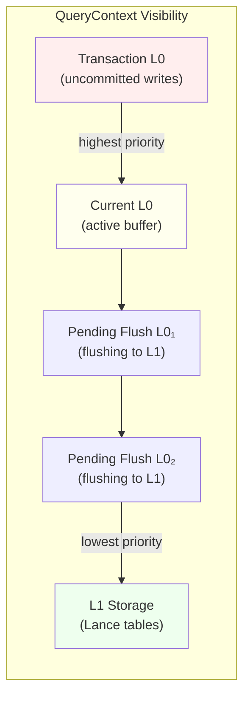

Priority order: **Transaction L0 > Current L0 > Pending Flush L0s > L1 Storage**

The L0Manager coordinates this chain:

```rust
L0Manager {
    current: RwLock<Arc<RwLock<L0Buffer>>>,               // Active L0
    pending_flush: RwLock<Vec<Arc<RwLock<L0Buffer>>>>,     // L0s being flushed
}
```

## WAL (Write-Ahead Log)

The WAL ensures durability before flush. Each WAL segment is stored as a JSON file in the object store:

| Field | Details |
|---|---|
| **Filename** | `{LSN:020}_{uuid}.wal` (zero-padded for lexicographic ordering) |
| **Format** | JSON-serialized `WalSegment { lsn: u64, mutations: Vec<Mutation> }` |
| **Mutations** | `InsertVertex`, `DeleteVertex`, `InsertEdge`, `DeleteEdge` |
| **LSN** | Monotonically increasing Log Sequence Number (starts at 1) |
| **Replay** | `replay_since(hwm)` fetches segments with LSN > high-water mark |

On startup, the Writer calls `replay_wal(hwm)` to recover any mutations that were buffered in L0 but not yet flushed to L1.

## PropertyManager

The PropertyManager handles lazy property loading with an LRU cache and L0 overlay:

```rust
PropertyManager {
    storage: Arc<StorageManager>,
    schema_manager: Arc<SchemaManager>,
    vertex_cache: Option<Mutex<LruCache<(Vid, String), Value>>>,
    edge_cache: Option<Mutex<LruCache<(Eid, String), Value>>>,
    cache_capacity: usize,  // Max entries per cache (0 = disabled)
}
```

**Lookup priority for edge properties:**

1. Check if deleted in L0 → return None
2. Check L0 chain (transaction → main → pending flush) → return if found
3. Check LRU cache → return if found
4. Fetch from Lance storage runs, bounded by the reader's version high water mark when it has one → update cache → return
5. L0 properties **always** take precedence over storage

Step 4 spans two tiers, and both conjoin `_version <= hwm` when the `PropertyManager`'s own `StorageManager` carries one: the per-type delta scan (via `StorageManager::apply_version_filter`) and the `props_json` fallback in the main edges table (via `MainEdgeDataset::find_props_by_eid`). Schemaless and overflow edge properties live *only* in `props_json`, so every such read reaches the fallback — not only reads that come after a compaction.

> **Which readers are actually bounded.** The high water mark comes from the `StorageManager` the `PropertyManager` was *constructed* with, not from whatever manager the surrounding query routes its scans through. Only the manifest-pinned time-travel view built by `UniInner::at_snapshot` constructs a `PropertyManager` over pinned storage, so only it gets a bounded step 4. A read-write transaction routes *scans* through `pinned_at_version` but keeps the live database-level `PropertyManager` on purpose (see [Known Limitations](#known-limitations)), so its hwm is `None` and step 4 reads at HEAD; forks are likewise unbounded. Step 3's LRU cache is version-agnostic in every case.

> **Embedder note (breaking).** `MainEdgeDataset::find_props_by_eid` takes a third argument, `version: Option<u64>`; pass `storage.version_high_water_mark()`, or `None` for an unbounded read at HEAD. Without it even a snapshot-pinned reader read L0 and the delta tier at its snapshot but this tier at HEAD, so a post-snapshot write leaked in and a post-snapshot delete made the edge vanish. The version bound is a *conjunct* — the highest-version-row-wins tombstone rule runs unchanged over whatever survives it. `exists_by_eid` stays deliberately unbounded: it is the compaction dual-write invariant check and must see rows at any version.

## Storage Best Practices

| Practice | Details |
|---|---|
| **Cloud Config** | Set appropriate timeouts per provider (S3: higher read timeout, GCS: higher connect timeout) |
| **Flush Tuning** | Write-heavy: raise `auto_flush_threshold` to 50k+. Read-heavy: lower to 5k for fresher reads |
| **BulkWriter for Imports** | Always use BulkWriter for initial data loading — bypasses WAL, defers indexes, 10-100x faster |
| **Monitor L1 Runs** | If L1 run count grows above `max_l1_runs` (4), compaction may be falling behind |

## Storage Anti-Patterns

| Anti-Pattern | Problem | Solution |
|---|---|---|
| **Disabling WAL in production** | Data loss on crash | Keep `wal_enabled: true` (default) |
| **Flush threshold too high** | Memory pressure, stale reads | Keep ≤ 100k mutations between flushes |
| **Not monitoring L1 runs** | Unbounded L1 growth → degraded reads | Set up alerts on `l1_runs` metric |
| **Single huge transaction** | L0 grows unbounded until commit | Break into smaller transactions |

---

# Part VI: Indexing Deep Dive

## Index Architecture

Uni uses a **two-tier index maintenance** strategy:

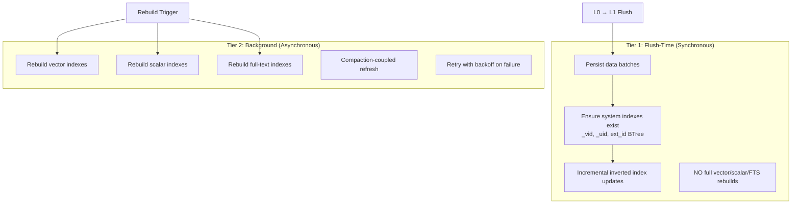

### Rebuild Triggers

| Trigger | Condition | When |
|---|---|---|
| **Growth** | Row count increased by 20-50% since last build | After flush |
| **Churn** | Update/delete ratio exceeds threshold | After compaction |
| **Bulk** | Always after bulk ingest commit | After BulkWriter.commit() |
| **Time** | Optional periodic maintenance window | Configurable |

## Index Types

### UID Index

Content-addressed O(1) lookup from UniId (SHA3-256) to VID.

| Field | Details |
|---|---|
| **URI** | `{base_uri}/indexes/uni_id_to_vid/{label}/index.lance` |
| **Schema** | `_uid: FixedSizeBinary(32)`, `_vid: UInt64`, `_uid_hex: Utf8` |
| **Index** | BTree on `_uid_hex` for O(log N) lookups |
| **Methods** | `get_vid(uid)`, `resolve_uids(&[UniId])` |

```cypher
// UID lookup is O(1) via BTree
MATCH (n:Person) WHERE n._uid = 'z3asjk42...' RETURN n
```

### Scalar Indexes (BTree, Hash, Bitmap)

Traditional database indexes on typed property columns:

| Type | Best For | Query Pattern |
|---|---|---|
| **BTree** | Range queries, ordering, prefix scans | `WHERE n.age > 25`, `STARTS WITH 'pre'` |
| **Hash** | Exact match lookups | `WHERE n.id = 123` |
| **Bitmap** | Low-cardinality columns | `WHERE n.status = 'active'` |

```cypher
// Create scalar indexes
CREATE INDEX idx_name FOR (p:Person) ON (p.name)           // Default: BTree
CREATE INDEX idx_status FOR (o:Order) ON (o.status)         // BTree
```

### Vector Indexes (HNSW, IVF-PQ, Flat)

For approximate nearest neighbor (ANN) search on embedding vectors:

| Type | Best For | Parameters |
|---|---|---|
| **HNSW** | < 1M vectors, high recall | `m` (connections), `ef_construction`, `ef_search` |
| **IVF-PQ** | > 1M vectors, memory-efficient | `num_partitions`, `num_sub_vectors`, `bits` |
| **Flat** | < 10k vectors, exact search | None (brute force) |

```cypher
// Create vector index with HNSW
CREATE VECTOR INDEX idx_embed FOR (d:Document) ON (d.embedding)
  WITH { metric: 'cosine', type: 'hnsw' }

// Create vector index with IVF-PQ for large datasets
CREATE VECTOR INDEX idx_embed FOR (d:Document) ON (d.embedding)
  WITH { metric: 'l2', type: 'ivf_pq', num_partitions: 256 }
```

**Distance Metrics:**

| Metric | Raw Distance | Score Conversion | Similarity Range | Best For |
|---|---|---|---|---|
| `Cosine` | `1.0 - cos(a,b)` (range [0, 2]) | `(2.0 - d) / 2.0` | [0, 1] | Normalized embeddings (most models) |
| `L2` | Squared Euclidean distance | `1.0 / (1.0 + d)` | (0, 1] | Raw embeddings, spatial data |
| `Dot` | Negative dot product | Pass-through | Unbounded | Maximum inner product search |

Score conversion is **metric-aware**: `uni.vector.query`, `uni.search`, and `similar_to()` all use the same `calculate_score(distance, metric)` function to normalize raw Lance distances into similarity scores, regardless of which metric the vector index was created with.

**Sparse (learned-sparse / SPLADE) index kind.** Beyond the dense ANN families above, a vector index may be created with `type: 'sparse'` to index high-dimensional, mostly-zero `SparseVector` columns (SPLADE-style term-weight vectors). It is backed by an inverted term→(VID, weight) structure rather than HNSW/IVF graphs, and scores by sparse dot product. One knob is specific to it:

| Option | Type | Default | Description |
|---|---|---|---|
| `quantize` | Bool | `true` | `true` = 8-bit quantization of term weights (smaller, lossy); `false` = lossless `f32` weights |

```cypher
CREATE VECTOR INDEX idx_sparse FOR (d:Doc) ON (d.emb)
  OPTIONS { type: 'sparse', quantize: false }
```

Query it through `uni.sparse.query` (see Part VIII, [Sparse Vectors](#sparse-vectors)).

### Full-Text Indexes (BM25)

BM25-based full-text search on text properties:

```cypher
CREATE FULLTEXT INDEX idx_content FOR (a:Article) ON EACH [a.content]

// Query with BM25 scoring
CALL uni.fts.query('Article', 'content', 'graph database', 10)
YIELD node, score
```

### JSON FTS Indexes

Full-text search on nested JSON/JSONB properties:

```cypher
CREATE JSON FULLTEXT INDEX idx_meta FOR (d:Data) ON metadata
```

### Inverted Indexes

Term-to-VID mapping for `ANY(x IN list WHERE x IN allowed)` query patterns:

```rust
InvertedIndex {
    dataset: Option<Dataset>,           // Backing Lance dataset
    base_uri: String,                   // Storage URI
    label: String,                      // Vertex label
    property: String,                   // Indexed property
    config: InvertedIndexConfig,        // { label, property, normalize, max_terms_per_doc }
}
```

Postings (`term → VIDs`) are built transiently during index operations, not stored as a struct field.

**Memory guard**: `DEFAULT_MAX_POSTINGS_MEMORY = 256 MB`. Build uses temp segment flushing when memory limit is reached.

### VidLabelsIndex

In-memory bidirectional index for O(1) VID ↔ label lookups:

```rust
VidLabelsIndex {
    vid_to_labels: HashMap<Vid, Vec<String>>,
    label_to_vids: HashMap<String, HashSet<Vid>>,
}
```

Rebuilt from the main vertex table on database open. Updated incrementally on writes.

## Index Lifecycle

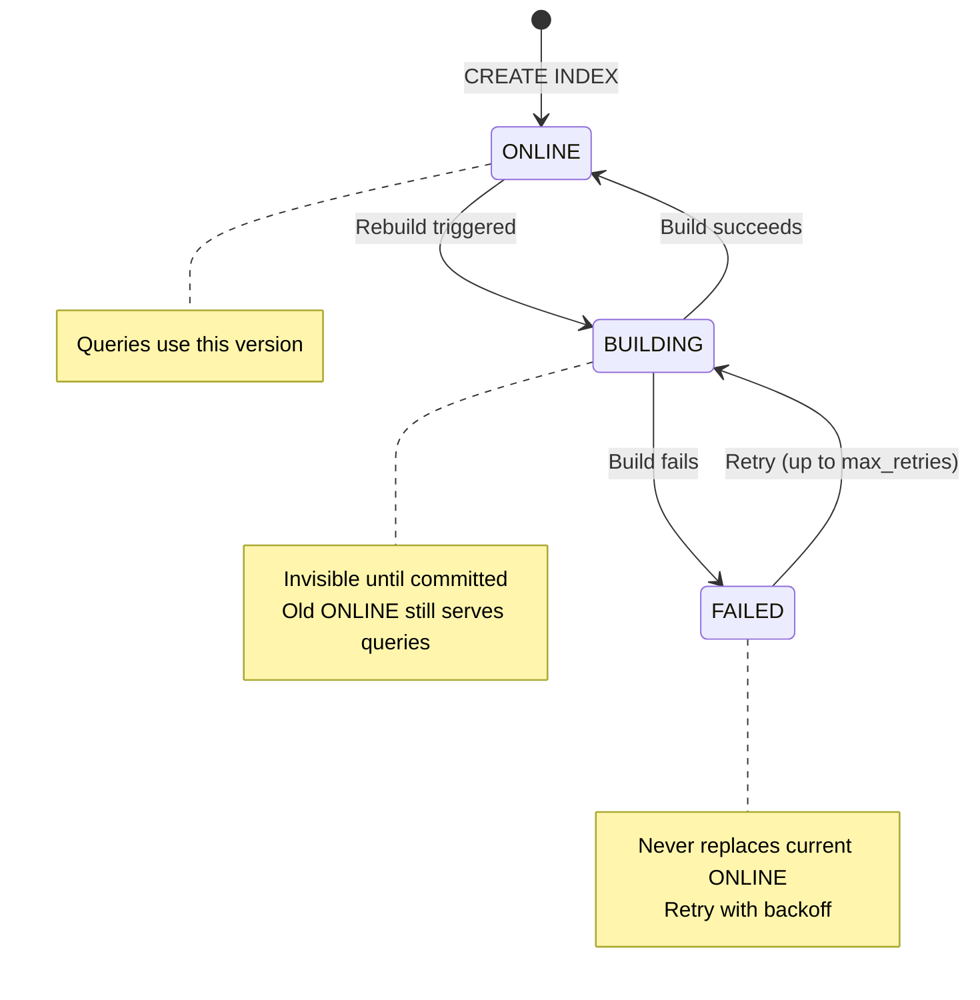

**Index Status Gating**: The query planner only uses indexes with `Online` status. Indexes in `Building`, `Stale`, or `Failed` states are invisible to queries — the old `Online` version continues serving until a rebuild succeeds. This means index rebuilds are zero-downtime: the new index is built in the background and atomically swapped in on success.

| Status | Query Visible | Writes Trigger Rebuild | Description |
|---|---|---|---|
| `Online` | Yes | No | Up-to-date and serving queries |
| `Building` | No (old Online serves) | Queued | Rebuild in progress |
| `Stale` | No (old Online serves) | Queued | Scheduled for rebuild after transient failure |
| `Failed` | No (old Online serves) | Retry if under max_retries | Exhausted retry attempts |

## Predicate Pushdown Priority

When executing a query, the planner pushes predicates down to the most efficient index:

```mermaid
graph TB
    PRED[WHERE Predicate] --> UID{UID Lookup?<br/>n._uid = '...'}
    UID -->|Yes| UIDX[UID Index<br/>O(1) hash lookup]
    UID -->|No| BT{Scalar Index?<br/>n.prop = value<br/>n.prop > value}
    BT -->|Yes| BTX[BTree/Hash/Bitmap<br/>O(log N) lookup]
    BT -->|No| FTS{Full-Text?<br/>CONTAINS 'term'}
    FTS -->|Yes| FTSX[BM25 Full-Text<br/>Scored results]
    FTS -->|No| LANCE{Lance Filter?<br/>Arrow predicate}
    LANCE -->|Yes| LX[Lance Scan<br/>Columnar pushdown]
    LANCE -->|No| RES[Residual Filter<br/>Post-scan evaluation]
```

## Choosing the Right Index

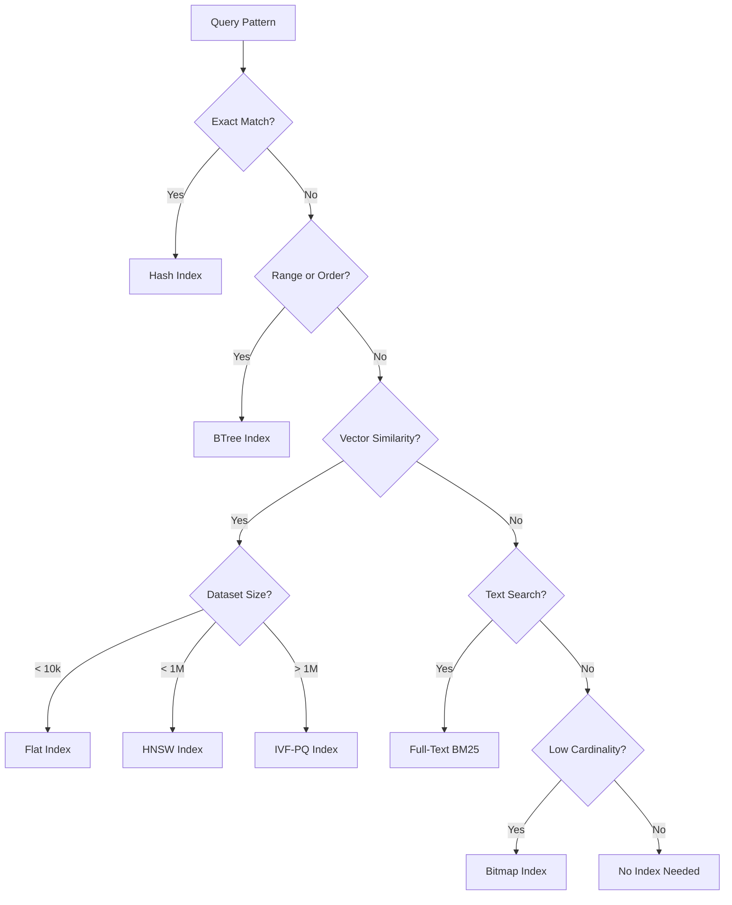

## Indexing Best Practices

| Practice | Details |
|---|---|
| **Index every WHERE property** | Properties used in WHERE clauses should have scalar indexes |
| **HNSW for < 1M vectors** | Best recall-latency trade-off for moderate datasets |
| **IVF-PQ for > 1M vectors** | Memory-efficient with acceptable recall |
| **Match metric to model** | Use Cosine for models with normalized output (most), L2 for raw |
| **BTree for range queries** | ORDER BY, >, <, >=, <=, STARTS WITH |

## Indexing Anti-Patterns

| Anti-Pattern | Problem | Solution |
|---|---|---|
| **Over-indexing** | Index maintenance cost on every write | Only index properties used in queries |
| **Wrong distance metric** | Cosine on unnormalized vectors gives poor results | Check your embedding model's documentation |
| **Missing scalar index on filters** | Full scan on high-cardinality columns | Add BTree index on filtered properties |
| **Vector index without enough data** | HNSW/IVF-PQ need minimum data to be effective | Use Flat for < 1000 rows |

---

# Part VII: Cypher Query Language

## Overview

Uni implements a substantial subset of the OpenCypher query language, extended with vector search, full-text search, DDL commands, time travel, and window functions. The parser is based on `pest` (PEG grammar) and produces an AST that the query planner converts to DataFusion physical plans.

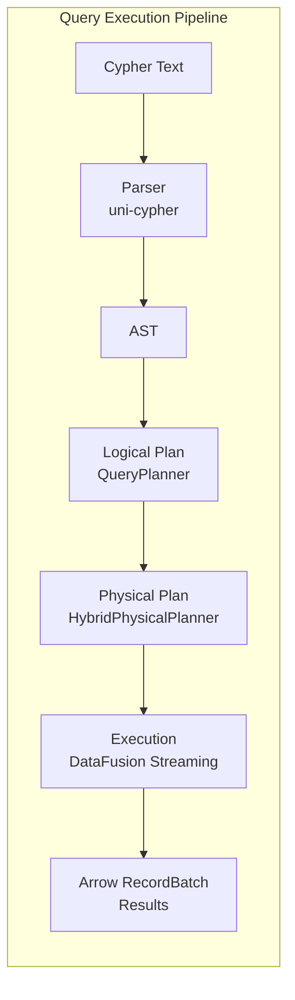

## Clauses

### MATCH

Pattern matching — the core of Cypher. Finds subgraphs matching a pattern.

```cypher
// Simple node match
MATCH (n:Person) RETURN n

// Node with properties
MATCH (n:Person {name: 'Alice'}) RETURN n

// Edge pattern
MATCH (a:Person)-[r:KNOWS]->(b:Person) RETURN a, r, b

// Multi-hop pattern
MATCH (a:Person)-[:KNOWS]->(b:Person)-[:WORKS_AT]->(c:Company)
RETURN a.name, c.name

// OPTIONAL MATCH (left outer join)
OPTIONAL MATCH (n:Person)-[r:MANAGES]->(m:Person) RETURN n, m
```

### Node Patterns

<!-- doctest: skip -->
```cypher
(n)                    // Any node, bound to variable n
(n:Person)             // Node with label Person
(n:Person:Employee)    // Node with multiple labels
(n {name: 'Alice'})    // Node with property filter
(n:Person {age: 30})   // Label + property filter
()                     // Anonymous node
```

### Edge Patterns

<!-- doctest: skip -->
```cypher
-[r]->                 // Outgoing edge
<-[r]-                 // Incoming edge
-[r]-                  // Undirected edge
-[r:KNOWS]->           // Typed edge
-[r:KNOWS|FRIEND_OF]-> // Multiple types (OR)
-[r:KNOWS {since: 2020}]-> // Edge with properties
-[r *1..3]->           // Variable-length path (1 to 3 hops)
-[r *]->               // Variable-length (any number of hops)
-[r *..5]->            // Variable-length (up to 5 hops)
```

### Path Patterns

```cypher
// Named path
MATCH p = (a)-[:KNOWS*]->(b)
RETURN nodes(p), relationships(p), length(p)

// Shortest path
MATCH p = shortestPath((a:Person)-[:KNOWS*]-(b:Person))
WHERE a.name = 'Alice' AND b.name = 'Bob'
RETURN p

// All shortest paths
MATCH p = allShortestPaths((a:Person)-[:KNOWS*]-(b:Person))
RETURN p
```

### Pattern Comprehension

```cypher
// Inline pattern with filtering and projection
RETURN [(a)-[:KNOWS]->(b) WHERE b.age > 25 | b.name] AS friends_over_25
```

### CREATE

```cypher
// Create nodes
CREATE (n:Person {name: 'Alice', age: 30})

// Create edges
MATCH (a:Person {name: 'Alice'}), (b:Person {name: 'Bob'})
CREATE (a)-[:KNOWS {since: 2023}]->(b)

// Create with RETURN
CREATE (n:Document {title: 'Hello'}) RETURN n
```

### MERGE

Upsert — create if not exists, update if exists:

```cypher
// Merge node
MERGE (n:Person {ext_id: 'user-123'})
ON CREATE SET n.created = datetime()
ON MATCH SET n.last_seen = datetime()
RETURN n

// Merge edge
MATCH (a:Person {name: 'Alice'}), (b:Person {name: 'Bob'})
MERGE (a)-[r:KNOWS]->(b)
ON CREATE SET r.since = date()
```

**Performance.** A single-node, single-label `MERGE (n:Label {key: ...})` with a
literal key map takes a batched fast path: the existing-node lookup is resolved
from one per-statement L0 snapshot plus a persisted lookup, with no per-row query
planning. This is what makes `UNWIND $rows AS e MERGE (n:Label {key: e.key}) ...`
scale (it also handles intra-batch duplicate keys correctly). Put a **scalar
index** on the MERGE key so the persisted lookup is an index point-lookup rather
than a full label scan. Multi-node/edge MERGE (`MERGE (a)-[:R]->(b)`) and
non-literal property maps (`MERGE (n:Label $props)`) use the slower per-row
general path — prefer a single-node MERGE for the node and batched
`CREATE`/`MATCH` for edges.

### WITH

Intermediate result projection — acts as a pipeline stage:

```cypher
MATCH (n:Person)
WITH n, n.age AS age
WHERE age > 25
RETURN n.name, age
ORDER BY age DESC
```

### WITH RECURSIVE

Recursive common table expressions:

<!-- doctest: skip -->
```cypher
WITH RECURSIVE reachable(vid, depth) AS (
    MATCH (n:Person {name: 'Alice'}) RETURN id(n) AS vid, 0 AS depth
    UNION ALL
    MATCH (a)-[:KNOWS]->(b)
    WHERE id(a) IN reachable.vid AND reachable.depth < 5
    RETURN id(b) AS vid, reachable.depth + 1 AS depth
)
RETURN DISTINCT vid, min(depth) AS min_depth
```

### RETURN

Final result projection:

```cypher
RETURN n.name, n.age                    // Columns
RETURN n.name AS person_name            // Aliases
RETURN DISTINCT n.city                  // Deduplicate
RETURN n ORDER BY n.age DESC            // Ordering
RETURN n LIMIT 10                       // Limit results
RETURN n SKIP 20 LIMIT 10              // Pagination
RETURN count(*) AS total                // Aggregation
```

### WHERE

Filtering conditions (applies to MATCH, WITH, RETURN):

<!-- doctest: skip -->
```cypher
WHERE n.age > 25
WHERE n.name = 'Alice' AND n.active = true
WHERE n.name STARTS WITH 'A'
WHERE n.name CONTAINS 'lic'
WHERE n.name ENDS WITH 'ce'
WHERE n.name =~ '.*lice.*'             // Regex
WHERE n.name IN ['Alice', 'Bob']
WHERE n.email IS NOT NULL
WHERE EXISTS { MATCH (n)-[:KNOWS]->() }
```

### UNWIND

Expand a list into rows:

```cypher
UNWIND [1, 2, 3] AS x RETURN x
UNWIND $names AS name MATCH (n:Person {name: name}) RETURN n
```

`UNWIND`-driven operations are batched rather than run per row: `CREATE`,
property-/id-correlated `MATCH` (index IN-list pushdown when the property is
indexed), `SET`, `REMOVE`, `DELETE`, and single-node `MERGE` (see MERGE above)
all process the whole batch in one statement. For bulk upserts, prefer one
`UNWIND $batch AS e MERGE (n:Label {key: e.key}) ON CREATE SET ... ON MATCH SET ...`
over a MERGE-per-row loop, and scalar-index the key.

### DELETE

```cypher
// Delete node (must have no edges)
MATCH (n:Person {name: 'Alice'}) DELETE n

// Detach delete (removes all edges first)
MATCH (n:Person {name: 'Alice'}) DETACH DELETE n
```

### SET / REMOVE

```cypher
// Set properties
MATCH (n:Person {name: 'Alice'}) SET n.age = 31, n.updated = datetime()

// Set labels
MATCH (n:Person {name: 'Alice'}) SET n:Employee

// Remove properties
MATCH (n:Person {name: 'Alice'}) REMOVE n.temporary_field

// Remove labels
MATCH (n:Person {name: 'Alice'}) REMOVE n:Employee
```

### CALL

Invoke procedures with YIELD:

```cypher
CALL uni.vector.query('Document', 'embedding', $query_vector, 10)
YIELD node, score
RETURN node.title, score

CALL uni.schema.labels()
YIELD label, nodeCount
RETURN label, nodeCount
```

### UNION

Combine query results:

```cypher
MATCH (n:Person) RETURN n.name AS name
UNION
MATCH (n:Company) RETURN n.name AS name

// UNION ALL keeps duplicates
MATCH (n:Person) RETURN n.name UNION ALL MATCH (n:Company) RETURN n.name
```

## Expressions

### Operators

| Category | Operators |
|---|---|
| **Arithmetic** | `+`, `-`, `*`, `/`, `%`, `^` |
| **Comparison** | `=`, `<>`, `<`, `<=`, `>`, `>=` |
| **Logical** | `AND`, `OR`, `XOR`, `NOT` |
| **String** | `CONTAINS`, `STARTS WITH`, `ENDS WITH`, `=~` (regex) |
| **Membership** | `IN` |
| **Similarity** | `~=` (vector similarity — desugars to `uni.vector.query` top-K scan) |
| **Null** | `IS NULL`, `IS NOT NULL` |

### CASE Expression

<!-- doctest: skip -->
```cypher
CASE n.status
    WHEN 'active' THEN 'Active'
    WHEN 'inactive' THEN 'Inactive'
    ELSE 'Unknown'
END

CASE
    WHEN n.age < 18 THEN 'Minor'
    WHEN n.age < 65 THEN 'Adult'
    ELSE 'Senior'
END
```

### Quantifiers

<!-- doctest: skip -->
```cypher
ALL(x IN n.scores WHERE x > 50)       // All elements match
ANY(x IN n.tags WHERE x = 'important') // At least one matches
SINGLE(x IN n.refs WHERE x = target)   // Exactly one matches
NONE(x IN n.errors WHERE x IS NOT NULL) // No elements match
```

### REDUCE

<!-- doctest: skip -->
```cypher
REDUCE(total = 0, x IN n.scores | total + x) AS sum
```

### List Comprehension

<!-- doctest: skip -->
```cypher
[x IN range(1, 10) WHERE x % 2 = 0 | x * x] AS even_squares
```

### Map Projection

```cypher
MATCH (n:Person)
RETURN n{.name, .age, city: n.address.city} AS person_data
```

### Parameters

```cypher
MATCH (n:Person) WHERE n.name = $name RETURN n
MATCH (n:Person) WHERE n.age > $min_age RETURN n
```

Parameters prevent injection and enable query plan caching.

## Aggregation Functions

| Function | Description | Example |
|---|---|---|
| `count(expr)` | Count rows | `count(*)`, `count(DISTINCT n.city)` |
| `sum(expr)` | Sum values | `sum(n.amount)` |
| `avg(expr)` | Average | `avg(n.score)` |
| `min(expr)` | Minimum | `min(n.created_at)` |
| `max(expr)` | Maximum | `max(n.price)` |
| `collect(expr)` | Collect into list | `collect(n.name)`, `collect(DISTINCT n.tag)` |
| `percentileDisc(expr, p)` | Discrete percentile | `percentileDisc(n.latency, 0.99)` |
| `percentileCont(expr, p)` | Continuous percentile | `percentileCont(n.score, 0.5)` |

## Window Functions

```cypher
MATCH (n:Employee)
RETURN n.name, n.salary, n.department,
    ROW_NUMBER() OVER (PARTITION BY n.department ORDER BY n.salary DESC) AS rank,
    LAG(n.salary) OVER (ORDER BY n.salary) AS prev_salary,
    SUM(n.salary) OVER (PARTITION BY n.department) AS dept_total
```

| Function | Description |
|---|---|
| `ROW_NUMBER()` | Sequential row number |
| `RANK()` | Rank with gaps |
| `DENSE_RANK()` | Rank without gaps |
| `LAG(expr, offset)` | Previous row value |
| `LEAD(expr, offset)` | Next row value |
| `FIRST_VALUE(expr)` | First in window |
| `LAST_VALUE(expr)` | Last in window |
| `NTH_VALUE(expr, n)` | Nth value |
| `NTILE(n)` | Distribute into n buckets |

## Built-in Functions Reference

### Graph Introspection

| Function | Returns | Description |
|---|---|---|
| `id(node)` | UInt64 | Internal VID or EID |
| `created_at(node_or_rel)` | DateTime (UTC, ns) | Wall-clock time when the row was first inserted. Read-only, system-managed. |
| `updated_at(node_or_rel)` | DateTime (UTC, ns) | Most-recent write-touch time. Advances on any CREATE/SET/MERGE that targets the row, including same-value writes. |
| `type(rel)` | String | Edge type name |
| `labels(node)` | List | Node labels |
| `keys(map)` | List | Map keys or node property names |
| `properties(node)` | Map | All properties as a map |
| `nodes(path)` | List | Vertices in a path |
| `relationships(path)` | List | Edges in a path |
| `startNode(rel)` | Node | Source vertex of edge |
| `endNode(rel)` | Node | Destination vertex of edge |

#### System-managed timestamps

`created_at(n)` and `updated_at(n)` (and the edge-equivalent `created_at(r)` / `updated_at(r)`) surface storage-layer timestamps that uni-db automatically maintains on every vertex and edge — no schema declaration needed. They return `DateTime` in UTC at nanosecond precision.

**Semantics:**

- `created_at` is set when the row is first inserted and never changes afterward.
- `updated_at` is set at creation and bumped on every subsequent write that touches the row — including label changes, property updates, and same-value `SET`s. Idempotent `MERGE ... ON MATCH SET` will keep advancing it.
- Both columns are visible inside the writing transaction (uncommitted writes see their own timestamps).
- Read-only: there is no Cypher syntax to overwrite these values. The bulk loader can supply explicit per-row values via its API.

```cypher
// Filter by recency
MATCH (n:Person) WHERE created_at(n) > datetime("2026-05-01") RETURN n

// Compare to a known cutoff
MATCH (a)-[r:KNOWS]->(b) RETURN r, updated_at(r) AS last_touched
ORDER BY last_touched DESC LIMIT 10
```

### String Functions

| Function | Returns | Description |
|---|---|---|
| `toString(x)` | String | Convert to string |
| `toLower(s)` | String | Lowercase |
| `toUpper(s)` | String | Uppercase |
| `trim(s)` | String | Remove whitespace |
| `left(s, n)` | String | First n characters |
| `right(s, n)` | String | Last n characters |
| `substring(s, start, len)` | String | Substring |
| `replace(s, from, to)` | String | Replace occurrences |
| `split(s, delim)` | List | Split by delimiter |
| `size(s)` / `length(s)` | Integer | String length |

### Math Functions

| Function | Returns | Description |
|---|---|---|
| `abs(x)` | Numeric | Absolute value |
| `ceil(x)` | Numeric | Ceiling |
| `floor(x)` | Numeric | Floor |
| `round(x)` | Numeric | Round |
| `sqrt(x)` | Float | Square root |
| `exp(x)` | Float | e^x |
| `log(x)` | Float | Natural log |
| `log10(x)` | Float | Base-10 log |
| `pow(x, y)` | Numeric | x^y |
| `sign(x)` | Integer | -1, 0, or 1 |
| `rand()` | Float | Random [0, 1) |
| `sin(x)`, `cos(x)`, `tan(x)` | Float | Trigonometric |
| `asin(x)`, `acos(x)`, `atan(x)` | Float | Inverse trig |
| `atan2(y, x)` | Float | Two-argument arctangent |

### Type Conversion

| Function | Returns | Description |
|---|---|---|
| `toInteger(x)` | Integer | Convert to integer |
| `toFloat(x)` | Float | Convert to float |
| `toBoolean(x)` | Boolean | Convert to boolean |
| `toString(x)` | String | Convert to string |

### Collection Functions

| Function | Returns | Description |
|---|---|---|
| `size(list)` | Integer | List length |
| `head(list)` | Value | First element |
| `last(list)` | Value | Last element |
| `tail(list)` | List | All except first |
| `reverse(list)` | List | Reverse order |
| `range(start, end, step?)` | List | Integer range |
| `index(list, elem)` | Integer | Position of element |
| `coalesce(a, b, ...)` | Value | First non-null |

### Temporal Functions

**Constructors:**

| Function | Returns |
|---|---|
| `date(year, month, day)` / `date(string)` | Date |
| `time(hour, min, sec, tz?)` | Time |
| `localtime(hour, min, sec)` | LocalTime |
| `datetime(year, month, day, hour, min, sec, tz)` | DateTime |
| `localdatetime(year, month, day, hour, min, sec)` | LocalDateTime |
| `duration(months, days, seconds, nanos)` | Duration |
| `btic(literal)` | Btic — temporal interval from ISO 8601 string |

**BTIC literal formats:** `btic('1985')` (year), `btic('1985-03')` (month), `btic('1939/1945')` (range), `btic('~1985')` (approximate), `btic('2020-03/')` (ongoing), `btic('/')` (unbounded).

**Dotted functions:**

| Function | Returns |
|---|---|
| `duration.between(start, end)` | Duration |
| `duration.inMonths()` | Integer |
| `duration.inDays()` | Integer |
| `duration.inSeconds()` | Float |
| `datetime.fromepoch(seconds)` | DateTime |
| `datetime.fromepochmillis(millis)` | DateTime |

**Clock functions:**

| Function | Description |
|---|---|
| `datetime.transaction()` | Time at transaction start |
| `datetime.statement()` | Time at statement start |
| `datetime.realtime()` | Current wall clock |

**Property accessors:** `year`, `month`, `day`, `hour`, `minute`, `second`, `timezone`

### BTIC Temporal Interval Functions

BTIC (Binary Temporal Interval Codec) encodes half-open time intervals `[lo, hi)` with per-bound granularity (millisecond through millennium) and epistemic certainty (definite, approximate, uncertain, unknown) into a single 24-byte property value. The packed format is `memcmp`-compatible for efficient B-tree ordering.

**Accessors:**

| Function | Returns | Description |
|---|---|---|
| `btic_lo(b)` | DateTime | Lower bound (inclusive); NULL if unbounded |
| `btic_hi(b)` | DateTime | Upper bound (exclusive); NULL if unbounded |
| `btic_duration(b)` | Int64 | Duration in milliseconds; NULL if unbounded |
| `btic_granularity(b)` | String | Lower bound granularity (`"year"`, `"month"`, `"day"`, ...) |
| `btic_lo_granularity(b)` / `btic_hi_granularity(b)` | String | Per-bound granularity |
| `btic_certainty(b)` | String | Least-certain bound (`"definite"`, `"approximate"`, `"uncertain"`, `"unknown"`) |
| `btic_lo_certainty(b)` / `btic_hi_certainty(b)` | String | Per-bound certainty |
| `btic_is_finite(b)` | Boolean | True if both bounds are finite |
| `btic_is_unbounded(b)` | Boolean | True if either bound is infinite |
| `btic_is_instant(b)` | Boolean | True if interval is 1ms wide |

**Allen's interval algebra predicates (2-arg → Boolean):**

| Function | True when |
|---|---|
| `btic_contains_point(b, point)` | `b.lo <= point < b.hi` |
| `btic_overlaps(a, b)` | intervals share at least one tick |
| `btic_contains(a, b)` | `a` fully contains `b` |
| `btic_before(a, b)` | `a` ends at or before `b` starts |
| `btic_after(a, b)` | `a` starts at or after `b` ends |
| `btic_meets(a, b)` | `a.hi == b.lo` (adjacent, no gap) |
| `btic_adjacent(a, b)` | either meets or met-by (symmetric) |
| `btic_disjoint(a, b)` | no shared ticks |
| `btic_equals(a, b)` | same bounds, ignoring metadata |
| `btic_starts(a, b)` | same `lo`, `a` ends earlier |
| `btic_during(a, b)` | `a` strictly inside `b` |
| `btic_finishes(a, b)` | same `hi`, `a` starts later |

**Set operations (2-arg → Btic or NULL):**

| Function | Returns |
|---|---|
| `btic_intersection(a, b)` | Overlapping portion; NULL if disjoint |
| `btic_span(a, b)` | Smallest interval spanning both |
| `btic_gap(a, b)` | Gap between disjoint intervals; NULL if overlapping |

**Aggregation:**

| Function | Returns | Description |
|---|---|---|
| `btic_min(collection)` | Btic | Earliest interval by total order |
| `btic_max(collection)` | Btic | Latest interval by total order |
| `btic_span_agg(collection)` | Btic | Bounding interval of all inputs |
| `btic_count_at(collection, point)` | Int64 | Count of intervals containing the point |

**Comparison operators:** BTIC values support `<`, `>`, `<=`, `>=`, `=`, `<>` using the canonical `(lo, hi, meta)` lexicographic total order.

**Example:**

```cypher
// Store fuzzy historical dates
CREATE (e:Event {name: 'Renaissance', period: btic('1400/1600')})

// Query: find events overlapping with the 15th century
MATCH (e:Event)
WHERE btic_overlaps(e.period, btic('1400/1500'))
RETURN e.name, btic_lo(e.period) AS start, btic_hi(e.period) AS end

// Aggregation: span of all events
MATCH (e:Event)
RETURN btic_span_agg(e.period) AS total_span
```

### Bitwise Functions

| Function | Returns | Description |
|---|---|---|
| `bitwise_and(x, y)` | Integer | Bitwise AND |
| `bitwise_or(x, y)` | Integer | Bitwise OR |
| `bitwise_xor(x, y)` | Integer | Bitwise XOR |
| `bitwise_not(x)` | Integer | Bitwise NOT |
| `shift_left(x, n)` | Integer | Left shift |
| `shift_right(x, n)` | Integer | Right shift |

## Cypher Best Practices

| Practice | Details |
|---|---|
| **Use parameters** | `$param` syntax prevents injection and enables plan caching |
| **Filter early** | Put WHERE close to MATCH — enables predicate pushdown |
| **Use LIMIT with ORDER BY** | Enables top-K optimization |
| **Prefer MERGE** | Over manual CREATE + existence check |
| **Index MERGE keys** | A scalar index on the MERGE key turns the batched-MERGE lookup into an index point-lookup (vs a full label scan) |
| **Bulk upsert with `UNWIND ... MERGE`** | One single-node MERGE statement per batch beats one statement per row |
| **Named paths** | Use `p = (a)-->(b)` when you need path functions |

## Cypher Anti-Patterns

| Anti-Pattern | Problem | Solution |
|---|---|---|
| **Cartesian products** | Unconnected patterns multiply results | Connect patterns or use WITH |
| **Unbounded VLP** | `[*]` without upper bound → exponential expansion | Always set upper bound: `[*..5]` |
| **COLLECT without DISTINCT** | Duplicate elements in collected list | Use `collect(DISTINCT x)` |
| **WITH \*** | Materializes everything in pipeline | Explicitly name needed variables |
| **String concatenation for filters** | Injection risk | Use `$param` parameters |
| **MERGE on an un-indexed key** | Per-row match degrades to a full label scan | Add a scalar index on the MERGE key |
| **MERGE-per-row loop** | Misses the batched fast path | Use `UNWIND $batch AS e MERGE (n:L {key: e.key}) ...` |

---

# Part VIII: Cypher Extensions & Procedures

Uni extends standard OpenCypher with procedures, DDL commands, time travel, and search capabilities, organized into hierarchical namespaces.

> **Note:** Every procedure in this Part is registered through the plugin framework and resolved from the `PluginRegistry` at call time — there is no hardcoded procedure-dispatch table. See [Part XVII: Plugin Framework](#part-xvii-plugin-framework) for the `ProcedurePlugin` surface and the authoring path; the "Declared Plugins" and "Background Job Procedures" sections below cover defining procedures and scheduling jobs from Cypher.

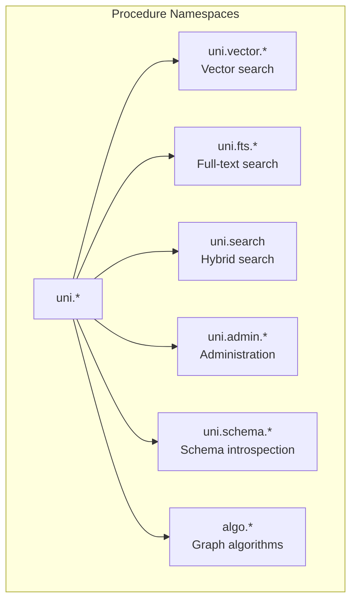

## Vector Search

<!-- doctest: skip -->
```cypher
CALL uni.vector.query(label, property, query_vector, k [, filter] [, threshold] [, options])
YIELD node, score, distance, vector_score, rerank_score, vid
```

| Parameter | Type | Description |
|---|---|---|
| `label` | String | Vertex label to search |
| `property` | String | Vector property name |
| `query_vector` | List\<Float\> or String | Embedding vector or text (auto-embedded) |
| `k` | Integer | Number of results |
| `filter` | String (optional) | WHERE predicate string |
| `threshold` | Float (optional) | Minimum similarity score |
| `options` | Map (optional) | Reranker configuration (see [Cross-Encoder Reranking](#cross-encoder-reranking)) |

**Example — basic vector search:**

```cypher
CALL uni.vector.query('Document', 'embedding', $query_vector, 10)
YIELD node, score
RETURN node.title, score
ORDER BY score DESC
```

**Example — vector search with filtering:**

```cypher
CALL uni.vector.query('Document', 'embedding', $query_vector, 20, 'category = "tech"')
YIELD node, score
WHERE score > 0.7
RETURN node.title, score
```

**Example — auto-embedding (when embedding config exists):**

```cypher
CALL uni.vector.query('Document', 'embedding', 'graph databases for beginners', 5)
YIELD node, score
RETURN node.title, score
```

Score normalization: Returns a 0-1 similarity score regardless of distance metric. Uses metric-aware conversion: Cosine → `(2-d)/2`, L2 → `1/(1+d)`, Dot → pass-through.

Dimension check: the query vector's length must match the column's declared `VECTOR(dim)` — a mismatch errors with "vector dimension mismatch" (since 2.5.0; previously it silently returned 0 rows). The same check applies to the dense arm of hybrid search. See [Vector Dimension Enforcement](#vector-dimension-enforcement).

**Example — vector search with cross-encoder reranking:**

```cypher
CALL uni.vector.query('Document', 'embedding', 'graph databases', 10,
    null, null,
    {reranker: 'rerank/minilm', reranker_property: 'content'})
YIELD node, score, rerank_score
RETURN node.title, score
ORDER BY score DESC
```

## similar_to() Expression Function

`similar_to()` is a unified similarity scoring expression that can be used directly in `RETURN`, `WHERE`, and `ORDER BY` clauses — no `CALL`/`YIELD` boilerplate required.

<!-- doctest: skip -->
```cypher
similar_to(source, query [, options]) → Float
```

Unlike the `uni.vector.query` / `uni.fts.query` / `uni.search` procedures which are standalone scan operators, `similar_to()` is a **per-row expression** evaluated inline within any `MATCH` query. It supports three scoring modes that are auto-detected from argument types:

### `~=` Operator vs `similar_to()` Function

Uni provides two syntaxes for similarity search. They serve **different purposes**:

| Syntax | What It Does | Best For |
|---|---|---|
| `n.embedding ~= $query` | **Top-K index scan** — desugars to `uni.vector.query` procedure, returns nearest neighbors from the vector index | "Find the 10 most similar documents from millions" |
| `similar_to(n.embedding, $q)` | **Per-row scoring** — evaluates inline within `MATCH`, scores each already-bound node | "Score this matched node's similarity" |
| `similar_to([sources], [queries])` | **Hybrid fusion** — combines vector + FTS scores via RRF or weighted fusion in a single expression | "Rank by combined semantic + keyword relevance" |

The `~=` operator is **vector-only** and cannot do FTS or hybrid search. For hybrid search, use `similar_to()` with multi-source arrays.

> **Common confusion:** `=~` is regex match (`n.name =~ '(?i)john'`), `~=` is vector similarity. They are unrelated operators.

### Scoring Modes

| Source Type | Query Type | Mode | Behavior |
|---|---|---|---|
| Vector property | Vector literal | **Vector** | Metric-aware similarity per row (cosine, L2, or dot — resolved from vector index) |
| Vector property (with embedding config) | String literal | **AutoEmbed** | Auto-embeds query string once, then metric-aware similarity per row |
| String property (with FTS index) | String literal | **FTS** | BM25 full-text search, normalized via `score / (score + fts_k)` saturation to [0, 1] |

### Single-Source Examples

```cypher
// Vector-to-vector cosine similarity
MATCH (d:Doc)
RETURN d.title, similar_to(d.embedding, $query_vector) AS score
ORDER BY score DESC

// Auto-embed: string query → embedded → cosine against stored vectors
MATCH (d:Doc)
RETURN d.title, similar_to(d.embedding, 'graph databases') AS score
ORDER BY score DESC

// FTS: BM25 scoring (requires FULLTEXT INDEX on d.content)
MATCH (d:Doc)
RETURN d.title, similar_to(d.content, 'distributed systems') AS score
ORDER BY score DESC

// In WHERE clause for filtering
MATCH (d:Doc)
WHERE similar_to(d.embedding, $query_vector) > 0.8
RETURN d.title
```

### Multi-Source Fusion

Combine multiple scoring sources into a single fused score:

```cypher
// Multi-source: vector + FTS fusion (RRF by default)
MATCH (d:Doc)
RETURN d.title,
  similar_to([d.embedding, d.content], [$query_vector, 'search term']) AS score
ORDER BY score DESC

// Multi-source with weighted fusion
MATCH (d:Doc)
RETURN d.title,
  similar_to(
    [d.embedding, d.content],
    [$query_vector, 'search term'],
    {method: 'weighted', weights: [0.7, 0.3]}
  ) AS score
ORDER BY score DESC
```

### Correct vs Incorrect Hybrid Search

**Correct — single `similar_to` with multi-source arrays and fusion:**
```cypher
MATCH (d:Doc)
RETURN d.title,
  similar_to([d.embedding, d.content], [$qvec, $qtxt]) AS score
ORDER BY score DESC
```
This uses RRF fusion by default, with proper BM25 score normalization (saturation to [0, 1]).

**Incorrect — naive addition of two separate calls:**
```cypher
// DON'T DO THIS: scores are on different scales, no normalization
MATCH (d:Doc)
RETURN d.title,
  (similar_to(d.embedding, $qvec) + similar_to(d.content, $qtxt)) AS score
ORDER BY score DESC
```
Adding raw scores mixes incompatible scales (cosine similarity [0, 1] vs unbounded BM25). The multi-source form normalizes BM25 via `score / (score + fts_k)` before fusion.

### Options Map

| Option | Type | Default | Description |
|---|---|---|---|
| `method` | String | `'rrf'` | Fusion method: `'rrf'` or `'weighted'` |
| `weights` | List\<Float\> | Equal | Per-source weights for weighted fusion (must sum to 1.0) |
| `k` | Integer | `60` | RRF constant (higher = less weight to rank position) |
| `fts_k` | Float | `1.0` | BM25 saturation constant: `score / (score + fts_k)` |

### Implementation

`similar_to()` is implemented as a custom DataFusion `PhysicalExpr` (`SimilarToExecExpr`) that carries an `Arc<GraphExecutionContext>` for storage and embedding model access. This means it runs **inside DataFusion's columnar engine** with full optimizer support (pushdown, projection pruning, parallel execution), unlike the fallback row-by-row executor previously used.

Key optimizations:
- **FTS pre-computed per-batch**: Calls `storage.fts_search()` once per RecordBatch, builds `HashMap<Vid, f32>` for O(1) per-row lookups
- **Auto-embed per-batch**: Embeds query string once per batch, then cosine per-row
- **Async-in-sync**: Uses `std::thread::scope` + `tokio::runtime::Builder::new_current_thread()` for async storage calls within sync `PhysicalExpr::evaluate()`

### Execution Paths

`similar_to()` has two execution paths depending on context:

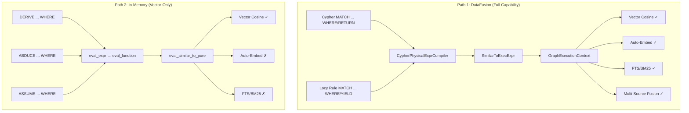

**Path 1 — DataFusion (Cypher queries and Locy rule evaluation):**
All `MATCH ... WHERE` and `YIELD` expressions — whether in standalone Cypher or inside Locy rules — are compiled to DataFusion `FilterExec` / projection plans via `CypherPhysicalExprCompiler`. This creates `SimilarToExecExpr` with full `GraphExecutionContext` access: auto-embedding, FTS search, multi-source fusion all work.

**Path 2 — In-memory (Locy command dispatch):**
`DERIVE`, `ABDUCE`, and `ASSUME` commands execute **after strata converge**. They operate on already-materialized `Vec<Row>` facts and use `eval_expr()` for WHERE filtering. This path calls `eval_similar_to_pure()`, which only supports vector-vector cosine similarity — no storage or schema access is available.

**Why two paths?** Locy execution is two-phase:

1. **Strata evaluation** (DataFusion): Plans and executes rules via `LocyProgramExec` → fixpoint iteration → converged facts stored in `DerivedStore` as `RecordBatch`es.
2. **Command dispatch** (row-level): Takes converged facts as `Vec<Row>` and applies commands — DERIVE generates mutations, ABDUCE does hypothetical reasoning with savepoints, ASSUME tests hypothetical mutations. These are not queries; they're fact-application operations that iterate over rows.

The `GraphExecutionContext` and `SessionContext` are available in `NativeExecutionAdapter` at command dispatch time but are not currently threaded through to `eval_function()`. This is a known limitation, not a fundamental constraint.

| Context | Execution Path | Vector | Auto-Embed | FTS | Multi-Source |
|---|---|---|---|---|---|
| Cypher `MATCH ... WHERE/RETURN` | DataFusion | Yes | Yes | Yes | Yes |
| Locy rule `MATCH ... WHERE/YIELD` | DataFusion | Yes | Yes | Yes | Yes |
| Locy rule `ALONG / FOLD` | DataFusion | Yes | Yes | Yes | Yes |
| `DERIVE ... WHERE` | In-memory | Yes | No | No | No |
| `ABDUCE ... WHERE` | In-memory | Yes | No | No | No |
| `ASSUME ... WHERE` | In-memory | Yes | No | No | No |

## Sparse Vectors

Uni supports **learned-sparse retrieval** (SPLADE-style): instead of a dense embedding, a model emits a high-dimensional, mostly-zero weight vector over a term vocabulary. Each non-zero entry is a `(term_id, weight)` pair, and relevance is the **sparse dot product** of query and document vectors. Sparse vectors complement dense vectors — they capture exact-term signal (lexical match) that dense embeddings tend to smear away — and are a first-class arm of [Hybrid Search](#hybrid-search).

### The `sparse_vector(N)` Type

A sparse-vector property is declared with the Cypher type `sparse_vector(N)` (Rust: `DataType::SparseVector { dimensions: N }`), where `N` is the **term-space cardinality** — the size of the vocabulary, i.e. `max_term_id + 1`. It bounds the index space; the value itself stores only its non-zero entries.

```cypher
CREATE (:Doc {
  content: 'graph databases for beginners',
  emb: sparse_vector(30522)        // 30 522-term vocabulary (e.g. BERT WordPiece)
})
```

In the Rust schema builder:

```rust
db.schema()
    .label("Doc")
    .property("content", DataType::String)
    .property_nullable("emb", DataType::SparseVector { dimensions: 30522 })
    .apply()
    .await?;
```

### Value Shape

A sparse-vector value is a `{indices, values}` map: `indices` is the list of non-zero term ids, `values` the parallel list of their weights. The two lists must be the same length; `indices` are term ids in `[0, N)`.

```cypher
// Literal write of a 3-term sparse vector
CREATE (:Doc {emb: {indices: [12, 884, 9001], values: [0.71, 0.33, 1.20]}})
```

The same `{indices, values}` shape is accepted as the query value for `uni.sparse.query` (a native sparse vector is also accepted directly).

### Storage Layout

On disk a sparse-vector column is an **Arrow struct of two lists** — `indices` (a list of integer term ids) and `values` (a list of `f32` weights) — one struct entry per row. This is the columnar analogue of the `{indices, values}` map: only non-zeros are materialized, so storage scales with vector sparsity, not with the vocabulary size `N`.

### The Sparse Index

A sparse index is created as a `VECTOR INDEX` with `type: 'sparse'` (see Part VI, [Vector Indexes](#vector-indexes-hnsw-ivf-pq-flat)):

```cypher
CREATE VECTOR INDEX idx_sparse FOR (d:Doc) ON (d.emb)
  OPTIONS { type: 'sparse', quantize: false }
```

| Option | Type | Default | Description |
|---|---|---|---|
| `type` | String | — | Must be `'sparse'` to select the learned-sparse index kind |
| `quantize` | Bool | `true` | `true` = 8-bit term-weight quantization (smaller, lossy); `false` = lossless `f32` weights |

Quantization defaults **on** (8-bit) for compactness; set `quantize: false` when exact weight fidelity matters more than index size.

### `uni.sparse.query`

<!-- doctest: skip -->
```cypher
CALL uni.sparse.query(label, property, query, k [, filter] [, threshold] [, options])
YIELD vid, score, rerank_score
```

| Parameter | Type | Description |
|---|---|---|
| `label` | String | Vertex label to search |
| `property` | String | `SparseVector` property name |
| `query` | Map or SparseVector | Query as a `{indices, values}` map or a native sparse vector |
| `k` | Integer | Number of results |
| `filter` | String (optional) | WHERE predicate string |
| `threshold` | Float (optional) | Minimum score |
| `options` | Map (optional) | Reranker configuration (see [Cross-Encoder Reranking](#cross-encoder-reranking)) |

The YIELD columns are exactly **`vid`, `score`, `rerank_score`** — there is no `sparse_score` or `distance` column here (those names belong to the hybrid `uni.search` YIELD). **`score` is the raw sparse dot product** of the query and stored vectors (not a normalized [0, 1] similarity), with larger meaning more relevant. `rerank_score` is populated only when a cross-encoder reranker is configured in `options`.

```cypher
// Sparse retrieval over a SPLADE column, top 10
CALL uni.sparse.query('Doc', 'emb',
    {indices: [12, 884, 9001], values: [0.71, 0.33, 1.20]}, 10)
YIELD vid, score
RETURN vid, score
ORDER BY score DESC
```

The query is **MVCC- and L0-aware**: candidates retrieved from the index are exact-rescored against the live row state, so freshly written or updated sparse vectors that have not yet been flushed into the index are scored correctly rather than served stale.

### Best Practices

- **Pair sparse with dense, don't choose.** Sparse retrieval recovers exact-term matches that dense embeddings miss; the two are most effective fused through [Hybrid Search](#hybrid-search), not used in isolation.
- **Auto-embed from one model.** With a hybrid alias (e.g. BGE-M3) you do not hand-build `{indices, values}`; declaring a `SparseVector` index over a text source and registering an `EmbedHybrid` alias fills the column from a forward pass. See [Hybrid Search](#hybrid-search) and [Host-Side Model Runtime (Uni-Xervo)](#host-side-model-runtime-uni-xervo).
- **Keep `N` honest.** `dimensions` must cover every term id the model can emit (`max_term_id + 1`); an undersized `N` silently drops or rejects high term ids.
- **Use `quantize: false` only when needed.** Lossless `f32` weights cost more space; the 8-bit default is sufficient for ranking in most workloads.

### Anti-Patterns

- **Reading `score` as a similarity.** Sparse `score` is an unbounded dot product, not a [0, 1] cosine. Do not threshold it on a `> 0.8`-style cutoff calibrated for dense search; calibrate against your own corpus.
- **Expecting a `sparse_score` / `distance` column.** Those columns exist only on `uni.search`; `uni.sparse.query` yields `vid, score, rerank_score`.

## Full-Text Search

<!-- doctest: skip -->
```cypher
CALL uni.fts.query(label, property, search_term, k [, filter] [, threshold] [, options])
YIELD node, score, fts_score, rerank_score, vid
```

BM25-based full-text search. Scores are normalized to 0-1 relative to the top match. Supports optional cross-encoder reranking via the `options` map.

```cypher
CALL uni.fts.query('Article', 'content', 'distributed graph database', 10)
YIELD node, score
RETURN node.title, score
```

**Tokenizer / analyzer configuration (3.0.0).** Full-text indexes honor tokenizer, stemmer, and stop-word configuration set at index-create time — previously every FTS index used Lance's default "simple" tokenizer regardless of options, making CJK / multilingual text effectively unindexable:

```cypher
CREATE FULLTEXT INDEX article_fts FOR (a:Article) ON EACH [a.content] OPTIONS {
  analyzer: 'standard', language: 'English', stemmer: 'english',
  stopwords: 'english', ascii_folding: true, lower_case: true,
  max_token_length: 40, ngram_min: 2, ngram_max: 3
}
```

18-language stemming and stop-words plus ngram tokenization are supported (`TokenizerConfig::Analyzer`); CJK requires dictionary files under `LANCE_LANGUAGE_MODEL_HOME`.

## Hybrid Search

```cypher
CALL uni.search(label, properties, query_text, query_vector, k, filter, options)
YIELD node, score, vector_score, fts_score, sparse_score, rerank_score, distance, vid
```

Combines vector, full-text, and (optionally) sparse search with score fusion. Arguments are **positional**: `query_vector` and `filter` are passed as `null` when not used.

The `properties` argument is a map `{vector, fts, sparse}` selecting which property feeds each arm. A bare string is shorthand for "use this same property for both the vector and FTS arms, sparse off."

| Option | Values | Description |
|---|---|---|
| `method` | `'rrf'` (default), `'weighted'`, `'dbsf'`, `'relative_score'` | Score fusion method (3.0.0 added `dbsf` = distribution-based z-score; `relative_score` = min-max + weighted) |
| `alpha` | 0.0 - 1.0 | Vector-vs-FTS weight (2-way `weighted` mode only) |
| `weights` | List\<Float\> `[vector, fts, sparse]` | Per-arm weights for 3-way `weighted` fusion |
| `rrf_k` | Integer (default: `60`) | RRF constant (higher = less weight to rank position) |
| `over_fetch` | Float (default: 2.0) | Over-fetch factor for pagination |
| `sparse_query` | Map or SparseVector | Query vector for the sparse arm (`{indices, values}` or native) |
| `reranker` | String | Cross-encoder alias, **or** `'maxsim'` for multi-vector/ColBERT late-interaction rerank |
| `reranker_property` | String | Node text property for cross-encoder document input |
| `reranker_k` | Integer (default: k×3) | Over-fetch for reranking (clamped to [k, 1000]) |
| `reranker_query` | String | Override query text for cross-encoder |
| `maxsim_query` | List\<Vector\> | Query token vectors for `reranker: 'maxsim'` |
| `maxsim_metric` | String | Distance metric for MaxSim late interaction |

> ANN tuning knobs (`nprobes`, `refine_factor`, `ef_search`) are **not** plumbed through `uni.search`; tune them at index-create time or via `uni.vector.query`.

```cypher
// Basic 2-way hybrid search with RRF
CALL uni.search('Document', {vector: 'embedding', fts: 'content'},
    'graph databases', null, 10, null, {})
YIELD node, score
RETURN node.title, score

// 2-way hybrid with cross-encoder reranking
CALL uni.search('Document', {vector: 'embedding', fts: 'content'},
    'graph databases', null, 10, null,
    {method: 'rrf', reranker: 'rerank/minilm', reranker_property: 'content'})
YIELD node, score, rerank_score, vector_score, fts_score
RETURN node.title, score
```

### 3-Way Hybrid (vector + FTS + sparse)

The sparse arm is **opt-in and requires two things together**: a `sparse:` key in the `properties` map **and** a `sparse_query` in `options`. Supplying only one of them is a **silent no-op** — the sparse arm simply does not run. When active, fuse all three arms with `method: 'weighted'` and a 3-element `weights: [vector, fts, sparse]`.

```cypher
// 3-way fusion: dense + lexical + learned-sparse, optionally MaxSim-reranked
CALL uni.search(
    'Document',
    {vector: 'embedding', fts: 'content', sparse: 'emb'},
    'graph databases',
    null,                         // query_vector (auto-embedded from query_text)
    10,
    null,                         // filter
    {
      method: 'weighted',
      weights: [0.5, 0.2, 0.3],   // [vector, fts, sparse]
      sparse_query: {indices: [12, 884, 9001], values: [0.71, 0.33, 1.20]},
      reranker: 'maxsim',         // multi-vector / ColBERT late interaction
      maxsim_query: $query_token_vectors
    })
YIELD node, score, vector_score, fts_score, sparse_score, rerank_score, distance
RETURN node.title, score
ORDER BY score DESC
```

Here the full YIELD surface is available: `vector_score`, `fts_score`, and `sparse_score` carry the per-arm contributions, `score` the fused (or reranked) final score, `rerank_score` the late-interaction score when `reranker` is set, and `distance` the raw vector distance.

### Single-Pass BGE-M3 Hybrid (`EmbedHybrid`)

The cleanest way to feed a 3-way hybrid is one model that emits all three representations at once. **BGE-M3** does exactly this: a single forward pass yields a dense embedding, a learned-sparse vector, and a multi-vector / ColBERT token matrix. Uni models this as **one catalog alias** with task `EmbedHybrid` (provider `local/onnx`, model `aapot/bge-m3-onnx`).

```json
{
  "alias": "embed/bge-m3",
  "task": "EmbedHybrid",
  "provider_id": "local/onnx",
  "model_id": "aapot/bge-m3-onnx"
}
```

The key move is **sharing one alias and one source property across three index configs**. You declare three destination columns of different `DataType`s, each pointing its `embedding: { alias, source }` at the same alias and the same text source:

| Destination `DataType` | Routed head | Index |
|---|---|---|
| `Vector` | dense | dense vector index |
| `SparseVector` | sparse | sparse index (`type: 'sparse'`) |
| `List<Vector>` | multi-vector | multi-vector / ColBERT index |

Because the alias and source match, the engine treats the three configs as **one hybrid group and runs a single forward pass**, fanning the result out to the three columns. **Head routing is inferred from the destination column's `DataType`** — `Vector` → dense, `SparseVector` → sparse, `List<Vector>` → multi-vector — so there is **no `head:` sub-key** to set. At index-open time a capability check enforces that the heads required by the declared columns are a subset of the heads the alias actually exposes (`required_heads ⊆ available_heads`); a mismatch fails fast at open rather than silently producing empty columns.

```rust
// One EmbedHybrid alias + one source ("content") → three columns, one pass.
let hybrid = EmbeddingCfg {
    alias: "embed/bge-m3".into(),
    source_properties: vec!["content".into()],
    ..Default::default()
};

db.schema()
    .label("Doc")
    .property("content", DataType::String)
    .property_nullable("embedding", DataType::Vector { dimensions: 1024 })
    .property_nullable("emb", DataType::SparseVector { dimensions: 250002 })
    .property_nullable("tokens", DataType::List(Box::new(DataType::Vector { dimensions: 1024 })))
    .index("embedding", dense_index_with(hybrid.clone()))         // → dense head
    .index("emb", IndexType::sparse_with_embedding(250002, hybrid.clone())) // → sparse head
    .index("tokens", dense_index_with(hybrid.clone()))            // → multi-vector head
    .apply()
    .await?;
```

> A passing end-to-end test of this exact pattern (mock 3-head hybrid model, all three columns round-tripping post-flush, pre-flush L0, deferred-batch, and Cypher literal) lives at `crates/uni/tests/bge_m3_hybrid_3way.rs`.

The `EmbedHybrid` alias is dispatched through the same host-side model runtime as every other embedding — see [Host-Side Model Runtime (Uni-Xervo)](#host-side-model-runtime-uni-xervo) for catalog configuration, prefetch, and the `uni-xervo` types (`HybridEmbeddingModel`, `HeadSet`) that back it.

## Host-Side Model Runtime (Uni-Xervo)

Applications can access configured embedding and generation aliases directly through the host API:

```rust
use uni_xervo::Message;

let xervo = db.xervo();  // Always succeeds; individual methods error if unconfigured

let vectors = xervo
    .embed("embed/default", &["graph databases for beginners"])
    .await?;

let answer = xervo
    .generate(
        "llm/default",
        &[
            Message::system("You summarize technical material."),
            Message::user("Explain what snapshot isolation means in Uni."),
        ],
        GenerationOptions::default(),
    )
    .await?;

// Convenience wrapper — each string is treated as a user message
let quick = xervo
    .generate_text(
        "llm/default",
        &["List three use cases for hybrid search."],
        GenerationOptions::default(),
    )
    .await?;
```

- `embed(alias, texts)` returns `Vec<Vec<f32>>`
- `rerank(alias, query, documents)` returns `Vec<ScoredDoc>` — cross-encoder relevance scoring for reranking search results
- `generate(alias, messages, options)` accepts `&[Message]` with roles `system`, `user`, `assistant` and a `GenerationOptions` struct
- `generate_text(alias, messages, options)` is a convenience wrapper — each string becomes a user message
- `prefetch(aliases)` pre-loads and caches specific model aliases — downloads model files, builds sessions, runs warmup
- `prefetch_all()` pre-loads every model in the catalog
- `raw_runtime()` exposes the underlying `ModelRuntime` for advanced orchestration
- `GenerationOptions` supports `max_tokens`, `temperature`, `top_p` fields

**Sharing a runtime across databases.** A `ModelRuntime` owns its providers, its
catalog, and its cache of loaded models, so a database built from a catalog holds
its own copy of every model's weights. `UniBuilder::xervo_runtime(Arc<ModelRuntime>)`
takes an already-built runtime instead, and `UniXervo::raw_runtime()` hands one
back out — N databases then share one resident copy. `uni_db::xervo::build_model_runtime`
is the single definition of the provider registration `cfg` chain; both
`UniBuilder::build` and the Python `ModelRuntime` constructor route through it so
the enabled-provider set cannot drift between them.

The prebuilt path validates only that each alias the persisted schema references
is *present* in the runtime's catalog. The per-alias head-capability check
(`embed_caps::text_embedding_heads`) requires `spec.task`, which uni-xervo does not
expose publicly, so a task mismatch on a shared runtime surfaces at first inference
rather than at open. The catalog path checks both.

**Best practice — prefetch at startup:**

```rust
let xervo = db.xervo();
xervo.prefetch(&["embed/default", "llm/default"]).await?;
// All subsequent embed/generate calls skip cold-start latency
```

Both `prefetch` methods are awaitable and fail-fast. Use them instead of relying on first-call lazy loading, especially in latency-sensitive pipelines. For models that must be available at startup, prefer `warmup: "Eager"` in the catalog with `required: true`.

This is the same runtime used by vector-index auto-embedding on writes, by text-query auto-embedding in `uni.vector.query(...)` / `similar_to(...)`, and by cross-encoder reranking in search procedures.

## Cross-Encoder Reranking

All three search procedures support an optional **cross-encoder reranking** stage. A cross-encoder jointly attends to a (query, document) pair to produce a more accurate relevance score than bi-encoder similarity or BM25, but is too expensive to run on the full corpus. It runs on a small over-fetched candidate set for fast retrieval with high-precision final ranking.

**Pipeline:** `Retrieval (vector/FTS/hybrid) → Over-fetch reranker_k candidates → Cross-encoder scores (query, doc) pairs → Top k returned`

Reranking is opt-in — enabled by adding `reranker` to the options map of any search procedure.

### Reranker Options

| Option | Type | Default | Description |
|---|---|---|---|
| `reranker` | String | `null` (disabled) | Xervo model alias (e.g. `'rerank/minilm'`) |
| `reranker_property` | String | FTS property (hybrid/FTS) or required (vector) | Text property fed as cross-encoder "document" |
| `reranker_k` | Integer | `k × 3` | Candidates to over-fetch for reranking (clamped to [k, 1000]) |
| `reranker_query` | String | Query arg | Override query text. Required when `uni.vector.query` receives a pre-computed vector |

When reranking is active, `score` reflects the reranker score and `rerank_score` is populated. Original retrieval scores (`vector_score`, `fts_score`, `distance`) remain available.

### Available Providers

| Provider | Provider ID | Model Example | Type |
|---|---|---|---|
| ONNX (local) | `local/onnx` | `cross-encoder/ms-marco-MiniLM-L6-v2` | Local CPU inference, `provider-onnx` feature |
| Cohere | `remote/cohere` | `rerank-english-v3.0` | Remote API |
| Voyage AI | `remote/voyageai` | `rerank-2` | Remote API |

### Catalog Configuration

```json
{
  "alias": "rerank/minilm",
  "task": "Rerank",
  "provider_id": "local/onnx",
  "model_id": "cross-encoder/ms-marco-MiniLM-L6-v2"
}
```

### Reranking Does Not Apply to `similar_to()`

`similar_to()` is a per-row scalar expression with no bounded candidate set. Cross-encoders are only effective on small candidate sets, so reranking is limited to the three search procedures.

## Admin Procedures

### Compaction

```cypher
// Trigger manual compaction
CALL uni.admin.compact()
YIELD success, files_compacted, bytes_before, bytes_after, duration_ms

// Check compaction status
CALL uni.admin.compactionStatus()
YIELD l1_runs, l1_size_bytes, in_progress, pending, total_compactions, total_bytes_compacted
```

### Snapshots

```cypher
// Create snapshot
CALL uni.admin.snapshot.create('release-v1.0')
YIELD snapshot_id

// List snapshots
CALL uni.admin.snapshot.list()
YIELD snapshot_id, name, created_at, version_hwm

// Restore snapshot
CALL uni.admin.snapshot.restore($snapshot_id)
YIELD status
```

### Declared Plugins (`uni.plugin.declare*`)

Define new extensions from inside Cypher (Uni's `apoc.custom` analogue). The definitions are persisted (`_DeclaredPlugin` node + JSON sidecar) and survive restart. Cycle detection, dependency-missing detection, and drop-with-dependents protection are enforced.

```cypher
// A scalar function whose body is Cypher:
CALL uni.plugin.declareFunction(
  'myco.discount', '(price: float, pct: float) -> float',
  'cypher', 'RETURN price * (1.0 - pct)')
// A procedure (WRITE mode requires Capability::ProcedureWrites):
CALL uni.plugin.declareProcedure('myco.reindex', '...', 'cypher', '...')
CALL uni.plugin.declareAggregate('myco.wmean', ...)
// 3.0.0: declareTrigger installs a REAL firing TriggerPlugin (was a no-op procedure).
// Event filter: CREATE|UPDATE|DELETE [ON :Label | -[:Type]-] [WHEN pred] [ASYNC]; binds $vid/$label/$event_kind.
CALL uni.plugin.declareTrigger('myco.audit', 'Account', 'AfterCommit', ...)
CALL uni.plugin.listDeclared()              // enumerate declared extensions
CALL uni.plugin.dropDeclared('myco.discount')
```

### Background Job Procedures (`uni.periodic.*`)

Schedule recurring or one-shot maintenance jobs against registered `BackgroundJobProvider`s (see [Part XVII](#part-xvii-plugin-framework)). Schedules and job state are durable (`_BackgroundJob` node + `background_jobs.json`).

```cypher
CALL uni.periodic.schedule('uni.system.ttl_sweep', 'cron', '0 */5 * * * *')  // (qname, kind, schedule_arg)
CALL uni.periodic.cancel('uni.system.ttl_sweep')                              // yields true if a job was removed
CALL uni.periodic.list()                                                      // one row per known job
CALL uni.periodic.submit('MATCH (n:Stale) DETACH DELETE n')                   // run one write-mode batch now
CALL uni.periodic.iterate('MATCH (n:Big) RETURN n', 'DETACH DELETE n', '{}')  // (query, mutating_query, options_json)
CALL uni.periodic.commit()                                                    // sync sentinel (v1 no-op)
```

Schedule kinds: `once` / `periodic` / `cron` / `manual`. Built-in jobs: `uni.system.ttl_sweep` and `uni.system.compaction` are wired to real host hooks; `uni.system.statistics_refresh` is a stub pending a planner statistics API. A `CircuitBreaker` opens a job after 10 consecutive failures (30 s cooldown). The Rust API exposes `Uni::periodic_schedule` / `periodic_cancel` / `periodic_list`.

## Schema Introspection

```cypher
// List all labels
CALL uni.schema.labels()
YIELD label, propertyCount, nodeCount, indexCount

// List edge types
CALL uni.schema.edgeTypes()
YIELD type, propertyCount, sourceLabels, targetLabels

// Label details
CALL uni.schema.labelInfo('Person')
YIELD property, dataType, nullable, indexed, unique

// List indexes
CALL uni.schema.indexes()
YIELD name, type, label, state, properties

// List constraints
CALL uni.schema.constraints()
YIELD name, type, enabled, properties, target
```

## DDL via Cypher

### Labels

```cypher
CREATE LABEL Person ( name STRING, age INTEGER, email STRING UNIQUE )
ALTER LABEL Person ADD PROPERTY phone STRING
ALTER LABEL Person DROP PROPERTY age
ALTER LABEL Person RENAME PROPERTY name TO full_name
DROP LABEL IF EXISTS Person
```

### Edge Types

```cypher
CREATE EDGE TYPE KNOWS (weight FLOAT) FROM Person TO Person
ALTER EDGE TYPE KNOWS ADD PROPERTY since DATE
DROP EDGE TYPE IF EXISTS KNOWS
```

### Indexes

```cypher
CREATE INDEX idx_name FOR (p:Person) ON (p.name)
CREATE VECTOR INDEX idx_embed FOR (d:Document) ON (d.embedding) OPTIONS { metric: 'cosine' }
CREATE FULLTEXT INDEX idx_content FOR (a:Article) ON EACH [a.content]
CREATE JSON FULLTEXT INDEX idx_meta FOR (d:Data) ON metadata
DROP INDEX idx_name
```

### Constraints

```cypher
CREATE CONSTRAINT email_unique ON (p:Person) ASSERT p.email IS UNIQUE
CREATE CONSTRAINT product_sku_key ON (p:Product) ASSERT p.sku IS KEY
DROP CONSTRAINT constraint_name
```

### SHOW Commands

```cypher
SHOW DATABASE       // Database metadata
SHOW INDEXES        // All indexes with status
SHOW CONSTRAINTS    // All constraints
SHOW CONFIG         // Current configuration
SHOW STATISTICS     // Storage statistics
```

### Admin Commands

```cypher
VACUUM              // Reclaim space
CHECKPOINT          // Force flush
BACKUP TO '/path/to/backup'
COPY Person TO '/path/to/file' WITH {format: 'csv'}
COPY Person FROM '/path/to/file' WITH {format: 'parquet'}
```

## Time Travel

Query historical data using snapshots or timestamps:

```cypher
// By snapshot ID
MATCH (n:Person) VERSION AS OF 'snapshot-abc123'
RETURN n.name, n.age

// By timestamp
MATCH (n:Person) TIMESTAMP AS OF '2025-01-15T12:00:00Z'
RETURN n.name, n.age
```

## EXPLAIN and PROFILE

```cypher
// Show query plan without executing
EXPLAIN MATCH (n:Person)-[:KNOWS]->(m:Person) RETURN n, m

// Execute and show timing per operator
EXPLAIN MATCH (n:Person)-[:KNOWS]->(m:Person) RETURN n, m
```

---

# Part IX: Graph Algorithms

Uni includes **42 graph algorithms** organized by category, accessible as procedures via `CALL algo.*`.

## Algorithm Catalog

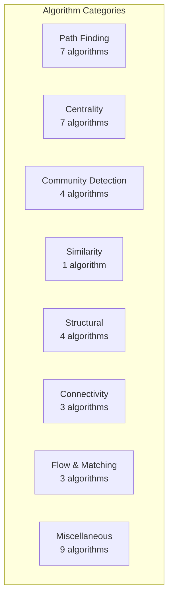

### Path Algorithms

| Procedure | Description | Use Case |
|---|---|---|
| `algo.dijkstra` | Single-source shortest path (weighted) | Navigation, routing |
| `algo.bidirectionalDijkstra` | Bidirectional shortest path | Faster point-to-point |
| `algo.bellmanFord` | Shortest path with negative weights | Financial arbitrage |
| `algo.astar` | A* with heuristic guidance | Spatial routing |
| `algo.kShortestPaths` | K distinct shortest paths | Alternative routes |
| `algo.allSimplePaths` | All simple paths between nodes | Dependency analysis |
| `algo.allPairsShortestPath` | Floyd-Warshall for all pairs | Network diameter |

### Centrality Algorithms

| Procedure | Description | Use Case |
|---|---|---|
| `algo.degreeCentrality` | Vertex degree (in/out/total) | Hub identification |
| `algo.betweenness` | Shortest-path betweenness | Bridge nodes, bottlenecks |
| `algo.closeness` | Average distance to all others | Information spread |
| `algo.harmonic` | Harmonic centrality | Disconnected graphs |
| `algo.eigenvector` | Eigenvector centrality (iterative) | Influence measurement |
| `algo.katz` | Katz centrality | Status in social networks |
| `algo.pagerank` | PageRank (iterative) | Web ranking, importance |

### Community Detection

| Procedure | Description | Use Case |
|---|---|---|
| `algo.wcc` | Weakly Connected Components (union-find) | Cluster identification |
| `algo.scc` | Strongly Connected Components (Tarjan) | Cycle groups |
| `algo.louvain` | Louvain modularity optimization | Community structure |
| `algo.labelPropagation` | Label propagation (semi-synchronous) | Fast community detection |

### Similarity

| Procedure | Description | Use Case |
|---|---|---|
| `algo.nodeSimilarity` | Jaccard neighborhood overlap | Similar users/items |

### Structural

| Procedure | Description | Use Case |
|---|---|---|
| `algo.triangleCount` | Count triangles | Clustering coefficient |
| `algo.topologicalSort` | DAG topological ordering | Build systems, dependencies |
| `algo.cycleDetection` | Detect cycles | Deadlock detection |
| `algo.bipartiteCheck` | Bipartite graph verification | Two-coloring |

### Connectivity

| Procedure | Description | Use Case |
|---|---|---|
| `algo.bridges` | Bridge edge detection | Network reliability |
| `algo.articulationPoints` | Cut vertex detection | Single points of failure |
| `algo.kcore` | K-core decomposition | Dense subgraph discovery |

### Flow & Matching

| Procedure | Description | Use Case |
|---|---|---|
| `algo.fordFulkerson` | Maximum flow | Network capacity |
| `algo.dinic` | Maximum flow (Dinic's) | Large flow networks |
| `algo.maxMatching` | Maximum cardinality matching | Assignment problems |

### Miscellaneous

| Procedure | Description | Use Case |
|---|---|---|
| `algo.mst` | Minimum spanning tree (Kruskal) | Network design |
| `algo.randomWalk` | Random walk sampling | Graph embedding, sampling |
| `algo.elementaryCircuits` | All elementary cycles | Circuit analysis |
| `algo.maximalCliques` | Maximal clique enumeration | Dense groups |
| `algo.graphColoring` | Graph coloring | Scheduling, register allocation |
| `algo.graphMetrics` | Global metrics (diameter, density, avg clustering) | Graph summary |

## Execution Modes

Algorithms run in one of two modes depending on their computational requirements:

```mermaid
graph TB
    Q[Algorithm Request] --> LIGHT{Light Algorithm?<br/>Single path, reachability}
    LIGHT -->|Yes| DT[DirectTraversal<br/>Zero-copy BFS<br/>AdjacencyManager + L0]
    LIGHT -->|No| HEAVY{Heavy Algorithm?<br/>PageRank, WCC, Louvain}
    HEAVY -->|Yes| GP[GraphProjection<br/>Materialized Dense CSR<br/>1 GB default, 100M vertex limit]

    DT --> FAST[Fast Startup<br/>Streaming Results]
    GP --> BULK[Full Materialization<br/>Iterative Computation]
```

### DirectTraversal

- **Zero-copy BFS** on `AdjacencyManager` + `L0Buffer`
- Used for: shortest path, reachability, single-source queries
- **Fast startup**: No materialization needed
- **Streaming results**: Results available as traversal progresses

### GraphProjection

- **Materialized dense CSR** graph in memory
- Used for: PageRank, WCC, Louvain, betweenness, eigenvector, etc.
- **Configuration**: `ProjectionBuilder` with `node_labels()`, `edge_types()`, `include_reverse()`, `build()`
- **Limits**: `max_projection_memory` (1 GB default), `max_vertices` (100M default)

## Running Algorithms

### Example: PageRank

```cypher
CALL algo.pagerank({
    nodeLabels: ['Person'],
    edgeTypes: ['KNOWS'],
    dampingFactor: 0.85,
    maxIterations: 20,
    tolerance: 0.0001
})
YIELD nodeId, score
RETURN nodeId, score
ORDER BY score DESC
LIMIT 10
```

### Example: Shortest Path

```cypher
CALL algo.dijkstra({
    startNode: $start_vid,
    endNode: $end_vid,
    edgeTypes: ['ROAD'],
    weightProperty: 'distance'
})
YIELD path, totalCost
RETURN path, totalCost
```

### Example: Community Detection

```cypher
CALL algo.louvain({
    nodeLabels: ['Person'],
    edgeTypes: ['KNOWS'],
    maxIterations: 10
})
YIELD nodeId, communityId
RETURN communityId, count(*) AS size
ORDER BY size DESC
```

### Example: Weakly Connected Components

```cypher
CALL algo.wcc({
    nodeLabels: ['Device'],
    edgeTypes: ['CONNECTED_TO']
})
YIELD nodeId, componentId
RETURN componentId, collect(nodeId) AS members
```

## Extending the Catalog — GraphView & GraphCompute

The 35 algorithms above are native. **Custom** graph algorithms are authored through the plugin framework's `AlgorithmProvider` surface ([Part XVII](#part-xvii-plugin-framework)), which offers two paths:

- **In-process (`GraphView`)** — an algorithm authored in Rust obtains a read-only CSR topology snapshot via `AlgorithmHost::project(&GraphProjectionSpec) -> Arc<dyn GraphView>` and walks it with dense-slot accessors (`out_neighbors` / `out_degree` / `out_weight` / `to_vid` / …). First-party `uni.algo.reachability`, `uni.algo.pagerank`, `uni.algo.sssp`, and `uni.path.expand` are authored purely against this surface. Gated by `Capability::HostQuery`.
- **Guest-authored (`GraphCompute`)** — the same graph algorithms can be authored in **Rhai, Python, WASM, or Extism**, driving coarse native kernels over opaque handles ("conductor, not worker"). First-party `uni.algo.gcpagerank` / `gcwalks` / `gcoverlap` dogfood it. See [§GraphCompute — Guest-Authorable Graph Algorithms](#graphcompute--guest-authorable-graph-algorithms) for the kernel catalog, determinism guarantees, and budgets.

Both paths dispatch through `CALL` alongside the built-in `algo.*` procedures (miss-only, so a custom `uni.algo.*` never shadows a built-in).

## Algorithm Best Practices

| Practice | Details |
|---|---|
| **Use DirectTraversal for single paths** | Much faster than GraphProjection for point queries |
| **Use GraphProjection for iterative algorithms** | PageRank, WCC, Louvain need full materialization |
| **Set iteration limits** | Prevent infinite loops in convergence algorithms |
| **Project only needed labels/types** | Smaller projection = faster execution + less memory. For **guest GraphCompute** projections this is now enforced: an unscoped projection (no `nodeLabels`/`edgeTypes`) fails loud — name them, or pass `{projectAll: true}` to deliberately take the whole graph. |

## Algorithm Anti-Patterns

| Anti-Pattern | Problem | Solution |
|---|---|---|
| **Full graph for single path** | GraphProjection wastes memory | Use DirectTraversal |
| **Ignoring convergence params** | Algorithm may not converge | Set `maxIterations` and `tolerance` |
| **Running on unprojected graph** | Processing irrelevant vertices/edges | Use `nodeLabels` and `edgeTypes` filters |

---

# Part X: Locy Framework

## What Is Locy?

**Locy** (Logic + Cypher) is a Datalog-inspired logic programming language that extends OpenCypher with **recursive rules**, **path-carried values**, **aggregation**, **graph derivation**, **hypothetical reasoning**, and **abductive inference**. Every valid Cypher query is valid Locy — it's a strict superset.

Locy enables reasoning over graphs that would be impossible or extremely awkward in plain Cypher:

- **Transitive closure**: "Find all nodes reachable from X through any chain of Y relationships"
- **Risk propagation**: "Compute cumulative fraud risk along payment chains"
- **Permission resolution**: "Resolve effective RBAC permissions with priority and inheritance"
- **Provenance tracking**: "Trace the full supply chain lineage of a component"
- **What-if analysis**: "What would happen if we added/removed this edge?"

## Design Philosophy

From the Locy design document:

1. **Cypher superset** — Every valid Cypher query works unchanged
2. **Compiler, not engine** — Locy compiles rules into Cypher AST objects. The existing query planner/executor runs them.
3. **No string roundtripping** — The orchestrator builds AST objects programmatically, never serializes to text
4. **Single parse location** — All parsing (Cypher + Locy) happens in `uni-cypher`
5. **Decoupled** — `uni-locy` depends on `uni-cypher` (ASTs), not on `uni-query` or `uni-store`

## Compilation Pipeline

```mermaid
graph LR
    SRC[Locy Source] --> PARSE[Parse<br/>Pest Grammar]
    PARSE --> AST[LocyProgram AST]
    AST --> MOD[Module Resolution<br/>USE declarations]
    MOD --> DEP[Dependency Graph<br/>Rule-to-rule refs]
    DEP --> STRAT[Stratify<br/>SCC Detection]
    STRAT --> WARD[Wardedness Check<br/>Prevent unsafe negation]
    WARD --> TYPE[Typecheck<br/>Variable inference]
    TYPE --> COMP[CompiledProgram<br/>Topological strata order]
```

1. **Parse**: Pest grammar (`locy.pest` stacked on `cypher.pest`) produces `LocyProgram` AST with rules and commands
2. **Module Resolution**: Resolve `USE module { rule1, rule2 }` imports
3. **Dependency Graph**: Build rule-to-rule reference graph
4. **Stratify**: Detect strongly connected components (SCCs) — these are recursive rule groups
5. **Wardedness Check**: Ensure negation is stratified (no recursive negation)
6. **Typecheck**: Infer variable types across rules
7. **Assemble**: Topological ordering of strata into `CompiledProgram`

## Rule Syntax

```
MODULE namespace.path
USE other.module { rule1, rule2 }

CREATE RULE ruleName [PRIORITY n] AS
    MATCH pattern
    WHERE conditions                     -- pre-aggregation filter
    [ALONG name = expr]
    [FOLD name = aggregate]
    [WHERE aggregate_condition]          -- post-FOLD filter (HAVING)
    [BEST BY expr [ASC|DESC], ...]
    [YIELD [KEY] expr [AS alias] [PROB], ...
    | DERIVE pattern, ... ]
```

### IS Reference (Rule Invocation)

Rules reference other rules using `IS`:

<!-- doctest: skip -->
```cypher
// 1-arg form: single subject
WHERE x IS reachable

// 2-arg form: pair matching
WHERE x IS reachable TO y

// Tuple form: multi-arg
WHERE (x, y) IS reachable

// Negation
WHERE x IS NOT compromised
```

### ALONG (Path-Carried Values)

Accumulate values along traversal paths:

```locy
CREATE RULE shortest_risk AS
    MATCH (a:Account)-[t:TRANSFER]->(b:Account)
    WHERE a IS flagged
    ALONG cumulative_risk = prev.risk + t.amount * 0.01
    YIELD KEY b, cumulative_risk
```

- `prev.fieldName` — access the accumulator from the previous hop
- Supports full Cypher arithmetic: `+`, `-`, `*`, `/`, `%`, `^`
- Supports logical operators: `AND`, `OR`, `XOR`

### FOLD (Aggregation)

Aggregate across paths:

```locy
CREATE RULE total_exposure AS
    MATCH (a:Account)-[:TRANSFER*]->(b:Account)
    WHERE b IS suspicious
    FOLD total = SUM(t.amount),
         path_count = COUNT(*)
    YIELD KEY a, total, path_count
```

Supported aggregators: `COUNT`, `SUM`, `AVG`, `MIN`, `MAX`, `COLLECT`, `MSUM`, `MMAX`, `MMIN`, `MCOUNT`, `MNOR`, `MPROD`

#### Monotonicity in Recursive Strata

A rule in a recursive stratum may only `FOLD` with an aggregate the compiler can prove monotone; anything else fails with `NonMonotonicInRecursion` at compile time. The verdict comes from the plugin registry — `Semilattice::monotone_join` on the registered `LocyAggregate` — falling back to the built-in `M*` contract (`MMAX`, `MMIN`, `MCOUNT`, `MNOR`, `MPROD`, `MSUM`) when the registry has no entry, so a plugin-less embedding keeps working. The compile-time oracle and the planner's guard both go through the same `locy_monotonicity_verdict`; when they disagreed, a program could compile cleanly and then fail at plan time.

Consequences:

- `COUNT` and `COLLECT` are `monotone_join: true` in the builtin registry, so a recursive `FOLD n = COUNT(*)` or `FOLD xs = COLLECT(x)` **compiles**. Both are `has_top: false` — monotone but unbounded. The unboundedness only costs iterations for the aggregates the fixpoint loop actually tracks: `COUNT` overrides `update_step`, so its accumulator can keep changing and fail convergence condition (2) indefinitely, ending at `max_iterations`. `COLLECT` does not override `update_step`, so `AggregateTracker::update` skips it (the `CODE_UNKNOWN_FUNCTION` arm) and it is aggregated after the fixpoint via `LocyAggState::ingest` — it cannot itself keep the loop iterating. The iteration cap is the backstop, not a proof of termination.
- `SUM` and `AVG` are `monotone_join: false` and remain rejected in recursion. Use `MSUM` (caller-asserted non-negative) when a recursive sum is genuinely wanted.
- A plugin-registered aggregate declaring `monotone_join: true` works in a recursive stratum. That includes rules registered through `db.rules().register(...)` — the facade chains `RuleRegistry::with_plugin_registry` so registration compiles against the same aggregates queries see. It does **not** extend to reopening the database: `UniBuilder` has no plugin-registration hook (`Uni::add_plugin` is only reachable after open), and `build_locy_registry_from_persisted` runs immediately after `register_builtin_plugins` with a registry that holds builtins only. A persisted rule folding over a plugin aggregate therefore fails the open naming that rule, unless `skip_invalid_locy_rules(true)` is set — in which case it is dropped with a warning and must be re-registered after `add_plugin`. Rules folding over built-in aggregates reload normally.

#### What a self-reference reads: the two derived-scan views

A recursive rule's own facts exist in two shapes while the fixpoint runs, and different consumers need different ones. `DerivedScanView` (`crates/uni-query/src/query/df_graph/locy_fixpoint.rs`) names them, and the `DerivedScanRegistry` keys handles by `(rule_name, is_self_ref, view)` so both can be live at once:

- **`Contributions`** — the pre-fold rows, one per derivation, carrying the hidden `__deriv_*` discriminators. ALONG's `prev.x` needs these (it accumulates along a single path); so do a self-negated `IS NOT` and provenance, whose `base_fact_id` hashes must stay joinable with the ones `record_provenance` records.
- **`Folded`** — one row per KEY carrying that KEY's folded value, refreshed at the end of every merge by running `PriorityExec` + `FoldExec` — the same operators the post-fixpoint chain uses — over the accumulated contributions and grafting the result onto a representative row per KEY. A clause that folds a child's value reads this.

The planner picks the view **per clause**: a positive same-stratum reference to a rule carrying FOLD gets `Folded` unless the clause carries ALONG, in which case ALONG wins for that clause only. Before this split (issue #162), every self-reference read contributions, so a parent joined one row per *contribution* of its child rather than one row per child, and whole-row dedup then collapsed the equal-valued ones — a silently optimistic rollup.

Two consequences inside `FixpointState`:

- Contributions are **replaced** on re-derivation, keyed on every column except the fold inputs, rather than appended. Once a child's folded value can move between iterations, a parent that already emitted a row against the child's partial value would otherwise fold the stale row in alongside the fresh one.
- Convergence is **value-based**: a clause reading a full snapshot re-derives every iteration, so delta-emptiness alone is not progress. `MonotonicAggState` cannot serve here — it is only ever fed the delta.

### Post-FOLD WHERE (HAVING)

A `WHERE` clause after `FOLD` filters aggregated groups — equivalent to SQL's `HAVING`:

```locy
CREATE RULE frequent_payer AS
    MATCH (p:Person)-[r:PAID]->(i:Invoice)
    FOLD n = COUNT(*), total = SUM(r.amount)
    WHERE n >= 3 AND total >= 100
    YIELD KEY p, n, total
```

The post-FOLD `WHERE` runs after all FOLD aggregates are computed and before BEST BY. It can reference FOLD output columns and KEY columns. Multiple conditions are combined with `AND`.

### Probabilistic Aggregation (MNOR / MPROD)

Two monotonic aggregators for combining probabilities in recursive rules:

| Aggregator | Formula | Identity | Semantics |
|---|---|---|---|
| `MNOR` | `1 − ∏(1 − pᵢ)` | 0.0 | "Any one cause can produce the effect" (Noisy-OR) |
| `MPROD` | `∏ pᵢ` | 1.0 | "All matched conditions hold simultaneously" (product of independent successes) |

Both are monotonic (safe in recursive strata), clamp inputs to [0, 1], skip nulls, and are commutative.

```locy
// Risk combination: any signal can flag the account
CREATE RULE risk_combined AS
    MATCH (a:Component)-[s:SIGNAL]->(b:Flag)
    FOLD risk = MNOR(s.probability)
    YIELD KEY a, risk

// Joint reliability: all parts must work
CREATE RULE joint_reliability AS
    MATCH (asm:Part)-[r:REQUIRES]->(sub:Part)
    FOLD availability = MPROD(sub.reliability)
    YIELD KEY asm, availability
```

MPROD uses log-space computation when the product drops below 1e-15 to prevent underflow. MNOR and MPROD are incompatible with `BEST BY` (compiler error).

> **MPROD multiplies over *matched* rows, not over an expected set.** A condition that produces no matching row is simply absent from the product — it does **not** force the result to zero. MPROD alone therefore does not encode "every required element must be present." To express a true all-elements conjunction (e.g. a patent claim is infringed only when a product maps *every* claim element), pair MPROD with a completeness guard: count matched vs. total and keep only equal-count groups, or exclude incomplete groups with an `IS NOT` complement.
>
> ```cypher
> CREATE RULE claim_size AS
>     MATCH (c:Claim) WHERE c IS claim_elements TO ce
>     FOLD n_total = COUNT(ce) YIELD KEY c, n_total
>
> CREATE RULE pc_mapped AS
>     MATCH (p:Product), (c:Claim)
>     WHERE c IS claim_elements TO ce, p IS element_mapped TO ce
>     FOLD n_mapped = COUNT(ce), infringement = MPROD(mapping_conf)
>     YIELD KEY p, KEY c, n_mapped, infringement
>
> CREATE RULE claim_infringed AS         -- all-elements guard: n_mapped = n_total
>     MATCH (p:Product), (c:Claim)
>     WHERE (p, c) IS pc_mapped, c IS claim_size TO n_total, n_mapped = n_total
>     YIELD KEY p, KEY c, infringement
> ```

### PROB Columns and Probabilistic `IS NOT`

Locy can mark one output column per rule as the rule's probability channel:

```locy
CREATE RULE supplier_risk AS
    MATCH (s:Supplier)-[:HAS_SIGNAL]->(sig:Signal)
    FOLD risk = MNOR(sig.risk)
    YIELD KEY s, risk AS PROB
```

Supported forms:

- `expr AS PROB` — infer the output name from the expression
- `expr AS alias PROB` — explicit alias
- `expr PROB` — shorthand for simple expressions

When `IS NOT` targets a rule with a `PROB` column, negation becomes probabilistic complement instead of Boolean anti-join:

```locy
CREATE RULE usable_supplier AS
    MATCH (s:Supplier)
    WHERE s IS NOT supplier_risk
    YIELD KEY s, 1.0 AS confidence PROB
```

- If the referenced rule has a `PROB` column, `IS NOT` contributes `1 - p`
- If multiple probabilistic `IS` / `IS NOT` references appear in one clause, their probability terms multiply into the caller's `PROB` column
- If the referenced rule has no `PROB` column, `IS NOT` keeps normal Boolean semantics

### Shared-Proof Detection and Exact Probability Mode

MNOR and MPROD assume independent derivations. When multiple proof paths share the same underlying evidence, the runtime detects that overlap and emits `SharedProbabilisticDependency`.

With `LocyConfig::exact_probability = true`, Uni builds a per-group Boolean formula and uses a BDD-backed evaluator to compute exact probabilities for shared-proof MNOR/MPROD groups. Two fallbacks remain important:

- `BddLimitExceeded` — the group exceeded `max_bdd_variables`, so Uni falls back to the independence result for that key group
- `CrossGroupCorrelationNotExact` — shared evidence crosses separate aggregate groups; each group is exact internally, but cross-group correlation is still approximate

Derived rows from approximate groups are annotated with `_approximate = true`, and `LocyResult.approximate_groups` records the affected rule/key groups.

### BEST BY (Ranked Selection)

Select optimal results:

```locy
CREATE RULE best_route AS
    MATCH (a:City)-[r:ROAD]->(b:City)
    ALONG distance = prev.distance + r.length
    BEST BY distance ASC
    YIELD KEY b, distance
```

Enables `LIMIT 1` optimization — the engine can prune suboptimal paths early during semi-naive evaluation.

`BEST BY` cannot be combined with a *declared lattice fold* — `MMAX`, `MMIN`, `MCOUNT`, `MNOR`, `MPROD`, `MSUM` — and the combination is rejected with `BestByWithMonotonicFold`. That guard is purely syntactic over those six spellings and is deliberately decoupled from the monotonicity oracle above: the oracle asks whether an aggregate is sound under a fixpoint, this asks whether the user wrote a lattice fold. It also runs for **every** rule, not just recursive ones. `BEST BY … FOLD MAX(x)` / `MIN` / `COUNT` / `COLLECT` are therefore legal, even though those aggregates are `monotone_join: true`.

### YIELD KEY (Grouping)

Control result grouping:

```locy
CREATE RULE risk_summary AS
    MATCH (a:Account)-[:TRANSFER]->(b:Account)
    WHERE b IS flagged
    YIELD KEY a,       // Group by source account
          count(*) AS exposure_count,
          sum(t.amount) AS total_exposure
```

`KEY` marks grouping dimensions (implicit GROUP BY). Unmarked outputs are regular value columns. `PROB` marks the clause's probability column when probabilistic semantics are required.

### PRIORITY (Execution Ordering)

Control evaluation order within a stratum:

```cypher
CREATE RULE high_priority_rule PRIORITY 100 AS ...
CREATE RULE normal_rule AS ...  // Default priority: 0
CREATE RULE low_priority_rule [PRIORITY -10] AS ...
```

Higher priority values execute first.

### DERIVE (Graph Mutation)

Create new graph elements from reasoning results:

```locy
CREATE RULE infer_risk AS
    MATCH (a:Account)-[:TRANSFER]->(b:Account)
    WHERE a IS flagged
    DERIVE (b)-[:RISK_FROM]->(a)

// MERGE combines paths
CREATE RULE merge_paths AS
    MATCH (a)-[r]->(b)
    DERIVE MERGE a, b
```

### PREV (Previous Iteration Access)

Access values from the previous fixpoint iteration:

```locy
CREATE RULE converging_score AS
    MATCH (n:Node)
    ALONG score = (prev.score + neighbor_avg) / 2.0
    YIELD KEY n, score
```

`prev.<field>` is rewritten to a bare column reference over the self-referential derived scan, so a clause carrying `ALONG` always reads the **`Contributions`** view — a per-KEY aggregate is not defined per path. See *What a self-reference reads* above.

## Execution Model

### Two-Phase Execution Architecture

Locy programs execute in two distinct phases with different execution engines:

```mermaid
graph TB
    subgraph "Phase 1: Strata Evaluation (DataFusion)"
        LP[LocyProgramExec<br/>DataFusion ExecutionPlan]
        LP --> S0[Stratum 0: Base rules]
        S0 --> S1[Stratum 1: Recursive fixpoint]
        S1 --> S2[Stratum 2+: Dependent strata]
        S2 --> DS[DerivedStore<br/>RecordBatch facts]

        LP -.- GEC2[GraphExecutionContext<br/>storage + schema + xervo]
        LP -.- SC[SessionContext<br/>DataFusion session]
    end

    subgraph "Phase 2: Command Dispatch (Row-Level)"
        DS --> CONV[Convert to Vec Row]
        CONV --> CMD{Command Type}
        CMD --> DER[DERIVE<br/>Generate mutations]
        CMD --> ABD[ABDUCE<br/>Hypothetical reasoning]
        CMD --> ASM[ASSUME<br/>What-if analysis]
        CMD --> QRY[QUERY<br/>Goal resolution]
        CMD --> EXP[EXPLAIN RULE<br/>Derivation trace]

        DER --> MUT[execute_mutation]
        ABD --> SP[Savepoint → Mutate → Re-evaluate → Rollback]
        ASM --> SP
    end
```

**Phase 1** runs entirely within DataFusion. Locy rules compile to `LogicalPlan` nodes (Scan → Filter → Projection), physical planning uses `CypherPhysicalExprCompiler` (which creates `SimilarToExecExpr`, `ExistsExecExpr`, etc.), and fixpoint iteration runs via `FixpointExec`. All expression functions have full access to `GraphExecutionContext` — storage, schema, xervo runtime.

**Phase 2** operates on converged facts materialized as `Vec<Row>`. Commands are not queries — DERIVE iterates rows and generates CREATE/MERGE mutations; ABDUCE uses savepoint-rollback loops for counterfactual reasoning; ASSUME tests hypothetical mutations. WHERE filters on commands use `eval_expr()`, a lightweight row-level evaluator. Expression functions in this path (e.g., `similar_to`) are limited to pure computation (vector cosine) without storage access.

The `NativeExecutionAdapter` that dispatches commands does hold `GraphExecutionContext` and `SessionContext` — they're used for `execute_mutation()`, `re_evaluate_strata()`, and `execute_cypher_read()`. They are not currently threaded through to `eval_expr()` / `eval_function()`, which is why command WHERE clauses have limited expression support.

### Stratified Fixpoint

```mermaid
graph TB
    subgraph "Stratified Evaluation"
        S0[Stratum 0<br/>Non-recursive base rules]
        S1[Stratum 1<br/>Recursive group A]
        S2[Stratum 2<br/>Recursive group B<br/>depends on A]
        S3[Stratum 3<br/>Non-recursive final rules<br/>depends on A, B]
    end

    S0 -->|"Facts"| S1
    S1 -->|"Fixpoint reached"| S2
    S2 -->|"Fixpoint reached"| S3

    subgraph "Fixpoint Loop (per stratum)"
        INIT[Initialize delta = base facts]
        EVAL[Evaluate rules using delta]
        NEW[Compute new facts]
        CHECK{Delta empty?}
        CHECK -->|No| EVAL
        CHECK -->|Yes| DONE[Fixpoint reached]
        NEW --> CHECK
        EVAL --> NEW
        INIT --> EVAL
    end
```

1. Compute stratum 0 (non-recursive, base rules) — single pass
2. For each recursive stratum:
   - **Semi-naive evaluation**: Only re-evaluate rules using newly-derived facts (delta)
   - Each iteration produces a delta of new facts
   - **Fixpoint**: When delta is empty, the stratum is complete
3. Final non-recursive strata consume all previously-derived facts

### Semi-Naive Evaluation

The key optimization: instead of re-evaluating all rules against all facts each iteration, only consider **new** facts from the previous iteration. This provides exponential speedup for transitive closures.

```
Iteration 0: delta₀ = base facts from MATCH
Iteration 1: delta₁ = evaluate(rules, delta₀) - known_facts
Iteration 2: delta₂ = evaluate(rules, delta₁) - known_facts
...
Iteration n: deltaₙ = ∅ → fixpoint reached
```

Two exceptions. A **non-linear** rule (≥2 positive same-stratum `IS`-refs in one clause) gets full facts, because a Δ×Δ join misses the Δ×F_old combinations. And a rule serving the **`Folded`** view publishes a full per-KEY snapshot rather than a delta — an aggregate is a whole-relation quantity — so for those rules the fixpoint has settled when no KEY has been added *and* no value has moved, not merely when the delta is empty.

## Locy Commands

Commands execute in **Phase 2** (row-level dispatch) after strata have converged. They receive facts as `Vec<Row>` and perform operations that go beyond query evaluation — mutations, hypothetical reasoning, and derivation tracing.

> **Expression limitation:** WHERE filters in commands use `eval_expr()` (row-level evaluator), not DataFusion. Expression functions like `similar_to()` are limited to pure vector cosine — no auto-embed, FTS, or multi-source fusion. Rule WHERE clauses (Phase 1) have full DataFusion expression support.

### QUERY (Goal Query)

```locy
QUERY reachable WHERE start.name = 'Alice' RETURN node, distance
```

Evaluates rules using SLG (Selective Linear Definite clause) resolution.

### DERIVE (Fact Derivation)

```locy
DERIVE risk_propagation WHERE threshold > 0.5 RETURN flagged_nodes
```

Iterates over converged facts from the named rule, applies the WHERE filter, and generates Cypher CREATE/MERGE mutations for each matching row. The mutations are executed via `NativeExecutionAdapter::execute_mutation()`.

### ABDUCE (Abductive Reasoning)

"What facts would need to be true for this conclusion to hold?"

```locy
ABDUCE compromised WHERE target.name = 'ServerA' RETURN assumptions
ABDUCE NOT safe WHERE node.name = 'Gateway' RETURN required_conditions
```

Three-phase pipeline: (1) build derivation tree via EXPLAIN, (2) extract candidate modifications (edge removals, property changes, edge additions), (3) validate each candidate by savepoint → mutate → re-evaluate all strata → check if conclusion holds → rollback. Returns the minimal set of changes that achieve (or prevent) the goal.

### EXPLAIN RULE

Show the inference chain:

```locy
EXPLAIN RULE risk_score WHERE account.id = 'ACC-001' RETURN derivation
```

### ASSUME (Hypothetical Reasoning)

"What if we made these changes?"

```locy
ASSUME {
    CREATE (x:Account {name: 'Suspicious'})-[:TRANSFER]->(existing:Account)
}
THEN {
    QUERY risk_propagation RETURN affected_nodes
}
```

Executes within a savepoint: applies mutations, re-evaluates all strata in the mutated state, dispatches body commands (which can be nested DERIVE/ABDUCE/ASSUME), collects results, then rolls back. The database is never permanently modified.

## Module System

Locy programs can be organized into modules:

```locy
MODULE acme.compliance
USE acme.common { reach, control }
USE acme.security { threat_model }

CREATE RULE compliance_check AS
    MATCH (system:System)-[:HOSTS]->(service:Service)
    WHERE system IS reach TO service
    AND service IS NOT threat_model
    YIELD KEY system, KEY service, 'compliant' AS status
```

> **Note the `KEY service` in the YIELD.** An `IS NOT` subject must appear as a
> projected output column of the consuming rule — the anti-join resolves it by
> name after projection. Being bound in `MATCH`, or being the `TO` target of a
> positive `IS`, is *not* sufficient. Omitting `service` here would make the
> negation unresolvable; the engine rejects that rather than silently returning
> unfiltered rows (see issue #158).

## Configuration

```rust
LocyConfig {
    max_iterations: usize,          // Max fixpoint iterations per recursive stratum
    timeout: Duration,              // Overall evaluation timeout
    max_explain_depth: usize,       // Max derivation tree depth
    max_slg_depth: usize,           // Max SLG resolution depth
    max_abduce_candidates: usize,   // Candidate modifications to explore
    max_abduce_results: usize,      // Validated ABDUCE results to return
    max_derived_bytes: usize,       // Memory bound per derived relation
    deterministic_best_by: bool,    // Stable tie-breaking for BEST BY
    strict_probability_domain: bool, // Error instead of clamp for values outside [0,1]
    probability_epsilon: f64,       // MPROD log-space threshold (default: 1e-15)
    top_k_proofs: usize,           // Top-k proof filtering (0 = unlimited)
    top_k_proofs_training: Option<usize>, // Override top_k_proofs during training
    params: HashMap<String, Value>, // Parameters bound to $name references in rules/queries
    exact_probability: bool,        // Enable BDD-based exact evaluation for shared proofs
    max_bdd_variables: usize,       // Per-group BDD variable cap before fallback
}
```

### Runtime Diagnostics

`LocyResult` carries probability-specific runtime diagnostics:

- `warnings: Vec<RuntimeWarning>` — includes `SharedProbabilisticDependency`, `BddLimitExceeded`, and `CrossGroupCorrelationNotExact`
- `approximate_groups: HashMap<String, Vec<String>>` — human-readable rule/key groups that fell back to approximate mode
- `warnings()` / `has_warning()` — convenience helpers for runtime inspection

## Real-World Examples

### Fraud Risk Propagation

```locy
MODULE fraud.detection

CREATE RULE flagged AS
    MATCH (a:Account)
    WHERE a.fraud_score > 0.8
    YIELD KEY a

CREATE RULE risk_chain PRIORITY 10 AS
    MATCH (a:Account)-[t:TRANSFER]->(b:Account)
    WHERE a IS flagged
    ALONG risk = prev.risk + t.amount * 0.01
    BEST BY risk DESC
    YIELD KEY b, risk AS propagated_risk

QUERY risk_chain
WHERE propagated_risk > 100
RETURN b.name, propagated_risk
ORDER BY propagated_risk DESC
```

### RBAC Permission Resolution

```locy
MODULE rbac.resolver

CREATE RULE effective_permission PRIORITY 100 AS
    MATCH (u:User)-[:HAS_ROLE]->(r:Role)-[:GRANTS]->(p:Permission)
    YIELD KEY u, KEY p, r.priority AS grant_priority

CREATE RULE inherited_permission AS
    MATCH (r:Role)-[:INHERITS]->(parent:Role)-[:GRANTS]->(p:Permission)
    WHERE (u:User)-[:HAS_ROLE]->(r)
    BEST BY grant_priority DESC
    YIELD KEY u, KEY p

QUERY effective_permission
WHERE u.name = 'alice'
RETURN p.resource, p.action, grant_priority
```

### Supply Chain Provenance

```locy
MODULE supply.chain

CREATE RULE provenance AS
    MATCH (part:Part)-[:MADE_FROM]->(material:Material)
    ALONG chain = COLLECT(part.name)
    YIELD KEY material, chain AS supply_path

CREATE RULE risk_assessment AS
    MATCH (supplier:Supplier)-[:SUPPLIES]->(part:Part)
    WHERE supplier IS sanctioned
    DERIVE (part)-[:SUPPLY_RISK]->(supplier)
```

---

# Part XI: Transactions, Sessions & Concurrency

## Concurrency Model

Since 2.0, Uni provides **serializable transaction isolation** via Snapshot
Isolation plus commit-time Optimistic Concurrency Control (SSI/OCC),
**enabled by default** (`UniConfig.ssi_enabled = true`). Any number of
read-write transactions prepare concurrently; conflicts are detected at
commit and surface as retriable errors instead of silently losing writes.

```mermaid
stateDiagram-v2
    [*] --> Preparing
    Preparing --> Preparing: read (pinned snapshot, recorded in read-set) / write (private L0)
    Preparing --> Validating: commit() [writer lock]
    Validating --> Committed: no conflict → WAL append → merge
    Validating --> Aborted: SerializationConflict / ConstraintConflict (retriable)
    Preparing --> RolledBack: rollback() / drop (auto-rollback)

    note right of Preparing
        Many transactions prepare
        concurrently — no lock held
        until commit-time validation
    end note
```

- **Snapshot reads**: each read-write transaction pins an L0 snapshot at
  start; readers never block writers and writers never block readers.
- **Private write buffers**: writes go to the transaction's own L0 buffer
  (read-your-writes) and are invisible to others until commit.
- **Read-set tracking**: point lookups, scans (post-filter), neighbor
  traversals — and Locy clause-body reads inside `tx.locy()` — are recorded
  so commit-time validation can detect read-write antidependencies.
- **Auto-rollback on drop**: a transaction dropped without commit/rollback
  rolls back with a warning.

### Commit Protocol

`tx.commit()` acquires the writer lock and runs, in order:

1. **OCC validation** against every commit that landed since this
   transaction's snapshot: write-write intersection, read-write
   antidependencies (a committed write touching something this transaction
   read), and serializable `MERGE` uniqueness via the constraint index. A
   conflict aborts with `SerializationConflict` / `ConstraintConflict` —
   nothing is written.
2. **WAL append + flush** — the durable commit point (checksummed segment;
   fsync'd on local filesystems).
3. **Merge** of the private L0 into the main L0, then the write-set is
   recorded for future validators.

The whole step (lock acquisition included) is bounded by
`UniConfig.commit_timeout` (default 5 s); exceeding it returns
`UniError::CommitTimeout`. If a concurrent snapshot pins the current L0
generation, the committer clones it aside ("clone-on-freeze") rather than
mutating the pinned view.

### Conflicts and Retry

Conflicting commits fail fast. Wrap contended read-modify-write logic in a
retry helper — `is_retriable()` classifies `SerializationConflict`,
`ConstraintConflict`, and `CommitTimeout` as transient:

```rust
// Re-runs the whole transaction body on a retriable conflict
// (jittered exponential backoff; default 5 attempts).
session.transact_with_retry(RetryOptions::default(), |tx| async move {
    let n: i64 = tx.query_scalar("MATCH (c:Counter {id:'x'}) RETURN c.n").await?;
    tx.execute_with("MATCH (c:Counter {id:'x'}) SET c.n = $v")
        .param("v", n + 1)
        .run()
        .await?;
    Ok(())
}).await?;

// Single-statement convenience wrapper:
session.execute_with_retry("MERGE (u:User {email:'a@b.com'})").await?;
```

### `FOR UPDATE` Row Locks

For read-modify-write hotspots, `FOR UPDATE` provides pessimistic per-key
row locks held from `MATCH` until commit, serializing contending writers on
those keys instead of letting them race to validation. Acquiring the lock
on a fresh transaction re-pins the snapshot to the latest committed state,
so the locked RMW commits without retries:

```cypher
MATCH (c:Counter {id: 'x'}) FOR UPDATE
SET c.n = c.n + 1
```

`FOR UPDATE` requires SSI; with `ssi_enabled = false` it is a no-op (a
`tracing::warn!` is emitted when a query requests it).

### CRDT Carve-Out

Writes that touch only CRDT-mergeable properties are excluded from the
write-set: their merges are commutative, so concurrent CRDT updates never
cause spurious conflicts. Overwriting a CRDT property with a mismatched
scalar/variant is still conflict-detected (that is a real lost-update
risk, not a merge).

### Legacy Mode

`ssi_enabled = false` restores the 1.x behavior: single effective writer
with last-writer-wins merging and no conflict detection. It exists as a
migration valve, not a recommendation — concurrent writers can silently
lose updates in this mode.

### Known Limitations

- **Predicate phantoms**: the read-set tracks items, not predicates. A
  `MERGE` race on a key with no unique constraint can double-create;
  mitigate with a unique constraint (validated at commit) or `FOR UPDATE`.
- **Flush-boundary edge cases**: transactions pin the L1 vertex-scan tier
  (vertex rows filter to `_version <=` the snapshot version, so
  post-snapshot inserts flushed mid-transaction stay invisible). The pin is
  on row *existence*, not property values or edges. Scans route through the
  version-pinned `StorageManager`, but the `PropertyManager` deliberately
  stays on **live** storage: a transaction must read its own uncommitted
  properties out of tx_l0, and a version filter would hide them (it would
  break e.g. MERGE's edge-property match). The edge/adjacency tier stays
  live for the mirror-image reason — a `pinned_at_version` view *shares* the
  live `AdjacencyManager`, so the transaction's own unflushed edges stay
  visible to traversal. Cross-transaction property/edge skew on an
  already-visible row is therefore caught by OCC validation at commit (edge
  reads are recorded in the read-set), not by the pin. A vertex whose
  only pre-transaction state is in L1 and that is updated-and-flushed
  mid-transaction is *excluded* from the pinned scan rather than shown old
  (L1 rows are single-versioned).
- **`session.query()`** (outside a transaction) reads latest-visible data
  and does not participate in OCC; use a transaction when the read feeds a
  write.

## Three-Scope Model

All data access flows through three scopes with strict separation of concerns:

```
Uni (database handle)
  ├─ Lifecycle: open, shutdown, schema, snapshots
  ├─ Facades: rules(), compaction(), indexes(), functions(), xervo()
  └─ Factory: session() → Session

Session (read scope)
  ├─ Parameters: params().set(), params().get()
  ├─ Reads: query(), query_with() → QueryBuilder
  ├─ Locy: locy(), locy_with() → LocyBuilder
  ├─ Analysis: query_with().explain(), query_with().profile()
  └─ Factory: tx() → Transaction

Transaction (write scope)
  ├─ Reads: query() (sees uncommitted writes)
  ├─ Writes: execute(), execute_with() → ExecuteBuilder, bulk_insert_*(), bulk_writer()
  ├─ Analysis: execute_with().profile() → (ExecuteResult, ProfileOutput)
  ├─ Locy: locy() (DERIVE auto-applies to tx L0)
  ├─ Apply: apply(derived_fact_set)
  └─ Lifecycle: commit(), rollback(), drop (auto-rollback)
```

- **Uni** does not execute queries or mutations — it only provides factories and admin.
- **Session** is a long-lived, cheap read context. It holds scoped parameters, a private Locy rule registry, and a plan cache. Sessions are the factory for Transactions. `session.query()` rejects mutation clauses (CREATE, SET, DELETE, MERGE, REMOVE) with a clear error — mutations require a Transaction. Sessions implement `Clone`: clones share the plan cache but get independent parameters, metrics, and write guards.
- **Transaction** is a short-lived write context with a private L0 buffer. No lock is held until `commit()`.

## Transaction API

### Rust

```rust
// Create a session (sync, infallible, cheap)
let session = db.session();

// Start a transaction from the session
let tx = session.tx().await?;

// Execute mutations within the transaction
tx.execute("CREATE (n:Person {name: 'Alice', age: 30})").await?;
tx.execute("CREATE (n:Person {name: 'Bob', age: 25})").await?;

// Parameterized mutations via builder
tx.execute_with("CREATE (n:Person {name: $name})")
    .param("name", "Charlie")
    .run()
    .await?;

// Read within transaction (sees uncommitted writes)
let result = tx.query("MATCH (n:Person) RETURN count(*) AS cnt").await?;

// Commit or rollback
let commit_result = tx.commit().await?;
println!("Version: {}, mutations: {}", commit_result.version, commit_result.mutations_committed);
// OR: tx.rollback();
// OR: drop tx (auto-rollback with warning if dirty)

// Scratch (ephemeral, write-isolated) transaction — the cheap per-rollout
// "fork" (G8/E2). Behaves like tx() with read-your-writes, but commit() is
// REFUSED: all writes are discarded on drop. ~1 ms (a pinned snapshot), no
// Lance branch / registry / WAL, and the global id allocator is never advanced
// — so thousands of speculative open-write-discard rollouts are affordable.
let scratch = session.scratch().await?;
scratch.execute("CREATE (:Person {name: 'speculative'})").await?;
let _n = scratch.query("MATCH (n:Person) RETURN count(*) AS c").await?; // read-your-writes
// scratch.commit() would return an error; drop discards the writes.
```

### DerivedFactSet Workflow

Locy DERIVE can produce facts at the session level (read-only), then apply them in a transaction:

```rust
// Session-level DERIVE (does not mutate)
let result = session.locy("DERIVE similar_to(x, y) :- ...").await?;
let derived = result.derived().unwrap().clone();

// Apply in a transaction
let tx = session.tx().await?;
tx.apply(derived).await?;
tx.commit().await?;

// OR: DERIVE within transaction (auto-applies to tx's private L0)
let tx = session.tx().await?;
tx.locy("DERIVE similar_to(x, y) :- ...").await?;
tx.commit().await?;
```

Session-level derivation reads are not OCC-validated (they happen outside
any transaction), so `tx.apply()` **requires freshness by default**: if any
commit landed between DERIVE evaluation and apply, it returns
`StaleDerivedFacts`. Opt out with `tx.apply_with(derived).allow_stale()` or
bound the gap with `.max_version_gap(n)`. DERIVE inside `tx.locy()` does
not need this check — its reads are in the transaction's read-set.

## Session API

Sessions are the primary read scope. Create via `db.session()` (sync, infallible).

```rust
// Create a session
let session = db.session();

// Set scoped parameters (injected into every query as $key)
session.params().set("user_id", "alice-123");
session.params().set("role", "admin");

// Query using session parameters
let result = session.query("MATCH (u:User {id: $user_id}) RETURN u").await?;

// Query builder with parameters, timeout, and terminal methods
let result = session.query_with("MATCH (n:Person) WHERE n.age > $min_age RETURN n")
    .param("min_age", 25)
    .timeout(Duration::from_secs(5))
    .fetch_all()
    .await?;

// Explain and profile are builder terminals
let plan = session.query_with("MATCH (n:Person) RETURN n").explain().await?;
let (result, profile) = session.query_with("MATCH (n) RETURN n").profile().await?;

// Profile also works on tx writes — `tx.execute_with(cypher).profile()`
// returns (ExecuteResult, ProfileOutput): the mutation counters from the
// tx's private L0 plus per-operator timings.
let tx = session.tx().await?;
let (exec_res, write_profile) = tx
    .execute_with("CREATE (p:Person {name: $name})")
    .param("name", "Alice")
    .profile()
    .await?;
tx.commit().await?;

// Get a parameter value
let user_id = session.params().get("user_id");
```

Session parameters are merged with explicit query parameters. Explicit parameters take precedence.

## Facade Accessors

Sub-APIs are accessed via accessor methods on `Uni`, `Session`, or `Transaction`:

```rust
// Locy rule management (available at all three scopes)
db.rules().register("risk(x) :- ...")?;
session.rules().list();
tx.rules().register("local_rule(x) :- ...")?;

// Database administration (on Uni only)
db.compaction().compact("Person").await?;
db.indexes().rebuild("Person", true).await?;
db.functions().register("my_fn", |args| Ok(args[0].clone()))?;
let xervo = db.xervo();
```

## L0 Visibility and QueryContext

When a transaction is active, it gets its own L0 buffer. The QueryContext determines which L0 buffers are visible to a query:

```mermaid
graph TB
    subgraph "QueryContext Layers"
        TXN["Transaction L0<br/>Uncommitted writes<br/>Highest priority"]
        MAIN["Current Main L0<br/>Active write buffer"]
        PF1["Pending Flush L0₁<br/>Being flushed to L1"]
        PF2["Pending Flush L0₂<br/>Being flushed to L1"]
        L1["L1 Storage<br/>Flushed Lance tables<br/>Lowest priority"]
    end

    TXN --> MAIN --> PF1 --> PF2 --> L1
```

- **Within a transaction**: Sees its own uncommitted writes (Transaction L0) + all other visible data
- **Outside a transaction**: Sees Current Main L0 + Pending Flush L0s + L1 Storage
- **Snapshot reads**: See only the data as of a specific snapshot version

## Write Throttling

When L1 runs accumulate (compaction falling behind), write throttling kicks in to prevent unbounded growth:

```mermaid
graph LR
    subgraph "Write Throttle Pressure"
        NORMAL["Normal<br/>L1 runs < 8<br/>No delay"]
        SOFT["Soft Throttle<br/>8 ≤ L1 runs < 16<br/>Exponential backoff<br/>from 10ms base"]
        HARD["Hard Block<br/>L1 runs ≥ 16<br/>Writes blocked<br/>until compaction"]
    end

    NORMAL -->|"L1 runs ≥ soft_limit"| SOFT
    SOFT -->|"L1 runs ≥ hard_limit"| HARD
    HARD -->|"Compaction reduces L1"| SOFT
    SOFT -->|"Compaction reduces L1"| NORMAL
```

Configuration:

```rust
WriteThrottleConfig {
    soft_limit: 8,          // L1 runs: throttle starts
    hard_limit: 16,         // L1 runs: writes blocked
    base_delay: Duration::from_millis(10),  // Backoff base
}
```

## Triggers

Triggers react to mutations. A `TriggerPlugin` (see [Part XVII](#part-xvii-plugin-framework) for the trait) subscribes to label/event patterns and fires as commits flow through the writer. The interaction with the transaction lifecycle is what matters at the session level:

- **Phase** (`TriggerPhase`) decides *when* a trigger fires: `BeforeMutation`, `AfterMutation`, `BeforeCommit`, or `AfterCommit`. A trigger that returns `Reject { reason }` from a *before* phase **aborts the commit** — this is how triggers enforce invariants.
- **Fire mode** (`FireMode`) decides *how* it runs: `Synchronous` (blocks the writer), `Async` (spawned on the runtime, never blocks the commit), or `EventualConsistency` (best-effort through a durable retry queue).
- **Outcome** (`TriggerOutcome`): `Continue` (allow), `Reject { reason }` (abort, before-phase only), or `Defer { until }` (re-enqueue for later).
- The mutation payload is an Arrow `MutationBatch` with columns `event_kind | vid_or_eid | label | property | old_value | new_value`; event kinds are bit-flags (`NODE_CREATE` … `LABEL_REMOVED`).

Triggers can be declared from Cypher via `CALL uni.plugin.declareTrigger(...)` (see Part VIII) or registered as a compiled `TriggerPlugin`.

## Transaction Best Practices

| Practice | Details |
|---|---|
| **Keep transactions short** | Long transactions accumulate large L0 buffers, widen the conflict window, and risk flush-boundary read skew; the writer lock is only held at commit time |
| **Retry contended writes** | Wrap read-modify-write logic in `transact_with_retry` / `execute_with_retry`; treat `SerializationConflict` as normal contention, not an error |
| **Lock hotspots with `FOR UPDATE`** | For keys hammered by many writers, pessimistic row locks beat optimistic retry storms |
| **Use context managers** | `with session.tx() as tx:` ensures auto-rollback on error |
| **Monitor write throttle** | Alert on `l1_runs` approaching `soft_limit` |
| **Break bulk operations** | Split large imports into batches of 10-50k |
| **Session for reads, Transaction for writes** | Never try to write outside a transaction |

## Transaction Anti-Patterns

| Anti-Pattern | Problem | Solution |
|---|---|---|
| **Long-running write txns** | Large L0 buffers; wide conflict window; commit serialization delays | Keep under a few seconds |
| **Treating conflicts as fatal** | `SerializationConflict` is expected under contention; surfacing it to users loses writes for no reason | Retry via `transact_with_retry` / `is_retriable()` |
| **Read in one tx, write in another** | The second transaction's validation never saw the first's reads | Do the read-modify-write in ONE transaction |
| **Ignoring auto-rollback warning** | Resource leak indication | Always explicitly commit or rollback |
| **Writing on Session** | Session is read-only; mutation queries return an error | Use `session.tx()` to create a Transaction |

---

# Part XII: Snapshots & Time Travel

## Snapshot Architecture

Snapshots capture a **consistent point-in-time view** of the entire database. They record the versions of all datasets, enabling time travel queries and crash recovery.

```mermaid
graph TB
    subgraph "Snapshot Manifest"
        SM[SnapshotManifest]
        SM --> SID[snapshot_id: UUID]
        SM --> NAME[name: Optional String]
        SM --> CAT[created_at: DateTime]
        SM --> PSN[parent_snapshot: Optional]
        SM --> SV[schema_version: u32]
        SM --> VHW[version_high_water_mark: u64]
        SM --> WHW[wal_high_water_mark: u64]
        SM --> VTX[vertices: HashMap<br/>label → LabelSnapshot]
        SM --> EDG[edges: HashMap<br/>type → EdgeSnapshot]
    end

    subgraph "LabelSnapshot"
        LS[version: u32<br/>count: u64<br/>lance_version: u64]
    end

    subgraph "EdgeSnapshot"
        ES[version: u32<br/>count: u64<br/>lance_version: u64]
    end

    VTX --> LS
    EDG --> ES
```

### Manifest Fields

```rust
SnapshotManifest {
    snapshot_id: String,                         // UUID
    name: Option<String>,                        // Human-readable name
    created_at: DateTime<Utc>,
    parent_snapshot: Option<String>,              // For incremental snapshots
    schema_version: u32,
    version_high_water_mark: u64,                // Max MVCC version in snapshot
    wal_high_water_mark: u64,                    // Max WAL LSN in snapshot
    vertices: HashMap<String, LabelSnapshot>,    // Per-label metadata
    edges: HashMap<String, EdgeSnapshot>,        // Per-type metadata
}
```

## Snapshot Storage

```
catalog/
├── manifests/
│   ├── {snapshot_id_1}.json
│   ├── {snapshot_id_2}.json
│   └── ...
├── latest                          // File containing latest snapshot_id
└── named_snapshots.json            // { "name" → "snapshot_id" } map
```

## Snapshot Operations

### Creating Snapshots

```cypher
// Auto-named snapshot
CALL uni.admin.snapshot.create()
YIELD snapshot_id

// Named snapshot
CALL uni.admin.snapshot.create('release-v2.0')
YIELD snapshot_id
```

### Listing Snapshots

```cypher
CALL uni.admin.snapshot.list()
YIELD snapshot_id, name, created_at, version_hwm
```

### Restoring Snapshots

```cypher
CALL uni.admin.snapshot.restore($snapshot_id)
YIELD status
```

## Time Travel Queries

Query historical data without restoring a snapshot:

### By Snapshot ID

```cypher
MATCH (n:Person)
WHERE n.age > 25
RETURN n.name, n.age
VERSION AS OF 'abc-123-snapshot-id'
```

### By Timestamp

```cypher
MATCH (n:Person) TIMESTAMP AS OF '2025-01-15T12:00:00Z'
RETURN n.name, n.age
```

```mermaid
sequenceDiagram
    participant App as Application
    participant Exec as Query Executor
    participant SM as SnapshotManager
    participant Lance as Lance Tables

    App->>Exec: MATCH (n) TIMESTAMP AS OF '2025-01-15T12:00:00Z'
    Exec->>SM: find_snapshot_at_time('2025-01-15T12:00:00Z')
    SM->>SM: Binary search through manifests
    SM->>Exec: SnapshotManifest { version_hwm: 42, ... }
    Exec->>Lance: Read vertices_Person at lance_version
    Exec->>Exec: Filter: _version ≤ 42
    Exec->>App: Historical results
```

## Snapshot Best Practices

| Practice | Details |
|---|---|
| **Snapshot before bulk ops** | Create a named snapshot before large imports or schema changes |
| **Named snapshots for milestones** | Use descriptive names: `'pre-migration'`, `'release-v2.0'` |
| **Regular automated snapshots** | Set up periodic snapshot creation for disaster recovery |
| **Clean up old snapshots** | Snapshots consume storage; remove unneeded historical snapshots |

---

# Part XIII: Auto-Compaction

> For the complete auto-compaction reference, see [`docs/AUTO_COMPACTION.md`](AUTO_COMPACTION.md).

## Overview

Uni uses a **three-tier compaction** system that runs automatically in the background:

```mermaid
graph TB
    subgraph "Tier 1: CSR Overlay (In-Memory)"
        T1[Merge frozen L0 CSR segments<br/>into main adjacency index]
        T1T[Trigger: frozen_segments ≥ 4]
    end

    subgraph "Tier 2: Semantic Compaction (Application-Level)"
        T2[Merge L1 sorted runs → L2 base tables<br/>CRDT merge, tombstone filtering]
        T2T[Trigger: ByRunCount OR<br/>BySize OR ByAge]
    end

    subgraph "Tier 3: Lance Storage"
        T3[Fragment consolidation<br/>Index rebuilds<br/>Internal tombstone removal]
        T3T[Runs after Tier 2]
    end

    T1T --> T1
    T2T --> T2
    T2 --> T3T --> T3
```

## Automatic Semantic Compaction

Tier 2 compaction now runs **automatically** in the background loop. The background task polls at `check_interval`, updates compaction status (L1 run count, total size, oldest age), and evaluates three trigger types in priority order:

| Trigger | Condition | Priority | Description |
|---|---|---|---|
| `ByRunCount` | `l1_runs >= max_l1_runs` | 1 (highest) | Too many sorted runs degrade read performance |
| `BySize` | `l1_size_bytes >= max_l1_size_bytes` | 2 | Total L1 data exceeds size threshold |
| `ByAge` | `oldest_l1_age >= max_l1_age` | 3 | Oldest L1 run exceeds age threshold |

The first matching trigger fires a compaction task. After semantic compaction completes, Lance storage optimization runs automatically (fragment consolidation + index rebuilds).

## Quick Configuration Reference

| Parameter | Default | Description |
|---|---|---|
| `compaction.enabled` | `true` | Enable background compaction |
| `compaction.max_l1_runs` | `4` | L1 run count trigger (ByRunCount) |
| `compaction.max_l1_size_bytes` | `256 MB` | L1 size trigger (BySize) |
| `compaction.max_l1_age` | `1 hour` | L1 age trigger (ByAge) |
| `compaction.check_interval` | `30s` | Background check frequency |
| `compaction.worker_threads` | `1` | Compaction parallelism |
| `max_compaction_rows` | `5,000,000` | OOM guard: max rows in memory |

## Concurrency

- **CompactionGuard** (RAII): Only one compaction task at a time
- Frozen L0 segments remain readable during CSR rebuild until atomic swap
- Snapshot-based reads are completely unaffected by compaction
- Shadow-CSR GC (`AdjacencyManager::gc_shadow`) runs on the same task, right after CSR compaction, bounded by the versions in-flight `pinned_at_version` views hold — an entry a live reader still resolves is never reclaimed (see [ShadowCsr](#shadowcsr-deleted-edge-overlay))
- OOM guard prevents loading more than `max_compaction_rows` into memory

---

# Part XIV: Python Bindings

## Architecture

Uni provides two Python packages:

```mermaid
graph TB
    subgraph "Python API Layers"
        APP[Application Code]
        OGM[uni-pydantic<br/>Pydantic OGM Layer<br/>Type-safe models, lifecycle hooks]
        CORE[uni-db<br/>PyO3 Bindings<br/>Direct Rust FFI]
        RUST[Uni Core<br/>Rust Library]
    end

    APP --> OGM
    APP --> CORE
    OGM --> CORE
    CORE --> RUST
```

Both packages provide **synchronous** and **asynchronous** APIs. The sync API uses `Uni`/`Session`/`Transaction`; the async API uses `AsyncUni`/`AsyncSession`/`AsyncTransaction`.

## uni-db (PyO3 Core Bindings)

### Database Connection

```python
from uni_db import Uni, UniBuilder

# Simple open (creates if missing)
db = Uni.open("./my-graph")

# Builder pattern for advanced config
db = UniBuilder.open("./my-graph") \
    .cache_size(2 * 1024**3) \
    .parallelism(8) \
    .build()

# Open existing (fails if missing)
db = Uni.open_existing("./my-graph")

# Create new (fails if exists)
db = Uni.create("./my-graph")

# Temporary / in-memory
db = Uni.temporary()
db = Uni.in_memory()

# Fluent config via builder
db = UniBuilder.temporary() \
    .config({"query_timeout": 30.0, "parallelism": 8}) \
    .cache_size(4 * 1024**3) \
    .wal_enabled(True) \
    .build()

# Cloud credentials (all fields optional; uses env vars if omitted)
db = UniBuilder.open("s3://my-bucket/graph") \
    .cloud_config({
        "provider": "s3",
        "bucket": "my-bucket",
        "region": "us-east-1",
    }) \
    .build()
```

### Querying

All reads go through **Session**, all writes through **Transaction**:

```python
# Create a session (sync, cheap, no I/O)
session = db.session()

# Simple query
result = session.query("MATCH (n:Person) RETURN n.name, n.age")
for row in result:
    print(row["n.name"], row["n.age"])

# Parameterized query
result = session.query(
    "MATCH (n:Person) WHERE n.age > $min_age RETURN n",
    params={"min_age": 25}
)

# Query builder with timeout and memory limit
result = session.query_with("MATCH (n:Person) RETURN n") \
    .param("limit", 100) \
    .timeout(5.0) \
    .max_memory(512 * 1024**2) \
    .fetch_all()

# Mutations via Transaction
with session.tx() as tx:
    tx.execute("CREATE (n:Person {name: 'Alice', age: 30})")
    tx.execute("CREATE (n:Person {name: $name})", params={"name": "Bob"})
    tx.commit()
```

### Query Analysis

```python
# EXPLAIN (plan without execution)
plan = session.query_with("MATCH (n:Person)-[:KNOWS]->(m) RETURN n, m").explain()
print(plan.plan_text)
print(plan.index_usage)

# PROFILE (execute + timing)
result, stats = session.query_with("MATCH (n:Person) RETURN n").profile()

# PROFILE a transaction write — returns (ExecuteResult, ProfileOutput).
# The async equivalent on AsyncTxExecuteBuilder returns an awaitable.
with session.tx() as tx:
    exec_res, write_stats = (
        tx.execute_with("CREATE (p:Person {name: $name})")
        .param("name", "Alice")
        .profile()
    )
    tx.commit()
    print(exec_res.nodes_created, write_stats.total_time_ms)
```

### Schema Management

```python
from uni_db import DataType

# Fluent schema builder via db.schema()
db.schema() \
    .label("Person") \
        .property("name", DataType.STRING()) \
        .property("age", DataType.INT64()) \
        .property_nullable("email", DataType.STRING()) \
        .vector("embedding", 384) \
    .done() \
    .edge_type("KNOWS", ["Person"], ["Person"]) \
        .property("since", DataType.DATE()) \
        .property("weight", DataType.FLOAT64()) \
    .apply()

# Introspection
labels = db.list_labels()                    # ["Person"]
info = db.get_label_info("Person")           # LabelInfo with properties, indexes, constraints
edge_info = db.get_edge_type_info("KNOWS")   # EdgeTypeInfo
```

### Sessions

```python
# Create a session and set scoped parameters
session = db.session()
session.params().set("user_id", "alice-123")
session.params().set("role", "admin")

# Query with session parameters (injected as $user_id, $role)
result = session.query("MATCH (u:User {id: $user_id}) RETURN u")

# Get a parameter
user_id = session.params().get("user_id")
```

### Transactions

```python
# Context manager (auto-rollback on exception)
with session.tx() as tx:
    tx.execute("CREATE (n:Person {name: 'Alice'})")
    tx.execute("CREATE (n:Person {name: 'Bob'})")
    result = tx.query("MATCH (n:Person) RETURN count(*)")
    tx.commit()

# Flush uncommitted changes to durable storage
db.flush()
```

### Bulk Loading

Bulk operations are accessed through **Transaction**:

```python
with session.tx() as tx:
    writer = tx.bulk_writer() \
        .batch_size(50000) \
        .defer_vector_indexes(True) \
        .defer_scalar_indexes(True) \
        .build()

    # Insert vertices
    vids = writer.insert_vertices("Person", [
        {"name": "Alice", "age": 30},
        {"name": "Bob", "age": 25},
        {"name": "Charlie", "age": 35},
    ])

    # Insert edges
    writer.insert_edges("KNOWS", [
        (vids[0], vids[1], {"since": "2023-01-01"}),
        (vids[1], vids[2], {"since": "2023-06-15"}),
    ])

    stats = writer.commit()
    tx.commit()

print(f"Inserted {stats.vertices_inserted} vertices, {stats.edges_inserted} edges")
```

### Indexes

```python
# Manage indexes via the indexes() facade
indexes = db.indexes()
all_indexes = indexes.list()                    # All indexes
person_indexes = indexes.list("Person")         # Indexes for a label
task_id = indexes.rebuild("Person", background=True)  # Background rebuild
```

### Locy

```python
# Evaluate a Locy program via session
result = session.locy("""
    MODULE fraud
    CREATE RULE flagged AS
        MATCH (a:Account) WHERE a.fraud_score > 0.8
        YIELD KEY a
""")
print(result.stats)       # LocyStats
print(result.warnings)    # Runtime warnings
```

### Xervo (Embedding & Generation)

`db.xervo()` returns a `Xervo` proxy that routes calls to the model catalog configured on the builder via `.xervo_catalog_from_str()` or `.xervo_catalog_from_file()`.

```python
from uni_db import Message

xervo = db.xervo()

# Embed text
vectors = xervo.embed("embed/default", ["graph databases", "neural search"])
# → list[list[float]], one vector per input string

# Generate with Message objects
result = xervo.generate(
    "llm/default",
    [
        Message.system("You are a concise technical assistant."),
        Message.user("What is snapshot isolation?"),
    ],
    max_tokens=256,
    temperature=0.7,
)
print(result.text)          # Generated string
print(result.usage)         # TokenUsage | None

# Generate with plain dicts (equivalent to Message objects)
result = xervo.generate(
    "llm/default",
    [
        {"role": "system", "content": "You are helpful."},
        {"role": "user", "content": "Summarise Locy in one sentence."},
    ],
)

# Convenience wrapper — single prompt string
result = xervo.generate_text(
    "llm/default",
    "List three graph database use cases.",
    max_tokens=128,
)

# Rerank documents by relevance to a query
scored = xervo.rerank(
    "rerank/minilm",
    "How do graph databases handle relationships?",
    ["Graph DBs use edges to model relationships.", "SQL uses foreign keys."],
)
# → list[ScoredDoc] with index, score, text

# Prefetch models at startup (best practice for latency-sensitive pipelines)
xervo.prefetch(["embed/default", "llm/default"])   # specific aliases
xervo.prefetch_all()                                # everything in the catalog
```

#### Message

```python
msg = Message("user", "hello")        # positional role + content
msg = Message.user("hello")           # role = "user"
msg = Message.assistant("response")   # role = "assistant"
msg = Message.system("Be helpful.")   # role = "system"
```

`generate()` accepts a mixed list of `Message` objects and/or dicts — dicts must have `"role"` and `"content"` keys.

#### TokenUsage / GenerationResult

```python
result.text                        # str — the generated output
result.usage                       # TokenUsage | None
result.usage.prompt_tokens         # int
result.usage.completion_tokens     # int
result.usage.total_tokens          # int
```

### Authoring & Loading Plugins

Python can both *author* plugins in-process (decorator sink) and *load* external ones. The host injects a `db` object whose decorators accumulate registrations; `@session.*` variants register session-scoped, shadowing the global registry for the session's lifetime. See [Part XVII: Plugin Framework](#part-xvii-plugin-framework) for the full model.

```python
# In-process authoring — decorate functions/classes, then they register through the same
# PluginRegistry as built-ins:
@db.scalar_fn("haversine", args=["float", "float", "float", "float"],
              returns="float", vectorized=False, determinism="pure")
def haversine(lat1, lon1, lat2, lon2):
    ...

@db.aggregate_fn("wmean", args=["float", "float"], returns="float", determinism="pure")
class WeightedMean:
    ...

@db.procedure("expand", ...)
def expand(...):
    ...

# vectorized=True crosses the GIL once per Arrow RecordBatch (one batch in, one array out)
# instead of once per row — prefer it for hot paths.

# Loading external plugins — thin passthroughs to the Rust Uni methods. All four
# loaders are wrapped; the default wheel bundles wasmtime for the WASM pair.
db.load_rhai_plugin(open("geo.rhai").read(), grants=["ScalarFn"])
db.load_python_plugin(open("geo.py").read(), "ai.dragonscale.geo", grants=["ScalarFn"])
db.load_wasm_component(open("geo.wasm", "rb").read(), grants=["ScalarFn"])
db.load_wasm_extism(open("geo_extism.wasm", "rb").read(), grants=["ScalarFn"])
```

### Async API

```python
import asyncio
from uni_db import AsyncUni

async def main():
    db = await AsyncUni.open("./my-graph")
    session = db.session()

    result = await session.query("MATCH (n:Person) RETURN n.name")

    async with await session.tx() as tx:
        await tx.execute("CREATE (n:Person {name: 'Async Alice'})")
        await tx.commit()

    await db.shutdown()

asyncio.run(main())
```

### Facades

```python
# Rule management
db.rules().register("risk(x) :- ...")
db.rules().list()

# Compaction
db.compaction().compact("Person")
db.compaction().wait()

# Index management
db.indexes().list()
db.indexes().rebuild("Person", background=True)
```

### Data Classes

```python
# Returned by db.get_label_info()
LabelInfo:
    name: str
    count: int
    properties: list[PropertyInfo]
    indexes: list[IndexInfo]
    constraints: list[ConstraintInfo]

PropertyInfo:
    name: str
    data_type: str
    nullable: bool
    is_indexed: bool

IndexInfo:
    name: str
    index_type: str
    properties: list[str]
    status: str

BulkStats:
    vertices_inserted: int
    edges_inserted: int
    indexes_rebuilt: int
    duration_secs: float
    index_build_duration_secs: float
    indexes_pending: bool
```

## uni-pydantic (OGM Layer)

The Pydantic OGM provides **type-safe domain models** with automatic schema generation, lifecycle hooks, and a fluent query builder.

### Defining Models

```python
from uni_pydantic import UniNode, UniEdge, Field, Relationship, Vector

class Person(UniNode):
    __label__ = "Person"

    name: str = Field(index="btree")
    age: int
    email: str | None = Field(default=None, unique=True)
    embedding: Vector[384] | None = Field(default=None, metric="cosine")

    friends: list["Person"] = Relationship("FRIEND_OF", direction="outgoing")
    employer: "Company | None" = Relationship("WORKS_AT", direction="outgoing")

class Company(UniNode):
    __label__ = "Company"

    name: str = Field(index="btree")
    founded: int | None = None

class WorksAt(UniEdge):
    __edge_type__ = "WORKS_AT"
    __from__ = Person
    __to__ = Company

    since: str | None = None
    role: str | None = None
```

### Entity Lifecycle

```mermaid
stateDiagram-v2
    [*] --> New: Person(name='Alice')
    New --> Staged: session.add(person)
    Staged --> Persisted: session.commit()
    Persisted --> Modified: person.age = 31
    Modified --> Flushed: session.commit()
    Persisted --> Deleted: session.delete(person)
    Deleted --> [*]: session.commit()
```

### Session Operations

```python
from uni_db import Uni
from uni_pydantic import UniSession

db = Uni.temporary()
session = UniSession(db)

# Register models (generates schema)
session.register(Person, Company, WorksAt)
session.sync_schema()  # Apply to database

# Create entities
alice = Person(name="Alice", age=30, email="alice@example.com")
session.add(alice)
session.commit()

print(alice.vid)  # VID assigned after commit

# Update (dirty tracking is automatic — just mutate and commit)
alice.age = 31
session.commit()

# Query
people = session.query(Person).filter(Person.age >= 25).all()

# Delete
session.delete(alice)
session.commit()
```

### Query Builder

```python
# Filter expressions using PropertyProxy (one filter per call, chain for multiple)
people = session.query(Person) \
    .filter(Person.age >= 25) \
    .filter(Person.name.starts_with("A")) \
    .order_by(Person.age, descending=True) \
    .limit(10) \
    .skip(0) \
    .distinct() \
    .all()

# Single result
alice = session.query(Person) \
    .filter(Person.email == "alice@example.com") \
    .one()

# Count
total = session.query(Person).count()

# Vector search (k for result count, metric set at schema level)
similar = session.query(Person) \
    .vector_search("embedding", query_vector, k=10) \
    .all()

# Sparse (SPLADE) search -- query is a SparseVector, dict[int, float], or (indices, values)
sparse_hits = session.query(Document) \
    .sparse_search("splade", {1: 1.4, 7: 0.9}, k=10) \
    .all()

# Hybrid search -- three-way fused dense + FTS + sparse (wraps CALL uni.search)
hits = session.query(Document) \
    .hybrid_search(
        vector=("embedding", query_vector),    # (property, precomputed vec); bare "embedding" auto-embeds
        fts=("content", "quarterly revenue"),   # (property, FTS query text)
        sparse=("splade", sparse_vec),          # (property, sparse query)
        method="rrf",                           # or "weighted" with weights=[v, f, s] / alpha=
        k=10,
    ) \
    .all()

# Relevance scores ride alongside each hydrated node via .search_scores
for doc in hits:
    s = doc.search_scores                       # SearchScores | None (None for non-search queries)
    print(doc.title, s.score, s.vector, s.fts, s.sparse)

# Eager load relationships
people = session.query(Person) \
    .eager_load("friends", "employer") \
    .all()
```

`.search_scores` is a `SearchScores` sidecar (`score` fused, plus per-arm `vector` / `fts` /
`sparse` / `rerank` / `distance`) attached to every result from `vector_search`, `sparse_search`,
and `hybrid_search`; its column vocabulary mirrors the [Hybrid Search](#hybrid-search) `uni.search`
YIELD names. `hybrid_search` requires at least one of `vector` / `fts` / `sparse`; a single shared
`query_text` (from `fts`'s text or the `query_text=` kwarg) drives both FTS and dense auto-embed.

### Filter Operators

```python
Person.age == 30                     # Equality
Person.age != 30                     # Inequality
Person.age > 25                      # Greater than
Person.age >= 25                     # Greater or equal
Person.age < 65                      # Less than
Person.name.in_(["Alice", "Bob"])    # IN list
Person.name.not_in(["Charlie"])      # NOT IN list
Person.name.starts_with("A")        # Prefix match
Person.name.ends_with("ce")         # Suffix match
Person.name.contains("li")          # Substring
Person.name.like("A.*ce")           # Regex
Person.email.is_null()              # NULL check
Person.email.is_not_null()          # NOT NULL check
```

### Transactions

```python
with session.transaction() as txn:
    alice = Person(name="Alice", age=30)
    bob = Person(name="Bob", age=25)
    txn.add(alice)
    txn.add(bob)
    txn.create_edge(alice, "KNOWS", bob, {"since": "2023"})
    txn.commit()
    # Auto-rollback if exception
```

### Lifecycle Hooks

```python
from uni_pydantic import before_create, after_create, before_update, after_load

class AuditedNode(UniNode):
    __label__ = "AuditedNode"
    name: str
    created_by: str | None = None
    updated_at: str | None = None

    @before_create
    def set_audit_fields(self):
        self.created_by = "system"

    @after_create
    def log_creation(self):
        print(f"Created {self.name} with VID {self.vid}")

    @before_update
    def update_timestamp(self):
        from datetime import datetime
        self.updated_at = datetime.utcnow().isoformat()

    @after_load
    def post_load_hook(self):
        print(f"Loaded {self.name}")
```

Available hooks: `@before_create`, `@after_create`, `@before_update`, `@after_update`, `@before_delete`, `@after_delete`, `@before_load` (class method), `@after_load`

### Schema Generation

```python
from uni_pydantic import SchemaGenerator, generate_schema

# Generate schema from models
gen = SchemaGenerator()
gen.register(Person, Company, WorksAt)
schema = gen.generate()

print(schema.labels)      # {"Person": LabelSchema, "Company": LabelSchema}
print(schema.edge_types)  # {"WORKS_AT": EdgeTypeSchema}

# Convenience function
schema = generate_schema(Person, Company, WorksAt)
```

### Type Mapping (Python ↔ Uni)

| Python Type | Uni DataType |
|---|---|
| `str` | `String` |
| `int` | `Int64` |
| `float` | `Float64` |
| `bool` | `Bool` |
| `datetime` | `Timestamp` |
| `date` | `Date` |
| `list[str]` | `List(String)` |
| `dict[str, float]` | `Map(String, Float64)` |
| `Vector[384]` | `Vector{384}` |
| `Optional[str]` | `String` (nullable) |

### Exception Hierarchy

```
UniPydanticError (base)
├── SchemaError
│   └── TypeMappingError
├── ValidationError
├── SessionError
│   ├── NotRegisteredError
│   ├── NotPersisted
│   ├── NotTrackedError
│   └── TransactionError
├── QueryError
│   └── CypherInjectionError
├── RelationshipError
│   └── LazyLoadError
└── BulkLoadError
```

### Async OGM

```python
from uni_db import AsyncUni
from uni_pydantic import AsyncUniSession

async def main():
    db = await AsyncUni.open("./my-graph")
    session = AsyncUniSession(db)
    session.register(Person, Company)
    await session.sync_schema()

    alice = Person(name="Alice", age=30)
    await session.add(alice)
    await session.commit()

    people = await session.query(Person).filter(Person.age > 25).all()
```

## Python Best Practices

| Practice | Details |
|---|---|
| **Use Pydantic OGM for domain models** | Type safety, validation, lifecycle hooks |
| **Use raw uni-db for perf-critical paths** | Less overhead, direct Cypher execution |
| **Use BulkWriter for initial loads** | 10-100x faster than individual CREATEs |
| **Use async for I/O-bound workloads** | Non-blocking for web servers |
| **Register all models before sync_schema** | Schema generated from model definitions |

## Allocator: mimalloc (built into every wheel)

Every PyO3 wheel (CPU, CUDA, Metal, ONNX, ONNX-CUDA, ONNX-Metal) ships with
**mimalloc as the Rust-side global allocator**. Python's own allocator
(`PyMem_*`) is untouched — Python objects still go through CPython's heap.
Only Rust allocations route through mimalloc, which is what matters because
the entire Cypher pipeline (AST, logical plan, DataFusion physical plan,
executor state, per-statement closures) is Rust-side.

**Why it ships built-in**: profiling at 24-session concurrency showed ~50%
of CPU time in `glibc malloc` and kernel page-fault zeroing under heavy
concurrent allocation. mimalloc's thread-local arenas + heap recycling
sidestep both. Measured ~3× throughput on the `concurrent_mutations`
benchmark; the win applies directly to Python users running mutation-heavy
workloads (`tx.execute("CREATE ...")` loops, multi-session writers).

**Coexistence with CPython**:

```text
+---------------------+  +------------------------+
| Python objects      |  | Rust Vec/HashMap/Arc   |
| (PyList, PyDict,..) |  | (AST, plan, executor)  |
+----------+----------+  +-----------+------------+
           |                         |
       PyMem_*                   mimalloc
           |                         |
           +------- same process ----+
```

Separate arenas; no sharing, no conflict. Slight RSS overhead (~10 MB)
because each allocator maintains its own bookkeeping; negligible at
production scale.

**No configuration required.** Wheels work as-is. To override (e.g., to
benchmark against jemalloc), build from source with a different allocator
choice in `bindings/uni-db/src/lib.rs`.

---

# Part XV: Configuration Reference

## UniConfig

The main database configuration struct with all tunable parameters:

```mermaid
graph TB
    subgraph "Configuration Hierarchy"
        UC[UniConfig] --> CC[CompactionConfig]
        UC --> WTC[WriteThrottleConfig]
        UC --> OSC[ObjectStoreConfig]
        UC --> FSC[FileSandboxConfig]
        UC --> IRC[IndexRebuildConfig]
        UC --> CSC[CloudStorageConfig<br/>Optional]
    end
```

### Core Settings

| Parameter | Type | Default | Description |
|---|---|---|---|
| `cache_size` | `usize` | 1 GB | Adjacency cache size in bytes |
| `parallelism` | `usize` | CPU count | Worker threads for query execution |
| `batch_size` | `usize` | 1,024 | Morsel size for DataFusion streaming |
| `max_frontier_size` | `usize` | 1,000,000 | Max vertices in traversal frontier |
| `query_timeout` | `Duration` | 30s | Per-query timeout |
| `max_query_memory` | `usize` | 1 GB | Per-query memory limit |
| `max_transaction_memory` | `usize` | 1 GB | Transaction buffer limit |
| `max_compaction_rows` | `usize` | 5,000,000 | OOM guard for in-memory compaction |
| `max_recursive_cte_iterations` | `usize` | 1,000 | Maximum iterations for recursive CTE evaluation |
| `strict_schema` | `bool` | `false` | Reject writes referencing undeclared labels or edge types |

### strict_schema

When enabled, CREATE and MERGE operations that reference a label or edge type not declared in the schema are rejected with an error. This enforces schema-first discipline and catches typos at write time. Properties are not affected — unknown properties still go to overflow.

```rust
let config = UniConfig { strict_schema: true, ..UniConfig::default() };
let db = Uni::in_memory().config(config).build().await?;

// This will fail:
tx.execute("CREATE (:Animl {name: 'Cat'})").await; // → Error: Label 'Animl' is not defined
```

Python: `UniBuilder.in_memory().strict_schema(True).build()` or `.config({"strict_schema": True})`.

### Flush Settings

| Parameter | Type | Default | Description |
|---|---|---|---|
| `auto_flush_threshold` | `usize` | 10,000 | L0 mutation count trigger |
| `auto_flush_interval` | `Option<Duration>` | 5s | Time-based flush interval |
| `auto_flush_min_mutations` | `usize` | 1 | Min mutations before time-based flush |
| `wal_enabled` | `bool` | `true` | Write-ahead logging |

### CompactionConfig

| Parameter | Type | Default | Description |
|---|---|---|---|
| `enabled` | `bool` | `true` | Enable background compaction |
| `max_l1_runs` | `usize` | 4 | L1 run count compaction trigger |
| `max_l1_size_bytes` | `u64` | 256 MB | L1 aggregate size trigger |
| `max_l1_age` | `Duration` | 1 hour | L1 age trigger (planned) |
| `check_interval` | `Duration` | 30s | Background check frequency |
| `worker_threads` | `usize` | 1 | Compaction worker threads |
| `frozen_segments_compact_threshold` | `usize` | 2 | Frozen overlay segments before CSR compact |

#### Tuning for ingest-heavy workloads (issue #55)

Each L0 → L1 flush rotates the active overlay into a frozen segment that
subsequent reads must consult. Under high write rates (e.g., embedding
pipelines), segments can accumulate faster than `frozen_segments_compact_threshold`
triggers a merge, inflating per-query latency. Two levers help:

- **Lower `compaction.frozen_segments_compact_threshold`** (e.g., to `2`) to
  compact more aggressively, keeping the frozen-segment list short.
- **Raise `auto_flush_min_mutations`** or **disable `auto_flush_interval`**
  (`None`) when running benchmarks to suppress the 5-second timer flushes
  that would otherwise rotate small overlays for negligible durability gain.

Example for an ingest-heavy benchmark:

```rust
let config = UniConfig {
    auto_flush_interval: None,                     // count-based only
    auto_flush_threshold: 50_000,                  // bigger flushes
    compaction: CompactionConfig {
        frozen_segments_compact_threshold: 2,      // compact sooner
        ..CompactionConfig::default()
    },
    ..UniConfig::default()
};
```

### WriteThrottleConfig

| Parameter | Type | Default | Description |
|---|---|---|---|
| `soft_limit` | `usize` | 8 | L1 runs: throttle starts (exponential backoff) |
| `hard_limit` | `usize` | 16 | L1 runs: writes blocked |
| `base_delay` | `Duration` | 10ms | Throttle backoff base |

### ObjectStoreConfig

| Parameter | Type | Default | Description |
|---|---|---|---|
| `connect_timeout` | `Duration` | 10s | Connection timeout |
| `read_timeout` | `Duration` | 30s | Read operation timeout |
| `write_timeout` | `Duration` | 60s | Write operation timeout |
| `max_retries` | `u32` | 3 | Retry count |
| `retry_backoff_base` | `Duration` | 100ms | Exponential backoff base |
| `retry_backoff_max` | `Duration` | 10s | Max backoff delay |

### CloudStorageConfig

Configure cloud backends via environment variables or explicit config:

#### Amazon S3

```rust
CloudStorageConfig::S3 {
    bucket: String,
    region: Option<String>,
    endpoint: Option<String>,           // Custom endpoint (MinIO, etc.)
    access_key_id: Option<String>,
    secret_access_key: Option<String>,
    session_token: Option<String>,
    virtual_hosted_style: bool,
}
```

Environment: `AWS_ACCESS_KEY_ID`, `AWS_SECRET_ACCESS_KEY`, `AWS_DEFAULT_REGION`, `AWS_SESSION_TOKEN`

```python
# Python
db = UniBuilder.open("s3://my-bucket/graph-data").build()
# Or with explicit cloud config
db = UniBuilder.open("s3://my-bucket/graph-data") \
    .cloud_config({"provider": "s3", "bucket": "my-bucket", "region": "us-east-1"}) \
    .build()
```

#### Google Cloud Storage

```rust
CloudStorageConfig::Gcs {
    bucket: String,
    service_account_path: Option<String>,
    service_account_key: Option<String>,
}
```

Environment: `GOOGLE_APPLICATION_CREDENTIALS`

```python
db = UniBuilder.open("gs://my-bucket/graph-data").build()
```

#### Azure Blob Storage

```rust
CloudStorageConfig::Azure {
    container: String,
    account: String,
    access_key: Option<String>,
    sas_token: Option<String>,
}
```

Environment: `AZURE_STORAGE_ACCOUNT`, `AZURE_STORAGE_ACCESS_KEY`

```python
db = UniBuilder.open("az://account/container/graph-data").build()
```

### FileSandboxConfig

Security configuration for file I/O operations (BACKUP, COPY, EXPORT):

| Parameter | Type | Default | Description |
|---|---|---|---|
| `enabled` | `bool` | `false` (embedded), `true` (server) | Enable path restriction |
| `allowed_paths` | `Vec<PathBuf>` | `[]` | Allowed directories for file operations |

Prevents CWE-22 (path traversal) attacks in server mode.

### IndexRebuildConfig

| Parameter | Type | Default | Description |
|---|---|---|---|
| `max_retries` | `u32` | 3 | Rebuild retry count |
| `retry_delay` | `Duration` | 60s | Delay between retries |
| `worker_check_interval` | `Duration` | 5s | Background worker check frequency |
| `growth_trigger_ratio` | `f64` | 0.5 | Rebuild when row count grows by this ratio (`0.0` disables) |
| `max_index_age` | `Option<Duration>` | `None` | Optional time-based rebuild trigger |
| `auto_rebuild_enabled` | `bool` | `false` | Enable post-flush automatic rebuild scheduling |

### Stack Size

The `.cargo/config.toml` sets `RUST_MIN_STACK=8388608` (8 MB) to prevent stack overflows in debug builds. The algorithm execution path creates deeply nested async state machines that exceed the default 2 MB stack.

### Global Allocator (mimalloc)

Allocation-heavy workloads (many small mutations, concurrent Cypher
`CREATE`/`MERGE`, per-statement parse + plan churn) bottleneck on the
default glibc allocator long before they bottleneck on any uni-db lock.
Profile at sess=24 showed ~50% of CPU time in `__memset_avx2_unaligned_erms`
(zeroing fresh heap pages) and kernel `clear_page_erms` (zeroing anonymous
pages on first touch). glibc's per-arena locks and the kernel's per-CPU
page allocator both serialize under concurrent churn.

uni-db ships an optional `mimalloc` feature that re-exports `MiMalloc`:

```toml
[dependencies]
uni-db = { version = "...", features = ["mimalloc"] }
```

```rust
// in your binary's main.rs:
#[global_allocator]
static GLOBAL: uni_db::MiMalloc = uni_db::MiMalloc;
```

Measured: `concurrent_mutations` benchmark wall time at sess=24 drops
from **1012 ms → 394 ms** (2.57× speedup). The win is roughly constant
across N ∈ {1, 4, 12, 24} — glibc was bloated even single-threaded for
this workload, and mimalloc's thread-local arenas avoid the serialization
under concurrency.

**Defaults**:

- `uni-cli` binary (`cargo install uni-cli` or shipped binaries) uses
  mimalloc by default.
- All PyO3 wheels (uni-db, -cuda, -metal, -onnx, etc.) bundle mimalloc.
- Rust library consumers opt in via the feature flag above.

This is a library; we don't force an allocator on consumers — but if you
don't have a strong reason to use a different one, turn it on.

## Deployment Scenarios

### Local Development

```rust
let db = Uni::open("./dev-graph")
    .config(UniConfig {
        cache_size: 256 * 1024 * 1024,  // 256 MB
        auto_flush_threshold: 5000,
        ..Default::default()
    })
    .build()
    .await?;
```

### S3 Production

```rust
// Uses env vars: AWS_ACCESS_KEY_ID, AWS_SECRET_ACCESS_KEY, AWS_DEFAULT_REGION
let db = Uni::open("s3://prod-bucket/graph")
    .config(UniConfig {
        cache_size: 4 * 1024 * 1024 * 1024,  // 4 GB
        parallelism: 16,
        auto_flush_threshold: 50000,
        compaction: CompactionConfig {
            max_l1_runs: 8,
            worker_threads: 2,
            ..Default::default()
        },
        object_store: ObjectStoreConfig {
            read_timeout: Duration::from_secs(60),
            max_retries: 5,
            ..Default::default()
        },
        ..Default::default()
    })
    .build()
    .await?;
```

### Hybrid Mode (Local WAL + Cloud Data)

```rust
let db = Uni::open("./local-wal")
    .remote_storage("s3://prod-bucket/graph", CloudStorageConfig::s3_from_env("prod-bucket"))
    .build()
    .await?;
```

## Plugin Loading & Trust

Plugins are **not** configured through `UniConfig` — there is no `PluginConfig` struct. A plugin's privileges and resource envelope are set per load through its **capability grant set** and **manifest verification**:

- **Host grants.** Each `load_*` call (and `uni plugin install --grants …`, and Python `grants=…`) supplies the capabilities the host is willing to grant. The plugin's *effective* set is `declared ∩ granted`; anything denied is reported back (sandboxed loaders expose `denied_capabilities`) and the corresponding host functions are not linked. Grant the minimum — `[ScalarFn]` is enough for a pure-compute fn.
- **Resource quotas** ride on the same capability mechanism: `FuelPerCall(n)`, `WallClockMillisPerCall(n)`, `MemoryBytes(n)`, `ConcurrentInstances(n)`, `MaxResultRows(n)`.
- **Trust.** `verify_hash_pin` checks a Blake3 `hash` in the manifest; `verify_signed_manifest` performs Ed25519 verification against a `TrustRoot` (Ed25519 verification is **always compiled in** — a non-optional dependency, no feature flag). The host policy — `SignaturePolicy ∈ { Disabled, WarnIfUnsigned, RequireSigned }` plus the trust root of allowed keys — is configured via `Uni::open(...).plugin_trust(PluginTrustConfig { signature_policy, trust_root })`, a builder-level runtime object (`TrustRoot` is neither `Clone` nor `Serialize`, so it can't live in `UniConfig`). The default is `Disabled` + empty root — accept everything, as before. It is **enforced today on the compile-time `add_plugin` path**: under `RequireSigned`, an unsigned manifest or an untrusted key is rejected. The sandboxed/scripted loader manifest formats (`ComponentManifest`, `ExtismPluginManifest`, …) do **not yet carry signature fields**, so enforcing the policy on WASM/Extism/Rhai/Python *loads* is the remaining plugin-signing work (tracked follow-up — the deferred Phase-D signing subsystem); for those, hash-pinning recorded at install is the durable control.

There is intentionally **no global `PluginConfig` for grants or resource limits** — those are per-plugin capabilities resolved at load time (least privilege), not instance-wide defaults. The one instance-wide knob is the host **trust** policy (`plugin_trust`, above). See [Part XVII: Plugin Framework](#part-xvii-plugin-framework) for the capability model and manifest shape.

---

# Part XVI: Forks

Forks are **named, durable, isolated branches** of the graph. Where a snapshot is a read-only point-in-time view (Part XII), a fork is a *named*, *durable*, *writable* parallel timeline. A session that holds a fork sees its own version of the database — committed mutations land on the fork's Lance branches without touching primary; new labels and edge types can live fork-locally; the fork survives process restarts.

## Why Forks Exist

Forks unlock four broad use-cases the existing snapshot mechanism cannot cover, because snapshots are read-only:

- **What-if analysis.** Materialize a counterfactual ("what if this loan defaults? what if this supplier fails?") in a writable sandbox that can be queried with the full Cypher/Locy surface and inspected after the fact.
- **Write–audit–publish workflows.** Stage a bulk write into a fork, run validation queries and Locy rules against it, then either drop the fork (reject) or — in a future phase — promote it to primary (accept).
- **Scenario exploration.** Run regulatory or compliance simulations on isolated copies of production data without coordinating maintenance windows.
- **Long-lived sandboxes.** A pinned snapshot expires when its retention window passes; a fork persists until explicitly dropped, with its own session lifecycle.

**When *not* to fork — cheap ephemeral isolation.** A fork is the right tool when you need a *durable, promotable* writable copy. For discardable *ephemeral* isolation — a per-rollout MCTS that speculatively writes then throws the result away, thousands of times — a fork's ~10 ms create/drop (N Lance branch-manifest writes + registry 2PC + per-fork WAL + allocator PUT) dominates the compute. Two lighter primitives cover those cases:

- **`Session::pin_to_version(snapshot_id)`** — a fork-free, read-consistent snapshot for *read-only* rollouts. It is an in-memory `StorageManager` pin (`pinned_at_version`, ~1 ms) with no branch, registry, or WAL; writes are rejected.
- **`Session::scratch()`** — a *write-isolated* transient "fork" for *mutating* rollouts (G8/E2). It returns a transaction whose writes land in a **private L0 over a pinned read base** (`pinned_at_version`, which shares the adjacency manager so scratch edges are traversable) with an **in-memory id allocator seeded above the primary HWM**, gives full read-your-writes, and whose **`commit()` is refused** — the writes are always discarded on drop. It costs ~1 ms, does no branch / registry 2PC / per-fork WAL work, and never advances or rewrites the durable `id_allocator.json`, so thousands of open-write-discard rollouts leave the primary and its id counter untouched. Reach for a real fork only when you need to keep or **promote** the result.

Phase 1 shipped read-only forks. Phase 2 made forks writable. Phase 3 enabled nested forks (`forked.fork(name)`). Phase 4 added TTL, tags, watch filtering, hooks/params propagation, and the full Python binding surface. Phase 5 landed fork-local index fusion (lossless types in 5a, vector + FTS in 5b). Phase 6 / 6b shipped structural diff and write-audit-publish promote with content-addressed UID identity. Phase 7 closed out the user-facing surface — Python bindings for diff/promote, end-to-end use-case suite, schema-evolution × forks test, and the Fork* error-variant audit.

## Anatomy of a Fork

A fork's on-disk presence spans several artifacts:

- **Lance branch tree.** Each fork has one Lance branch per Lance dataset it owns. The branches sit under `<dataset>.lance/_refs/branches/{branch_name}.json` and chain to their parent via Lance's `base_paths`. A primary-rooted fork's branches chain to `main`; a nested fork's branches chain to *the parent fork's branch* (see "Fork Trees and Read Resolution" below).
- **Per-fork allocator** at `catalog/forks/{fork_id}/id_allocator.json`. Bootstrapped from primary's VID/EID high-water-mark at fork creation so the fork's ID streams don't collide with primary's pre-existing rows that the fork reads through `base_paths`.
- **Per-fork WAL stream** at `wal_forks/{fork_id}/`. Each commit on the fork appends WAL entries here; replay runs at `at_fork` time on session open. The flat `wal_forks/` prefix (not `wal/forks/`) avoids collision with primary's WAL listing under recursive `ObjectStore::list`.
- **Per-fork schema overlay** at `catalog/fork_schemas/{fork_id}.json`. A `SchemaDelta` storing added labels, added edge types, and added properties; merged onto primary's schema at session open time to produce the fork's merged `SchemaManager`. Empty by default; populated through `Session::fork_schema()` under strict-schema mode (or implicitly through `BranchedBackend` dynamic-branch materialization under schemaless mode).
- **Registry entry** in `catalog/fork_registry.json`. A `BTreeMap<String, ForkInfo>` keyed by name, holding `(id, name, parent_fork_id, parent_snapshot_id, schema_version_at_creation, datasets: BTreeMap<dataset → branch>, status, ttl_expires_at)`.
- **Tombstone files** at `catalog/fork_tombstones/{fork_id}.json` during drop. Written before branches are deleted; the recovery driver finishes any tombstoned fork on next open.

## The 2PC Lifecycle

Both create and drop run as durable two-phase commits so a crash anywhere in the middle resolves to a consistent state on the next process boot.

**Create (4 steps).**

1. Capture parent state: snapshot id at fork-point, schema version at fork-point. Per-fork `IdAllocator` is bootstrapped from primary's HWM.
2. `ForkRegistryHandle::begin_create(info)` writes the entry to `catalog/fork_registry.json` with `status: Pending`.
3. For every Lance dataset that exists on disk at fork-point — `vertices`, `edges`, every `vertices_{label}`, every `deltas_{type}_{fwd,bwd}` and `adjacency_{type}_{fwd,bwd}` — call `lance_branch::create_branch(uri, fork_branch_name, parent_v)`. For nested forks, route through `create_branch_from` against the parent fork's branch (see below).
4. `ForkRegistryHandle::finish_create(name, datasets)` flips status to `Active` and persists the dataset→branch map.

If step 3 fails part-way, the registry entry stays in `Pending` and a best-effort `rollback_create` runs. On next process boot, `recover_forks` (`crates/uni-store/src/fork/recovery.rs`) walks all `Pending` entries and rolls them back idempotently.

**Drop (5 steps).**

1. Refuse if `holder_count > 0` (live forked sessions), `inflight_tx_count > 0` (open transactions), or `list_children(id)` is non-empty (Phase 3 nested-fork guard; surfaces `ForkHasChildren`).
2. `ForkRegistryHandle::begin_drop(name)` writes `catalog/fork_tombstones/{id}.json` and flips the registry entry to `Tombstoned`.
3. Walk the dataset→branch map and call `lance_branch::delete_branch(uri, branch)` for each. Delete errors are logged-and-swallowed — the registry transition is what's load-bearing; recovery handles any residue.
4. `ForkRegistryHandle::finish_drop(&info)` removes the registry entry, deletes the tombstone, deletes the schema overlay.
5. If a crash occurs between steps 2 and 4, `recover_forks` walks all `Tombstoned` entries on next open and finishes the drop.

The recovery driver is idempotent — running it twice is a no-op the second time. Tests at `crates/uni-store/tests/recovery_fork_create_fault.rs` and `crates/uni/tests/fork_nested_recovery.rs` exercise both crash windows.

## Reads and Writes

Reads on a forked session route through `BranchedBackend`, a decorator over `StorageBackend` that:

- Looks up the fork's branch for the target dataset via `ForkScope::branch_for(name)`. The scope merges the immutable `ForkInfo.datasets` map (eagerly-branched at fork-point) with `ForkScope.dynamic_branches` (added on-the-fly when a flush hits a dataset without a fork-point branch).
- Issues the Lance scan against that branch. Lance resolves `base_paths` transparently — `child_branch → main` for a primary-rooted fork, `child_branch → parent_branch → main` for nested forks, and so on at arbitrary depth.
- Falls back to primary's scan when no branch exists (e.g. a label that hasn't been touched on the fork).

Writes go through the same backend. For a brand-new dataset (fork-only label, or a label that had no pre-fork rows on primary), `BranchedBackend::ensure_branch_for_new` materializes an *empty parent commit* on main first, branches from it, then writes the real batches to the branch. The empty parent on main is critical: writing the actual batches to main would leak the fork's data into primary's view of the dataset.

The `BranchedBackend` decorator does not stack across nesting levels. A nested child's UniInner contains a single `BranchedBackend` whose scope is the child's; the chain to ancestors lives in the Lance dataset's `base_paths`, not in additional decorator layers.

## Fork Trees and Read Resolution (Phase 3)

`Session::fork(name)` always parents the new fork on the *receiver* session — there is no API to override the parent. A primary session creates a child of primary; a forked session creates a nested child of that fork. The parent linkage is recorded in `ForkInfo.parent_fork_id: Option<ForkId>` (None ⇒ parent is primary).

**Branch lineage in Lance.** At fork-creation time, `build_datasets_for_fork` consults the parent's `ForkScope.branch_for(dataset)` for every candidate dataset. If the parent has a branch, the child branches off it via `create_branch_from(uri, child_branch, parent_branch, parent_version)`. If the parent doesn't have a branch (e.g. a dataset the parent never wrote to), the child either skips branching at create-time (for nested-but-unbranched datasets — the parent's state for that dataset is empty by definition, so branching off main is semantically identical) or falls through to `BranchedBackend::ensure_branch_for_new` on its first write. Lance handles arbitrary-depth chains transparently — the cost is one extra commit lookup per level, which the Phase 3 perf-sanity test (`crates/uni/tests/fork_nested_perf.rs`) asserts stays within 5× the depth-1 baseline.

**Auto-flush on create (materializing the fork point).** Inside `create_fork_2pc`, the parent's L0 buffer is flushed to L1 (`flush_to_l1`) *before* reading the parent branch's current version — for both primary-rooted and nested forks. A fork branches off concrete Lance dataset versions and resolves reads through `base_paths`; it never consults the parent's in-memory L0 buffer. Without the flush the child would branch off a stale (or, for an in-memory DB, empty) Lance tip and never see the parent's committed-but-unflushed writes through the chain. The flush is idempotent and a no-op when L0 is empty, so it is cheap; it only materializes writes the parent had *already committed* at fork time, so snapshot isolation is unaffected (post-fork writes are not flushed here and stay invisible to the fork). This means `db.flush()` before forking is **not** required for correctness. Earlier builds gated this flush on the parent being a fork and left primary-rooted forks to a `db.flush()`-before-fork convention; that gap was issue #97 (a fork on an in-memory DB read zero rows).

**Snapshot isolation per level.** A descendant sees its ancestor's state *as of the descendant's creation time*. Writes on an ancestor after the descendant was created are invisible to that descendant. Sibling forks under the same parent are mutually isolated by construction — each carries its own branch from the parent's tip. Phase 3 integration tests (`crates/uni/tests/fork_nested.rs`) cover all three isolation contracts.

**Schema composition.** A nested child's effective schema is `primary ⊕ parent_overlay ⊕ child_overlay`. Composition is implicit through chained `SchemaManager::with_overlay`: each `at_fork` call clones the current manager (which for a nested child *is* the parent's already-merged manager) and merges its own overlay on top. The result is one frozen merged snapshot per level, computed at session open time only. Additions made to the parent's overlay after the child was created stay isolated from the child, matching the same fork-point snapshot semantics that apply to data.

## Lifecycle Admin

`Uni::list_forks()` returns all `Active` entries; `Uni::fork_info(name)` looks up one by name; both are cheap reads against the in-memory cache.

`Uni::drop_fork(name)` runs the single-fork 5-step drop and surfaces typed errors for every refusal:
- `ForkInUse { name, holder_count }` — forked sessions are still alive.
- `ForkInflightTx { name }` — a `Transaction` is open on the fork's UniInner.
- `ForkHasChildren { name, children }` — Phase 3 guard; refuses to orphan descendants.

`Uni::drop_fork_cascade(name)` removes a fork and every descendant. It walks the subtree depth-first via `ForkRegistryHandle::list_children`, then pre-validates every node in one pass — every node must satisfy the `ForkInUse` and `ForkInflightTx` checks. Any blocker surfaces an aggregate `ForkSubtreeInUse { blockers: Vec<String> }` *before* tombstoning anything, so a partial cascade never leaves orphans. On a clean pre-validation pass, the cascade drops deepest-first via the single-fork `drop_fork` path; a crash mid-cascade resumes through existing tombstone recovery on the next process boot.

`Session::flush()` (Phase 3) flushes the session's writer to L1. On a forked session this flushes the fork's L0 to its Lance branches — equivalent to `Uni::flush()` on a primary session. Most users won't call this directly because nested-fork creation already auto-flushes the parent.

`Session::fork_schema()` returns a builder for fork-local schema additions. Required under `UniConfig { strict_schema: true }` to introduce fork-only labels and edge types. Entries land in the fork's in-memory `SchemaManager` and in the persisted overlay file (`catalog/fork_schemas/{fork_id}.json`); primary's `catalog/schema.json` is never touched.

## Lifecycle & Admin (Phase 4a)

Phase 4a bolts a small operational layer onto the substrate so forks can be used safely in long-running deployments without manual reaping or unbounded growth.

**TTL state machine.** A fork's `ttl_expires_at` is set at create time from `ForkBuilder::ttl(Duration)` (override) or `UniConfig::fork_default_ttl` (fallback). The background sweeper task spawned in `Uni::open` polls `ForkRegistryHandle::list_expired(now)` every `UniConfig::fork_sweeper_interval` (default 60s) and drives `Uni::drop_fork_cascade(name)` for each expired fork. Errors are logged-and-continued — the next tick retries. `UniConfig::disable_fork_sweeper = true` opts out entirely; tests that race against TTL must set this so deterministic timing is possible. The sweeper holds a `Weak<UniInner>`, so it never extends database lifetime; it uses `MissedTickBehavior::Skip` so a slow cascade doesn't trigger a thundering catch-up burst on the next tick.

**Budget.** `UniConfig::max_forks: Option<usize>` caps total fork count enforced at `ForkRegistryHandle::begin_create`. Counts include `Active + Pending + Tombstoned` — tombstoned forks still hold branch state on disk until recovery completes, so counting them prevents create/drop churn from slipping past the cap. Hitting the cap surfaces `UniError::ForkBudgetExceeded { current, max }` at the API layer.

**Tags.** `Uni::tag_fork(name, tag)` walks the fork's `(dataset → branch)` map and creates one Lance tag per dataset, namespaced as `fork_{tag}_{dataset}`. Each tag pins the branch's *current* version — subsequent fork writes do not move the tag. This is the load-bearing property: Lance's compaction retention sweep preserves any version referenced by an active tag, so tagged-then-dropped forks safely retain their state on disk for audit hold or regulatory snapshots. `Uni::untag_fork` is idempotent per-dataset (missing tags are no-ops). `Uni::list_fork_tags` deduplicates the user-visible tag names by stripping the namespace prefix.

**Cancellation parent → child.** `Session::new_forked` stores `parent_token.child_token()` instead of a fresh `CancellationToken`. Cancelling a parent session fires every descendant's token; cancelling a child does not affect the parent. Sibling forks under the same parent are independent. This matches spec §4.6.

A subtle interaction: `Session::cancel()` cancels the currently-held token *and replaces it with a fresh one* so the session remains usable. The fresh token is independent of the parent's old token. Tests asserting cascade propagation must capture token clones BEFORE calling cancel — the snapshot captured beforehand observes the cancellation, while the session's currently-held token (post-cancel) is fresh and not cancelled.

**Pin/refresh on forked sessions.** Phase 1 forbade `pin_to_version` on a forked session via a `debug_assert!` in `StorageManager::pinned()`. Phase 4a lifted the assertion: `pinned()` now preserves `fork_scope` so the resulting `StorageManager` reads through both the fork's branches (via `fork_scope`) and at the snapshot's HWM (via `pinned_snapshot`). Writes are gated separately at the session layer — `Session::tx()` rejects on a pinned session with `UniError::ReadOnly`.

**Watch / hooks / params on forked sessions.** Each `UniInner` (primary or fork-scoped) owns its own `commit_tx: broadcast::Sender`, so `Session::watch` is fork-isolated by construction — a forked session's watch only sees that fork's commits, primary's watch never sees fork commits, and sibling forks don't bleed into each other. Hooks and params are per-session and start empty on a fork (no propagation in either direction). These contracts existed before Phase 4a; the phase added regression tests (`fork_watch.rs`, `fork_hooks.rs`, `fork_params.rs`) so the design is locked in.

## Fork-Local Index Fusion (Phase 5a-impl)

Phase 5a-impl adds the build pipeline and planner integration that turn fork-local indexes into observable signal in the query plan. It covers the three *lossless* fusion types: `BtreeUnion` (equality-filter scans), `SortedKWayMerge` (ORDER BY scans), and `VidUidForkFirst` (UID rebinding lookups). Lossy types — vector ANN rerank and BM25 RRF — land in Phase 5b alongside their recall benchmarks.

**Build trigger.** Two paths fire a fork-local index build:

- **Automatic.** A background task spawned in `Uni::open` (`crates/uni/src/api/fork_index_builder.rs`) polls the fork registry every `UniConfig::fork_index_builder_interval` (default 30s). For each active fork whose `(label, column)` fragment count crosses `UniConfig::fork_index_build_threshold` (default 10k rows), if primary has a scalar index on that column, the auto-builder schedules a `ScalarBtree` build on the fork's branch.
- **Manual.** `Session::build_fork_local_index(label, column, kind)` triggers the build immediately and bypasses the threshold. Tests use this for deterministic timing; power users use it to opt into `Sorted` or `VidUid` kinds the auto-builder doesn't dispatch.

**Build path.** Confirmed by the Phase 5a spike at `crates/uni-store/src/backend/lance_branch.rs::tests::phase5a_spike_per_branch_index`: Lance writes per-branch indexes correctly. `create_index_builder` against a branch-checked-out dataset produces an index file scoped to that branch — main sees zero indexes after the build, the branch sees one. The fork's `drop_fork`/`drop_fork_cascade` cleans up the index files automatically because they live under the branch directory.

The build entry point is `uni_store::fork::index_builder::build_fork_local_index`. For `VidUid` it's a no-op write (Lance's `base_paths` chain on the fork's branch already gives us fork-first lookup semantics — only the `ForkScope` registry entry is created); for `ScalarBtree` and `Sorted` it calls through to `lance_branch::create_scalar_index_on_branch` and registers on success.

**Planner emission.** A logical-plan post-pass (`uni_query::rewrite_for_fork_fusion`) walks the tree once after the planner produces it, rewriting:
- `Scan { labels, filter: column = literal, .. }` → `FusedIndexScan { kind: BtreeUnion | VidUidForkFirst, .. }` when `(label, column)` is registered in the fork's `ForkLocalIndexKind` registry.
- `Sort { input: Scan, order_by: [column], .. }` → `Sort { FusedIndexScan { kind: SortedKWayMerge, .. } }` when the column has a `Sorted` registry entry.

The rewrite is wired at every `planner.plan(ast)` site in `crates/uni/src/api/impl_query.rs` so all query paths (read, profile, explain) observe the same fusion-aware plan tree. The rewrite is a no-op on primary sessions and on forked sessions without registered indexes — fall-through correctness is preserved.

**Physical operators (Phase 5a-impl decay).** `FusedIndexScan` decays to a regular `Scan` at the physical planner. This is intentional: Lance's per-branch index reads via `base_paths` produce correct fused results without bespoke physical operators for the lossless types. The planner-side variant carries observable signal (visible in `Session::query_with(...).explain().await?.plan_text`) without any runtime cost. Phase 5b will replace the decay with `FusedVectorSearchExec` (top-k merge + exact rerank) and `FusedFullTextSearchExec` (RRF) for the lossy types that genuinely need bespoke fusion.

**Read correctness.** End-to-end results on a forked session are correct *with or without* fork-local index registration — Lance's `base_paths` chain reads through both branches and the existing scan path produces the union. Phase 5a-impl's contribution is observability and the substrate for Phase 5b's lossy-type operators, not runtime behavior change for the lossless types.

## Lossy Fork-Local Fusion (Phase 5b)

Phase 5b extends Phase 5a-impl to the two *lossy* fusion types: vector ANN and BM25 FTS. The build path mirrors 5a-impl (per-branch Lance index files; spike-confirmed at `crates/uni-store/src/backend/lance_branch.rs::tests::phase5b_spike_per_branch_vector`); the read path lifts the Phase 1 stubs in `BranchedBackend::vector_search` and `full_text_search` so they route through the fork's branch when one exists, exposing fused results from primary-inherited and fork-local rows in a single Lance call.

**Build path.** `Session::build_fork_local_index(label, column, ForkLocalIndexKind::Vector)` builds a Lance native vector index (default IVF-Flat 1-partition L2) on the fork's branch via `lance_branch::create_vector_index_on_branch`. `ForkLocalIndexKind::FullText` builds via `IndexType::Inverted` + `InvertedIndexParams::default` (matching primary's `IndexManager::create_fts_index` — `ScalarIndexParams::for_builtin(Inverted)` is missing the required `base_tokenizer` and rejects the build). Both register in `ForkScope.fork_local_indexes` on success; the registry now covers all five Phase 5 kinds.

**Read path.** `BranchedBackend::vector_search` and `full_text_search` check whether the fork has a branch for the target dataset (`scope.branch_for(table)`); if yes, they call `lance_branch::vector_search_on_branch` / `full_text_search_on_branch`, which open the dataset on the branch and call `Scanner::nearest` / `Scanner::full_text_search`. Lance's `base_paths` chain on the branch surfaces both fork-local and parent-inherited rows in one scan. When the fork has no branch (label never written through the fork), the BranchedBackend delegates to primary's path.

**No bespoke physical operators in Phase 5b.** Lance's per-branch reads via `base_paths` are sufficient for the MVP. If recall benchmarks on N=100k+ datasets show Lance's per-branch ANN missing primary-inherited candidates, a follow-up adds an explicit two-side merge with exact rerank. For Phase 5b's MVP-scale tests (n=1100, q=20, K=10) recall@10 = 1.000 because Lance falls back to brute-force.

**Planner emission for vector/FTS uses a thin wrapper variant.** A follow-up to the initial Phase 5b ship added `LogicalPlan::FusedIndexScanWrapped { inner: Box<LogicalPlan>, kind: FusionKind }` plus a rewrite arm in `rewrite_for_fork_fusion` that recognizes `ProcedureCall { procedure_name: "uni.vector.query" | "uni.fts.query", arguments: [label, column, ...] }` and wraps it when a matching fork-local index has been registered. The physical planner unwraps and recurses on `inner`; runtime behavior is identical to the unwrapped node. This closes the observability asymmetry between Phase 5a-impl (which emitted `FusedIndexScan` for lossless types) and Phase 5b's CALL-style vector/FTS queries — `session.query_with(...).explain().await?.plan_text` now shows `FusedIndexScanWrapped { kind: AnnRerank }` or `Bm25Rrf` for forked sessions with the relevant index registered, matching the `FusedIndexScan { kind: BtreeUnion | SortedKWayMerge | VidUidForkFirst }` story 5a-impl established.

**Filter pushdown is dropped on the branch path.** Phase 5b's MVP doesn't push predicates through to `lance::Dataset::scan`; the caller above re-applies. Document and tighten in a 5b-followup.

**Recall scaffold.** `crates/uni/tests/fork_index_recall_bench.rs` (`#[ignore]`'d) is the on-ramp for spec §8.2's 95% recall@K target on N=100k+ items. Run with `cargo nextest run -p uni-db --test fork_index_recall_bench --run-ignored ignored-only --no-capture`. For full compliance reporting, write a Criterion bench at `crates/uni/benches/fork_index.rs` and capture results in `compliance_reports/fork_index_<date>.md`.

## Promotion and Diff (Phase 6b)

Phase 6 closes the write-audit-publish loop. Two complementary
surfaces, both with content-addressed identity:

**Diff** — `Uni::diff_fork_primary(name)` and `Uni::diff_forks(a, b)`
return a `ForkDiff { vertices, edges }` describing the structural
delta from the first view to the second: `added` rows appear in
the second view only, `deleted` in the first only, `changed`
carries per-property before/after pairs on rows with matching UID.
Identity is `compute_vertex_uid(label, None, properties)` for
vertices and `(src_uid, dst_uid)` (scoped to the edge type) for
edges, so two unrelated forks with overlapping VID allocation still
pair correctly. `DiffVertex.vid` survives as informational metadata.

`ForkDiff::invert()` is provided so the algebraic relation
`diff(a, b).invert() == diff(b, a)` is enforced by construction; it
swaps `added` ↔ `deleted` and `before` ↔ `after` in every
`PropertyChange`.

**Promote** — `Uni::promote_from_fork(name, &[PromotePattern])`
scans the named fork per pattern and bulk-inserts matches on
primary inside a single transaction. Two pattern shapes:

- `PromotePattern::label("Person").where_clause(...)` — vertex
  promotion. UID dedup via the same `compute_vertex_uid` used by
  the writer.
- `PromotePattern::edge_type("KNOWS").where_clause(...)` — edge
  promotion. Endpoints are resolved by their content UID; if
  either endpoint isn't on primary, the edge is counted in
  `edges_skipped_no_endpoint` and skipped. Within a single
  `promote_from_fork` call, vertices inserted by an earlier
  pattern are visible to a later edge pattern via an in-memory
  `(label, uid) -> vid` cache — so mixing vertex and edge
  patterns in one call promotes endpoints together with their
  edges, atomically.

**`UidIndex` is not branch-isolated** — that's the subtle pitfall
worth knowing. The shared
`indexes/uni_id_to_vid/{label}/index.lance` dataset accumulates
entries from both primary and fork branches. `UidIndex::get_vid`
returns *any* registered VID for a UID, even one that belongs to
a fork-only vertex. The promote engine corrects for this with
`resolve_primary_vid`, which takes the candidate VID and verifies
via `MATCH (n:Label) WHERE id(n) = $vid` on a primary session;
primary's branched backend naturally excludes fork-only rows.
Don't roll your own UID→primary-VID lookup without this round-trip.

**Schema growth interaction.** A fork-only label promoted to primary
must already have its dataset registered on primary's schema —
promote does *not* auto-create labels. The intended path is:
`db.schema().label("NewLabel").apply().await` on primary, then
`promote_from_fork(fork_name, &[PromotePattern::label("NewLabel")])`.
Same for fork-only edge types: register on primary first or the
call errors with `UniError::EdgeTypeNotFound` *before* opening
the primary transaction.

**Fork flush.** `promote_from_fork` opens a fresh fork session and
calls `fork.flush().await?` before scanning. Without this, edges
committed via an earlier (now-dropped) fork session can be
invisible to the new session — vertices happen to be visible
without flush but the asymmetry is fragile, so promote always
flushes.

## Schema Evolution × Forks (Phase 7)

A common question: "if I open a fork, then evolve primary's schema,
does the fork break?" The short answer is **no for label/edge-type
additions, yes for column-altering changes**. The Phase 7 test
`crates/uni/tests/fork_schema_evolution.rs` pins the supported
shape:

- **Adding a new label on primary** while a fork is open or has
  been previously committed: fully safe. The fork keeps reading
  its v1 columns through its branch and can be reopened cleanly
  after the primary evolution. The new label simply doesn't
  exist on the fork's branch path until the fork is dropped and
  recreated.
- **Adding a new edge type on primary**: same — safe and
  non-disruptive.
- **Adding a property column to an existing primary label**:
  not supported on a per-fork basis. A Lance branch shares its
  parent dataset's Arrow schema, so a fork-local property
  addition would either leak to primary or break branch
  read-merge. Phase 3 documented this as the standing limit;
  the workaround is to drop and recreate the fork after
  evolving primary.

Tagged historical primary states (via `Uni::tag_fork`) are also
unaffected by primary schema evolution — the tagged Lance commit
holds the schema-at-tag-time on disk regardless of what primary's
HEAD now looks like.

## Operational Signals

- `uni_fork_l1_flushes{fork=...}` — gauge incremented on every successful fork flush. A proxy for fragment growth on the fork's branches; Phase 5 will add proper fork compaction.
- `tracing::warn!` once per writer when the per-fork flush count crosses `UniConfig::fork_fragment_warn_threshold` (default 256). Mitigation today is drop-and-recreate.
- `tracing::warn!` from the TTL sweeper when a `drop_fork_cascade` call fails on an expired fork — the next tick retries.

## What's Not in Forks (Current Scope)

Carve-outs that have surfaced in user questions and are explicitly out of scope until later phases:

- **Hypothesis persistence (ASSUME snapshots).** Forks are durable database branches; they are not a hypothesis store for Locy reasoning. Use ASSUME at the Locy layer for that.
- **Re-parenting.** A fork's parent is fixed at creation. Moving a subtree under a different parent is not planned.
- **Parallel-edge promotion.** Phase 6b's edge identity is `(src_uid, dst_uid, type)`, so two parallel edges of the same type between the same endpoints with different property bags collapse to one. Multi-edge promotion would require an edge-content hash — deferred to a future phase.
- **Cypher TCK and Python bindings for diff/promote.** The Rust integration tests cover the contract; the Cypher Gherkin features and `bindings/uni-db` pyo3 wrappers are follow-on work.
- **Property additions to existing primary labels via `fork_schema()`.** A Lance branch shares its parent dataset's Arrow schema, so adding a typed column on a fork-only basis would either leak to primary or break branch read-merge. The path stays closed until Phase 6 promotion semantics define the migration.
- **Fork compaction.** Phase 5. Long-lived heavy-write forks accumulate L1 fragments; bound the cost by drop-and-recreate until then.
- **TTL, tags, watch filtering, hooks/params propagation on forked sessions.** Phase 4.

---

# Part XVII: Plugin Framework

Uni's extensibility is a single registry-backed plugin framework. Every extension — a scalar function, an aggregate, a Locy aggregate, a procedure, a storage backend, an index kind, a CRDT, a graph algorithm, a hook, a trigger, an auth provider — implements one of the surface traits in the foundation crate `uni-plugin`, is described by a `PluginManifest`, registers through a `PluginRegistrar`, and is resolved at call time from a shared `PluginRegistry`. The framework replaced roughly five separate ad-hoc registries (the old `CustomFunctionRegistry`, the closed `FoldAggKind` enum, the hardcoded procedure-dispatch match, the algorithm registry, and hardcoded index/storage dispatch) with one path. Built-in functionality is *dogfooded* through that same path: the built-in vector index is one `IndexKindProvider` among many, the Lance backend is one per-label `Storage` registration, and the Locy `MNOR`/`MPROD` aggregates are `LocyAggregate` registrations. If the framework cannot express a built-in, the framework is wrong and we fix the framework — that is the integrity invariant.

```mermaid
graph TB
    subgraph Authoring["Five Loaders"]
        Rust["Compile-time Rust<br/>uni-plugin-builtin / -apoc-core"]
        CM["WASM Component Model<br/>uni-plugin-wasm"]
        Extism["WASM Extism<br/>uni-plugin-extism"]
        Rhai["Rhai<br/>uni-plugin-rhai"]
        PyO3["PyO3<br/>uni-plugin-pyo3"]
    end
    Reg["PluginRegistrar<br/>(capability + namespace gate,<br/>staged, atomic commit)"]
    Registry["PluginRegistry<br/>(DashMap point-lookups +<br/>ArcSwap list surfaces)"]
    Exec["Executor / Planner / Writer<br/>resolve at call time"]
    Rust --> Reg
    CM --> Reg
    Extism --> Reg
    Rhai --> Reg
    PyO3 --> Reg
    Reg -->|commit_to_registry| Registry
    Registry --> Exec
```

> **Status note.** This Part documents what is shipped and test-verified today. Where the proposal's acceptance scorecard (plugin-framework proposal §19, 30 criteria: 19 ✅ / 6 ▶ / 6 ⏳) marks an item *substantively in place* (▶) or *pending* (⏳) — the CLI surface, OCI/Hub install, the Component-Model capability-gated host-fn body, GUC config parameters, and non-Rust authoring of surfaces beyond scalar/aggregate/procedure — it is called out explicitly in [§XVII.18](#whats-not-in-the-plugin-framework-current-scope).

## What Is the Plugin Framework?

The unit of extension is a **plugin**: a type implementing the `Plugin` trait (`crates/uni-plugin/src/plugin.rs`), which exposes a `manifest(&self) -> &PluginManifest` and a `register(&self, r: &mut PluginRegistrar) -> Result<(), PluginError>`. Inside `register`, the plugin calls one registrar method per extension it provides. The registrar validates each call against the plugin's *effective capabilities* and its qualified-name namespace, stages the registration, and — only if every call in the batch succeeds — atomically commits them to the registry via `commit_to_registry`. A capability mismatch fails the whole `register()` call; partial registration is never observable.

Names are `QName { plugin: SmolStr, local: SmolStr }` (`crates/uni-plugin/src/qname.rs`) — reverse-DNS plugin id plus a local name, e.g. `ai.dragonscale.geo` × `haversine`. The registry is consulted by the executor, planner, and writer through point-lookups; there are zero hardcoded dispatch arms left (the mechanical invariant: `grep` for `enum FoldAggKind` or a `match name { "MIN" | "MAX" | ... }` in `crates/uni-query/src/query/df_graph/` returns nothing).

The foundation crate is `uni-plugin` (traits, manifest, capability, registry, registrar, lifecycle, verification, observability). Loader crates and built-in sources sit above it (see [§XVII.5](#five-loaders--the-loader-matrix)).

## Why Plugins?

- **Closing closed-enum dispatch.** Before the framework, adding an aggregate or procedure meant editing a `match` in the executor. That coupling is gone: a new `LocyAggregate` or `ProcedurePlugin` registers and is dispatched purely through its trait object. The non-recursive Locy `FOLD` executor, the last holdout, now dispatches through `LocyAggState` rather than a name match (`crates/uni-query/src/query/df_graph/locy_fold.rs`). The Locy compiler's recursive-stratum monotonicity gate was a *second* hardcoded name list until it too was routed through the registry: it now reads `Semilattice::monotone_join` off the registered `LocyAggregate` (`locy_monotonicity_verdict`, falling back to the built-in `M*` names on a registry miss), so a plugin aggregate declaring `monotone_join: true` is accepted in a recursive stratum — via `session.locy(...)` and via `db.rules().register(...)`. The reopen path threads the same registry into `build_locy_registry_from_persisted`, but it runs before any plugin can be added, so only built-in aggregates survive a reopen (see [Monotonicity in Recursive Strata](#monotonicity-in-recursive-strata)).
- **Host-language extensibility.** Five loaders cover the spectrum: Rust for native performance, WASM (Component Model and Extism) for sandboxed polyglot third parties, PyO3 for data scientists authoring in-process, Rhai for sandboxed pure-Rust ops scripts.
- **Capability gating as a security boundary.** A plugin gets only the host services its grant intersection permits. An untrusted WASM scalar fn that declared only `[ScalarFn]` cannot touch the filesystem, the network, or run a host query — the relevant host functions are not even linked into its instance.
- **A measured perf path.** Scalar fns that declare a primitive Arrow return type (the native path) skip the `LargeBinary` `CypherValue` round-trip — the proposal's criterion #9 perf win.

## Capability Model

`CapabilitySet` (`crates/uni-plugin/src/capability.rs`) is the type that gates what a plugin may do. The `Capability` enum (`#[non_exhaustive]`, serde tag `kind`, kebab-case) has three families:

**Extension surfaces** (gate which registrar method a plugin may call) — **26 variants**:
`ScalarFn`, `AggregateFn`, `WindowFn`, `Procedure` (+ the finer `ProcedureWrites` / `ProcedureSchema` / `ProcedureDbms`), `LocyAggregate`, `LocyPredicate`, `LocyGenerator`, `Operator`, `Index`, `Storage`, `Algorithm`, `GraphCompute`, `Crdt`, `Hook`, `Trigger`, `BackgroundJob { max_concurrent }`, `Type`, `Auth`, `Authz`, `Collation`, `Cdc`, `Catalog`, and the meta-capability `PluginDeclare`. *(`Connector` was removed in 3.0.0; `LocyGenerator` and `GraphCompute` were added.)*

**Host-import surfaces** (gate which host services the plugin may call):
`Network { allow }`, `Filesystem { read, write }`, `HostQuery { read_only, scopes }`, `Kms { key_ids }`, `Secret { ids }`, `Lock { granularity }` (where `LockGranularity ∈ {Nodes, Edges, Both, Global}`), `Config { keys }`, `PluginStorage`. `HostQuery` additionally gates the GraphCompute data-read `project` kernel (the CSR topology snapshot).

**Resource quotas:**
`MemoryBytes(u64)`, `TotalMemoryBytes(u64)`, `FuelPerCall(u64)`, `WallClockMillisPerCall(u64)`, `ConcurrentInstances(u32)`, `MaxResultRows(u64)`, and the GraphCompute-specific `GraphComputeWork(u64)` (native-work budget) and `GraphComputeArenaBytes(u64)` (per-session handle-memory arena) — both fail-closed.

The **effective** capability set is `declared ∩ granted`, computed by `CapabilitySet::intersect` (`capability.rs`): every declared capability whose *variant* matches a granted one is retained (`contains_variant`); where the same variant carries different attenuations on each side, both are kept and the runtime enforces each. Denial is not silent — a registrar call that needs a capability absent from the effective set fails with `PluginError::CapabilityRequired`, and the sandboxed loaders surface a `denied_capabilities` list in their load outcome.

```rust
// Manifest declares [Filesystem, Network]; host grants only [Filesystem]:
let effective = declared.intersect(&granted);
// effective = [Filesystem]; Network is denied → host-net imports are not linked,
// and any attempt to register a Network-requiring surface fails the register() call.
```

## Plugin Manifest, ABI & Signing

`PluginManifest` (`crates/uni-plugin/src/manifest.rs`) is the plugin's self-description:

| Field | Type | Meaning |
|---|---|---|
| `id` | `PluginId` | reverse-DNS, e.g. `ai.dragonscale.geo` |
| `version` | `semver::Version` | plugin version |
| `abi` | `AbiRange` | host-ABI semver range it targets |
| `depends_on` | `Vec<PluginDep>` | `{id, version_req, optional}` |
| `capabilities` | `CapabilitySet` | requested at load time |
| `determinism` | `Determinism` | `Pure` / `SessionScoped` / `Nondeterministic` |
| `side_effects` | `SideEffects` | `ReadOnly` / `Writes` / `ExternalIO` |
| `scope` | `Scope` | `Instance` / `Session` |
| `hash` | `Option<String>` | Blake3 hex, for hash-pinning |
| `signature` | `Option<ManifestSignature>` | `{algorithm, key_id, value}` |
| `provides` | `ProvidedSurfaces` | declared surface inventory |
| `docs`, `metadata` | `String`, `BTreeMap` | free-form |

- **ABI range.** `AbiRange::parse` (`manifest.rs`) delegates to semver `VersionReq`, so `^1`, `^2`, `>=1, <99` all parse; `matches(host_major)` probes whether a host major satisfies the range. The framework keys multi-version linking off the *major* (see [§XVII.13](#hot-reload--multi-version-abi)).
- **Hash pinning.** `verify_hash_pin` (`crates/uni-plugin/src/verify.rs`) checks `manifest.hash == blake3(payload).to_hex()`. Unconditional, always available.
- **Signed manifests.** `verify_signed_manifest` / `verify_ed25519` perform real Ed25519 verification (`ed25519_dalek`) against a `TrustRoot`. Signing is a security primitive, so `ed25519-dalek` is a **non-optional dependency** — verification is always compiled in (there is no `ed25519` feature flag to disable it), and a signed manifest covers the whole manifest.
- **`ProvidedSurfaces`** enumerates what `register()` will populate (`scalar_fns`, `aggregate_fns`, `window_fns`, `procedures`, `locy_aggregates`, `locy_predicates`, `algorithms`, `storage_backends`, `index_kinds`, `crdt_kinds`, `logical_types` as name lists; `hooks` / `triggers` / `background_jobs` as bools) — used by the host to validate and route before registration runs.

## Five Loaders — the Loader Matrix

All five loaders converge on `PluginRegistrar`; the execution layer is loader-agnostic. A registered `Arc<dyn ScalarPluginFn>` looks identical to the executor regardless of origin.

| Axis | Rust | CM (wasmtime) | Extism | Rhai | PyO3 |
|---|---|---|---|---|---|
| Crate | `uni-plugin-builtin` / `-apoc-core` | `uni-plugin-wasm` | `uni-plugin-extism` | `uni-plugin-rhai` | `uni-plugin-pyo3` |
| Sandbox | none (trusted) | wasmtime + WIT | extism host-fn ABI | Rhai engine | none (trusted) |
| Boundary | native trait | WIT bindings (Arrow IPC) | Arrow IPC / JSON over linear memory | `rhai::Engine` | PyCapsule (Arrow C Data Interface) |
| Surfaces shipped | **all 26** | scalar / aggregate / procedure / **algorithm** | scalar / aggregate / procedure / **algorithm** | scalar / aggregate / procedure / **algorithm** | scalar / aggregate / procedure / **algorithm** |
| Vectorized scalars | n/a | row/IPC-batch | row/IPC-batch | row | **yes** (`vectorized=True`) |
| Cap. gating | compile-time | structural (linker omits imports) | runtime (host-fn filter) | runtime (engine factory) | manifest + runtime |
| Parity tier | reference | byte-identical | byte-identical | ≤ 4 ULP | ≤ 4 ULP |
| Reload | full | epoch-fenced | epoch-fenced | full | session-scope unregister |
| Parity test | (reference) | `m6_cross_abi_parity.rs` | (same) | `m7_rhai_cross_loader_parity.rs` | `m8_pyo3_cross_loader_parity.rs` |

> **Note:** Only the Rust path can author all 22 extension surfaces. As of 3.0.0 the four non-Rust loaders author **scalar, aggregate, procedure, and graph algorithms** — the WASM Component Model now defines *four* WIT worlds (`scalar-plugin`, `aggregate-plugin`, `procedure-plugin`, and `algorithm-plugin` in `crates/uni-plugin-wasm/wit/world.wit`, the last importing both the `host-graph` interface and the typed `host-arena` interface); Extism, Rhai, and PyO3 carry the matching GraphCompute host surface (`graph_compute` + `adapter_algorithm`). Guest graph algorithms drive the coarse GraphCompute kernels over opaque handles, and may grow their own mutable structure through the `graph-arena@1` kernels (see [§GraphCompute — Guest-Authorable Graph Algorithms](#graphcompute--guest-authorable-graph-algorithms)). The remaining surfaces are compile-time-Rust-only. Vectorized scalar evaluation is implemented for PyO3 only; CM/Extism are IPC-batch, Rhai is row-mode.

## Loading a Plugin (Host API)

### Rust

```rust
// In-process typed plugin (the path built-ins and most internal code use):
uni.add_plugin(my_plugin)?;                       // -> Result<()>

// Sandboxed / scripted loaders (each feature-gated; each returns its own
// LoadOutcome carrying plugin_id, version, effective_capabilities,
// denied_capabilities, scalars_registered, aggregates_registered,
// procedures_registered, and a runtime/pool handle):
uni.load_wasm_component(&WasmLoader::new(), &bytes, &host_grants, &registrar_caps)?;
uni.load_wasm_extism(&ExtismLoader::new(),  &bytes, &host_grants, &registrar_caps)?;
uni.load_rhai_plugin(&RhaiLoader::new(),    script,  &registrar_caps)?;
uni.load_python_plugin(py, &loader,         module_src, module_name, &registrar_caps)?;
```

> **Note:** There is no single shared `LoadOutcome` type — each loader crate defines its own with the same conceptual fields. `add_plugin` returns `Result<()>` (the typed plugin self-reports through its manifest). The `load_*` methods are gated behind the `wasm-plugins`, `extism-plugins`, `rhai-plugins`, and `pyo3-plugins` features respectively.

### Python

```python
# Host load APIs the Python wheel ships — each a thin passthrough to the Rust
# `Uni` method (grants list -> CapabilitySet, build loader, call through, return a dict):
db.load_rhai_plugin(script, grants=None)
db.load_python_plugin(module_src, module_name, grants=None)
db.load_wasm_component(wasm_bytes, grants=None)   # WASM Component Model (wasmtime)
db.load_wasm_extism(wasm_bytes, grants=None)      # Extism
# The default wheel bundles wasmtime; variant wheels (onnx/cuda/metal) that omit the
# `wasm-plugins`/`extism-plugins` features compile these two methods out.

# In-process authoring via the host-injected `db` decorator sink:
@db.scalar_fn("haversine", args=["float","float","float","float"],
              returns="float", determinism="pure")
def haversine(lat1, lon1, lat2, lon2): ...

@db.aggregate_fn("wmean", args=["float","float"], returns="float", determinism="pure")
class WeightedMean: ...

@db.procedure("expand", ...)
def expand(...): ...
# Session-scoped equivalents exist on `session` (@session.scalar_fn / aggregate_fn /
# procedure), and shadow the global registry for the session's lifetime.
```

### CLI

`uni plugin install foo.rhai` dispatches the Rhai install today. The broader `uni plugin {install,list,grant,remove,info,reload,verify}` surface and `oci://` / `extism://hub/` install are pending the M12 cutover (⏳).

## Authoring — the `geo.haversine` reference

The same scalar (great-circle distance, signature `(lat1, lon1, lat2, lon2: f64) -> f64`) ships as a worked example for every loader under `examples/`:

| Loader | Example dir | Load path |
|---|---|---|
| Component Model | `examples/example-wasm-geo/` (has `wit/`) | `Uni::load_wasm_component` |
| Extism | `examples/example-extism-geo/` | `Uni::load_wasm_extism` |
| Rhai | `examples/example-rhai-geo/` (`geo.rhai`) | `Uni::load_rhai_plugin` |
| PyO3 | `examples/example-pyo3-geo/` (`geo.py`) | `Uni::load_python_plugin` |

Cross-loader byte-parity is a real test: `crates/uni/tests/m6_cross_abi_parity.rs::cross_abi_haversine_results_match` loads the CM and Extism artifacts into one `Uni` under different qnames and asserts `e.to_bits() == c.to_bits()` across all rows; the Rhai and PyO3 variants agree to ≤ 4 ULP (`m7_*` / `m8_*`).

## Surface Traits Reference

Every surface trait lives in `crates/uni-plugin/src/traits/`, is `Send + Sync + 'static`, and speaks Arrow at the boundary. The registrable provider traits, with their real names (several differ from older docs — `LogicalTypeProvider` not "TypePlugin", `CollationProvider` not "Collation", `OptimizerRuleProvider` for planner extension). **3.0.0 removed four registrable-but-never-dispatched traits** — `PregelProgramProvider`, `OperatorProvider`, the plugin-level `StorageBackend` (the per-label `Storage` surface is retained), and `Connector` (its `AuthProvider` / `AuthzPolicy` siblings are retained) — see [§What's Not in the Plugin Framework](#whats-not-in-the-plugin-framework-current-scope):

| Surface | Trait (file) | Key method(s) | Built-in impls shipped |
|---|---|---|---|
| Scalar fn | `ScalarPluginFn` (scalar.rs) | `signature`, `invoke` | APOC-core + examples |
| Aggregate | `AggregatePluginFn` + `PluginAccumulator` (aggregate.rs) | `create_accumulator`; `update_batch`/`merge_batch`/`evaluate` | — |
| Window fn | `WindowPluginFn` (window.rs) | `evaluate` | — |
| Procedure | `ProcedurePlugin` + `ProcedureHost` (procedure.rs) | `signature`, `invoke` | 38 APOC + schema/algo/search |
| Locy aggregate | `LocyAggregate` + `LocyAggState` (locy.rs) | `semilattice`, `create`, `ingest_indices`, `finalize` | **10** (MIN/MAX/SUM/MSUM/COUNT/COUNTALL/AVG/COLLECT/MNOR/MPROD) |
| Locy predicate | `LocyPredicate` (locy.rs) | `evaluate` (1:1 row filter) | — |
| Locy generator | `LocyGenerator` (locy.rs) | `signature`, `generate` (1:N table-valued binding) | — |
| Optimizer rule | `OptimizerRuleProvider` (operator.rs) | `rule` (logical), `physical_rule` | pushdown negotiation |
| Pushdown markers | `SupportsFilter/Projection/Limit/TopN/AggregatePushdown` (pushdown.rs) | negotiation | (5 markers) |
| Index kind | `IndexKindProvider` + `IndexBuild`/`IndexHandle` (index.rs) | `kind`, `build`, `open` | vector index |
| Storage | `Storage` (storage.rs) | per-label async read / write | Lance backend |
| Algorithm | `AlgorithmProvider` + `AlgorithmHost` (algorithm.rs) | `signature`, `run(AlgorithmContext)` | 35 native + guest-authored |
| GraphCompute / GraphView | `AlgorithmProvider` + `AlgorithmHost::project → GraphView` (algorithm.rs) | typed `AlgorithmSignature { args, slices }`; `AlgoSession` kernels over handles | `uni.algo.gcpagerank` / `gcwalks` / `gcoverlap` |
| CRDT | `CrdtKindProvider` + `CrdtState` (crdt.rs) | `kind`, `empty`, `from_persisted` | 5 (LWW/OR-Set/G-Counter/MV-Register/RGA) |
| Hook | `SessionHook` (hook.rs) | `on_parse`/`on_analyze`/`on_plan`/`on_execute_start` | phased + legacy bridge |
| Trigger | `TriggerPlugin` (trigger.rs) | `subscription`, `fire`, `on_deferred` | — |
| Background job | `BackgroundJobProvider` + `JobHost` (background.rs) | `definition`, `execute` | ttl_sweep / compaction / statistics_refresh |
| Logical type | `LogicalTypeProvider` (types.rs) | `name`, `arrow_type`, `from_literal` | 5 (uri / geo.point / email / ipv4 / ipv6) |
| Collation | `CollationProvider` (collation.rs) | `name`, `compare`, `normalize` | 5 (ascii ×2, unicode ×2, natural) |
| Auth | `AuthProvider` (connector.rs) | `authenticate` | — |
| Authz | `AuthzPolicy` (connector.rs) | `check` | — |
| CDC output | `CdcOutputProvider` + `CdcStream` (cdc.rs) | `name`, `start` | — |
| Catalog | `CatalogProvider` + `CatalogTable` (catalog.rs) | `list_labels`, `resolve_label` | — |
| Replacement scan | `ReplacementScanProvider` (catalog.rs) | — | — |

The authoritative *surface count* is the `Capability` enum's **26 extension variants** (3.0.0 removed `Connector` and added `LocyGenerator` + `GraphCompute`).

## GraphCompute — Guest-Authorable Graph Algorithms

**New in 3.0.0.** GraphCompute lets a third party author a *graph algorithm* — PageRank / Personalized PageRank, reachability/BFS, WCC, Bellman–Ford, k-core, eigenvector, HITS/Katz, random walks, neighbourhood similarity — as a plugin in **Rhai, Python, WASM (Component Model), or Extism**, with no forking and no shipping Rust. It complements the 35 native `algo.*` algorithms of [Part IX](#part-ix-graph-algorithms) with an *extensible* path.

**"Conductor, not worker."** The guest runs only the O(iterations) control loop; native code does all O(V+E) work. Only **opaque handles and scalars** cross the plugin boundary — never frontiers, neighbour lists, or property columns. Because nothing heavy is marshalled, the identical design runs across every loader, and each ships a Personalized PageRank example that matches the native provider to **1e-9**.

### The guest surface

A guest implements **`AlgorithmProvider`** (`crates/uni-plugin/src/traits/algorithm.rs`):

- **`signature() -> &AlgorithmSignature`** — declares `output_fields` (Arrow), `docs`, typed positional `args: Vec<NamedArgType>` (arity- and type-checked, default-filled at call time via `coerce_config_json`), and required host kernel-slices. A guest loader's manifest `args` are now populated into this signature and genuinely validated — they were previously parsed then silently ignored, so a guest got no arity/type checking. The manifest arg-type vocabulary (shared by all loaders via `adapter_common::arrow_types::arg_type_from_token`) covers the primitives plus **`value`/`cypherValue`** (accepts a scalar *or* an array — a variable-length seed set) and **`list`/`array`** (array-shaped). A guest therefore declares one `value`-typed argument and passes a Cypher list as a single argument — `CALL myco.spread([1,2,3,4], {nodeLabels:['N'],edgeTypes:['E']})` — instead of generating the plugin per-arity and padding unused slots with a `-1` sentinel. The trailing projection-config object is an implicit optional final argument (`NamedArgType::projection_config`), so it never counts against the declared arity. Required host kernel-slices `slices: Vec<SliceReq>` (checked at registration via `check_slices`; the host implements **`graph-compute@1`** — the read-only kernels over a projection — and **`graph-arena@1`** — mutable session-local structure; `HOST_CAPABILITY_SLICES`). A guest declaring a slice the host lacks fails registration with a typed `0x86A` rather than trapping later on an unknown op.
- **`run(ctx: AlgorithmContext) -> SendableRecordBatchStream`** — the control loop. `AlgorithmContext { config_json, host }` gives the parsed args and the `AlgorithmHost`.

The guest builds a graph and drives kernels through an **`AlgoSession`** (the kernel session; `crates/uni-plugin-builtin/src/algorithms/graph_compute/session.rs`). JSON kernel requests are dispatched by `GraphComputeRegistry` (`KernelRequest` / `KernelResponse`), so the same coarse kernel catalog is reachable from any loader.

**The catalog is a type, not a set of strings.** `kernel_id.rs` declares every kernel once; a `kernels!` macro generates the `KernelId` enum, `ALL`, `op_name`, `reach` and `from_op_name` from that single declaration, so those cannot drift apart. `dispatch.rs` matches on `KernelId` with **no wildcard arm**, so a catalogued kernel fails to compile until it is dispatched, and per-loader contract tests assert every `AllLoaders` kernel is actually registered on Rhai and present on the PyO3 `GcSession`. This is the structural fix for the defect class of issues #151/#152 — a kernel reachable from one loader and silently invisible to another. Sandboxed loaders share one generic entrypoint and inherit new kernels automatically; the in-process loaders need per-kernel registration and are therefore the ones that drift.

### Kernel catalog & handles

Values are Arrow-backed; **handles are opaque, generational, epoch-tagged, kind-checked, and session-scoped** (`handle.rs` / `value.rs`). A handle packs `[epoch:16 | kind:4 | generation:12 | slot:32]`; the 4-bit kind tag admits up to 16 kinds, of which eight are live: `VertexSet = 0`, `Tensor = 1`, `Graph = 2`, `Walks = 3`, `Levels = 4`, `Pairs = 5`, `EdgeSet = 6`, `Arena = 7`.

The catalog is **67 kernels** — 66 reachable from every loader, plus `graph`, which sandboxed guests receive through the `invoke-algorithm` arguments rather than as an op. The families:

- **Topology** — `bind_graph` / `project` a CSR snapshot (a `GraphView`); frontier / `expand` (direction `out` / `in` / **`both`** — the union of out- and in-edges, mask-fused). A **`both`** traversal requires a projection built with `includeReverse: true` (the reverse CSR): it fails loud with a typed error naming `includeReverse` rather than silently degrading to out-only. **`reach_fixpoint(g, seeds, dir)`** collapses the whole BFS-to-fixpoint (the reachable set) into one native O(V+E) call, so a guest never hand-writes the frontier loop — and cannot accidentally write the O(V·E) version that re-expands the visited set each round.
- **Linear algebra** — SpMV over named semirings (direction `out` / `in` / `both`; `both` is an unweighted union, as the reverse CSR carries no weights); element-wise `map_apply` (`scale`, `recip`, `log`, **`exp`**, **`sqrt`**, affine, normalize) and `ewise` (`add`, `mul`, `min`, `max`, `axpy`, **`div`** with the `x/0 = 0` convention); reduce / scatter. `exp`/`log`/`sqrt`/`div` make the canonical UCT/PUCT term `c·√(ln N / n)` composable from kernels.
- **Set & selection** — set ops, arg-extreme / top-k, `next_bucket`.
- **Edge kernels (Mode A, proposal §5)** — a `[E]` per-edge tensor (`edge_weights`, CSR out-edge order, `Shape::E`) and an **edge mask** handle (`HandleKind::EdgeSet`): `edges_all`, `sample_edges(prob, seed, iter)` (per-edge Bernoulli mask from the same counter-hash), `edge_mask_window(vals, lo, hi)` (deterministic threshold → edge mask, e.g. a temporal window), `edge_intersect` / `edge_union`, and edge-masked traversal `expand_masked` / `spmv_masked` (out-direction; result equals the kernel on the subgraph of exactly the masked edges). Two further primitives sharpen this for percolation: **`expand_sampled(g, frontier, dir, exclude, prob, seed, iter)`** fuses the draw and the expansion — it draws a Bernoulli only for the *current frontier's* out-edges (O(frontier out-edges)) rather than the eager O(E) whole-graph draw of `sample_edges`, so a native influence cascade matches the algorithmic work of a lazy BFS; and **`sample_edges_undirected(g, prob, seed, iter)`** keys each Bernoulli on the *canonical unordered endpoint pair* `(min(u,v), max(u,v))` recomputed from the CSR, so both half-edges of an undirected link (`u→v` and `v→u`) share one draw — the link is up or down *as a unit* (correct for simple undirected graphs; parallel edges in a multigraph collide on the key). Together these express reachability/spmv over a per-iteration random edge subset (grid-reliability Monte-Carlo, percolation, influence-max) or a per-event-time subset (temporal reachability) with no guest per-element body.
- **Deterministic segmented reduce (Mode A, §6/§8)** — `segmented_reduce(values, groups)` reduces a `[V]` map grouped by a label/component map, using the determinism-owning accumulator (`uni_algo::algo::reduce::deterministic_sum`), so each group's total is **bitwise-identical regardless of vertex order or partitioning** — the reproducible reduction stock partitioned float `SUM` cannot give.
- **Sampling & similarity** — `random_walks`; `sample(prob, seed, iter)` — a reproducible `Bernoulli(prob[v])` mask over a `[V]` tensor drawn from a stateless counter-hash stream (`counter_hash(seed, iter, elem)`, shared with the walk seeding), so masks are bitwise-identical across runs/threads and a fresh `iter` decorrelates; all-pairs / neighbourhood overlap (Jaccard, cosine, Adamic–Adar, triangle count).
- **Mutable arena (`graph-arena@1`, `HandleKind::Arena`)** — session-local *synthetic* structure a guest **grows**, rather than reads from the store: search trees, residual networks, agent populations. Eleven kernels: `arena_new(capacity, branching)`, `arena_alloc`, `arena_expand(parents, fanout)` (allocate-and-link, the tree-growth primitive), `arena_link`, `arena_column` (a `[capacity]` `f64` state column, so a node can carry *both* visits and value), `arena_candidates` (the children of a frontier, so guest scoring is **candidate-scoped** — `O(frontier × branching)` — rather than whole-column `O(N)`), `arena_gather` / `arena_scatter`, `arena_descend(score_col, visit_col, maximize, vloss)`, **`arena_backup(value_col, leaves, deltas)`** (adds each leaf's `delta` along its *full root path* by walking parents — the value-backprop primitive that lifts a guest from a depth-1 bandit to a general-depth UCT/PUCT tree search; `arena_scatter` alone can only write the leaf), and `arena_freeze`. Adjacency is flat **CSR-with-slack**, so a live arena has no dense `[E]` numbering; `arena_freeze` compacts it into an ordinary `GraphProjection` behind an ordinary `Graph` handle, which is what makes the *whole* `graph-compute@1` library apply to guest-grown structure. Freezing is a **snapshot**, deliberately: the Mode-A kernels assume a graph that cannot change while they iterate it. `arena_descend` applies one visit and the virtual loss **in the descent loop** — omitting that collapses a 1024-rollout batch onto 16 distinct leaves. Its `vloss` is a **flat linear offset** added to the precomputed score column, *not* a per-visit UCB recomputed from `visits + vloss`; a guest that needs bit-exact parity with a hand-written per-visit-UCB engine runs at `vloss = 0`. Batched kernels charge the full native work they do, so batching amortizes the boundary crossing but never the meter.
- **Egress** — `emit` result rows, including ragged walk (`take_emitted_walks`) and pairwise (`take_emitted_pairs`) shapes.

The read-only **`GraphView`** (topology accessors `vertex_count` / `edge_count` / `out_neighbors(slot)` / `out_degree` / `in_neighbors` / `out_weight` / `to_vid` / `to_slot` / …, vertices addressed by dense `u32` slots) is obtained via **`AlgorithmHost::project(&GraphProjectionSpec) -> Arc<dyn GraphView>`**.

### Determinism, budgets & safety

- **Deterministic** — deterministic CSR ordering and fixed-order reductions give bitwise-reproducible results across thread counts.
- **Fail-closed budgets** — a native-work budget (`Capability::GraphComputeWork`, tracked by `AlgoSession::work_spent_units` / `work_budget_units`, and readable by a guest through the zero-charge `work_budget` / `work_spent` / `work_remaining` kernels) and a per-session handle-memory budget (`Capability::GraphComputeArenaBytes`, `bytes_live` / `live_handles` — note this is the *value-arena byte cap*, distinct from the `HandleKind::Arena` graph arena, which is charged against it) are enforced and fail-closed. The work budget resolves through one helper, `WorkBudget::resolve`: an explicit `GraphComputeWork` grant is **authoritative and replaces** the size-derived default `min(10_000·(|V|+|E|+1), 1e9)` (which applies only when ungranted) — in either direction. A grant that authorizes more native work is a real authorization to review — not a clamp that can only lower the default.
- **Non-convergence is a hard error** — `GraphComputeIncomplete` with distinct Exhausted / IterationLimit / Timeout reasons (never a silent partial).
- **Bounded guest loops** — Rhai `catch_unwind`, a Python `KeyboardInterrupt` watchdog, and WASM/Extism epoch interruption stop a runaway guest.

### Capability gating

`Capability::GraphCompute` gates the kernel surface; `Capability::HostQuery` **additionally** gates the data-read `project` kernel (the CSR topology snapshot). A guest granted only `GraphCompute` can compute over a graph it was handed but cannot itself project one.

### Projection contract — scoped-or-loud, L0-consistent

The `GraphProjectionSpec` boundary is **fail-loud and L0-consistent**: a projection either returns the graph the guest asked for or errors — it never silently hands back a plausible-but-wrong one (the "no silent drop" discipline applied to the compute boundary).

- **Scoped-or-loud (⚠️ breaking).** A projection naming neither `nodeLabels` nor `edgeTypes` no longer silently pulls in *every* declared label/edge-type. It **fails loud unless the caller opts into the whole graph with `projectAll: true`**. This closes a silent-corruption default: an index-keyed kernel (`sample_edges`, anything keyed on CSR position) over an unscoped projection would shift edge indices as unrelated data — a coexisting MCTS `:MCTSNode` / `:PARENT` search tree, say — entered the CSR, yielding non-deterministic, un-oracle-able numbers with no error. **Migration:** name the labels/edge-types you want (recommended), or pass `{projectAll: true}`. First-party `uni.algo.gc*` providers set `projectAll` internally, preserving their whole-graph default; third-party guests must scope or opt in.
- **Named emit mismatch.** `emit` rejects a bad column at the guest's `emit` call rather than letting the opaque Arrow "all columns must have the same length" detonate far downstream in the loader's batch assembly. Identity is checked first — a column whose `Origin` is not the primary projection is named as coming from a different projection — then length (`emit column length N != projected input node count M`). Identity subsumes most length faults now that every value is tagged, since a wrong-length column almost always also has a wrong origin.
- **Index space is a value property, not a session property.** Tensors, vertex sets, edge sets, walk matrices and pair lists all carry the projection (or arena) their slots are keyed to, and every kernel that mixes two of them, or one of them with a graph, rejects a mismatch with `0x862`. The kernels that egress vertex ids (`emit`, `topk`, `arg_extreme`, `emit_walks`, `emit_pairs`) translate slots through the value's own projection, so a second bound graph cannot silently borrow the first one's vids. This is the invariant that makes more than one projection per session safe to expose.
- **Named scopes (multi-projection).** A CALL may pre-declare extra projections with a `scopes` map on the trailing config object; the guest reaches them with `graph_named(name)`. Three properties are load-bearing. (1) **Scopes are built before the guest runs.** `graph_named` is a lookup, never a projection — a guest able to project on demand could project in a loop, and projection is `O(V+E)` storage work the native-work meter does not govern. (2) **The primary binds first.** `bind_graph` treats the first bind as primary, which is what `emit` keys its `nodeId` column to, so every adapter binds the primary spec before the scope loop. (3) **The budget spans every projection.** `WorkBudget::resolve` is sized from the summed vertex/edge counts, since a guest can do `O(V+E)` work on each scope. Each scope independently chooses Native or Cypher/Named mode, so `AlgorithmHostBridge::project_scope` takes the `graphRef` per call rather than reading the bridge's single stored one; `uni-query` installs the resolver when the primary *or* any scope is Cypher.
- **`rekey` is the checked escape hatch, and the only one.** Values do not cross index spaces — but comparing two layers over the same vertices is the reason scopes exist. `rekey(value, g)` walks both projections' slot→Vid maps and re-tags the value only if they agree vertex for vertex, naming the first divergent slot otherwise. It charges `O(V)` and accepts `[V]` tensors and vertex sets only; `[E]` values are refused because CSR edge order belongs to one topology. **Slot correspondence is enforced by construction for Native projections only** — `ProjectionBuilder` sorts and dedups vids before interning (`IdMap::compact`'s sortedness check is a `debug_assert!`), while `GraphProjection::from_rows` interns in row order and deliberately does not sort. `rekey` is what makes the difference safe: it checks rather than assumes, so a Cypher scope simply fails the check instead of producing right-looking wrong answers.
- **Undeclared-label drift.** A whole-graph (`projectAll`) projection fails loud naming any *schemaless* label present in storage/L0 but absent from the schema (uni-db permits `CREATE (:X)` without a prior `schema().label("X")`), rather than silently omitting those vertices.
- **L0-consistent property values.** Stored node/edge property values (`gc.node_property` / `gc.edge_property`) and edge weights now project correctly from committed-but-unflushed L0 — they previously read `NaN` (properties) or silently defaulted to `1.0` (weights) until a flush, because the property read skipped the L0 overlay the structure read already applied.

### First-party providers (dogfooding)

Three GraphCompute `CALL` procedures dogfood the guest surface end-to-end: **`uni.algo.gcpagerank`** (`GraphComputePageRankProvider`), **`uni.algo.gcwalks`** (`GraphComputeWalksProvider`), **`uni.algo.gcoverlap`** (`GraphComputeOverlapProvider`) — all in `crates/uni-plugin-builtin/src/algorithms/graph_compute/`. Separately, the GraphView in-process path backs first-party native algorithms authored purely against the public trait (`personalized_pagerank`, `reachable_set`, `wcc_labels`, `bellman_ford`, `k_core`, `eigenvector_centrality`), and `AlgorithmProvider::run` is wired into `CALL` dispatch on both the planner and simple-executor paths (miss-only, so built-in `algo.*` never regress).

### Loader surfaces

The WASM Component Model adds an **`algorithm-plugin`** WIT world importing **two** capability-gated interfaces: `host-graph` (`graph-call: func(req: string) -> result<string, fn-error>` — one generic entrypoint carrying the whole catalog as JSON) and `host-arena` (typed component functions carrying handles as `u64` and scalars directly). The typed interface exists because JSON costs ~2 µs per crossing against a batched kernel's microseconds of native work — a 32× tax at batch granularity — while a typed crossing costs ~134 ns. It is strictly **additive**: a guest built before it existed imports only `host-graph` and is unaffected, which is why the prebuilt component fixtures still instantiate unchanged. Extism, Rhai, and PyO3 each carry the matching `graph_compute` host surface + `adapter_algorithm`; Extism reaches the arena kernels through the JSON path (reachable, not yet typed). Design: `docs/proposals/graphcompute_plugin_api_2026-07-10.md` and `docs/proposals/guest_stateful_compute_2026-07-20.md`.

## The PluginRegistry — Read Side

`PluginRegistry` (`crates/uni-plugin/src/registry.rs`) backs all reads. It uses two storage strategies:

- **Keyed point-lookups via `DashMap`** for surfaces addressed by name/key: `scalar_fn(&QName)`, `aggregate(&QName)`, `procedure(&QName)` / `procedure_with_arity(&QName, usize)` / `procedure_overloads(&QName)`, `locy_aggregate(&QName)`, `index_kind(&IndexKind)`, `storage_backend(&str)` (scheme), `crdt_kind(&CrdtKind)`.
- **Append/list surfaces via `ArcSwap<Vec<…>>`** for collections consulted in bulk — truly wait-free reads: `triggers()`, `auth_providers()`, `authz_policies()`, hooks, connectors, optimizer rules, background jobs. A reader gets a consistent `Arc` snapshot; a reload swaps a new `Arc` in without blocking readers.

`remove_plugin(&PluginId)` clears every registration a plugin owns across all surfaces (tracked per-plugin), the basis for hot-reload and unload.

Call sites consult the registry directly. The procedure dispatcher (`crates/uni-query/src/query/executor/procedure.rs`) collapses to a resolve-or-fallback: `resolve_user_procedure` maps a dotted call name (`uni.text.toUpper`) onto a registry entry — exact `ns.local` first, then stripping the `uni.` prefix and trying the `["uni","builtin","apoc-core","custom"]` namespaces — and invokes the entry if found. The M4 cutover removed the hardcoded dispatch match; `procedure_call.rs::execute_procedure` is now `if registry.resolve(...) { invoke } else { tck_mock_fallback }`.

## Declared Plugins (`uni.plugin.declare*`)

The meta-plugin path — Uni's analogue of `apoc.custom` — lets users define new extensions *from inside Cypher*. The `uni-plugin-custom` crate registers procedures in the `custom` namespace that, when executed, call `PluginRegistrar` themselves; users invoke them as `uni.plugin.*` (the `uni.` prefix is stripped during resolution):

```cypher
CALL uni.plugin.declareFunction(
  'myco.discount', '(price: float, pct: float) -> float',
  'cypher', 'RETURN price * (1.0 - pct)')
CALL uni.plugin.declareProcedure('myco.reindex', '...', 'cypher', '...')  // WRITE mode needs Capability::ProcedureWrites
CALL uni.plugin.declareAggregate('myco.wmean', ...)
CALL uni.plugin.declareTrigger('myco.audit', 'Account', 'AfterCommit', ...)
CALL uni.plugin.listDeclared()
CALL uni.plugin.dropDeclared('myco.discount')
```

- **Integrity.** `uni-plugin-custom` performs dependency-missing detection, cycle detection (`CustomError::DependencyCycle` raised on insert), and drop-with-dependents protection (cascade/leaves-first removal).
- **Persistence.** Declarations are durable: a dual-write via `LazyCypherSink` (`crates/uni-plugin-host/src/persistence.rs`) materializes a `_DeclaredPlugin` system-label node (`MERGE (p:_DeclaredPlugin {qname:…})`) *and* a JSON sidecar, so declared extensions survive restart and re-register at startup. (Note: `crates/uni/src/persistence.rs` is a thin re-export of the host crate's module.)

## Background Jobs & Scheduler

The scheduler (M11) drives durable, recurring maintenance:

- **`Schedule`** (`crates/uni-plugin/src/traits/background.rs`): `Once(SystemTime)`, `Periodic(Duration)`, `Cron(SmolStr)`, `Manual`.
- **`BackgroundJobProvider`**: `execute(ctx) -> Result<JobOutcome, FnError>`, where `JobOutcome ∈ { Done, DoneAndReschedule(Duration), Failed { reason, retry } }`.
- **`SchedulerHost`** (`crates/uni-plugin-host/src/scheduler.rs`): tokio-backed, polls every `DEFAULT_TICK_INTERVAL` (100 ms), dispatches due jobs via `spawn_blocking`.
- **Cypher API:** `uni.periodic.{schedule, cancel, list, submit, iterate, commit}`. **Rust API:** `Uni::periodic_schedule`, `Uni::periodic_cancel`, `Uni::periodic_list`.
- **Built-in jobs** (`uni.system.*`): `ttl_sweep` (real — runs `MATCH (n) WHERE n.__ttl < timestamp() DETACH DELETE n` via a host hook), `compaction` (real — `host.compact_storage()`), `statistics_refresh` (a tracing stub pending a planner statistics API).
- **Persistence:** `SystemLabelSchedulerPersistence` dual-writes `<data_path>/_system/background_jobs.json` and `_BackgroundJob` graph nodes.
- **Resilience:** a `CircuitBreaker` (`crates/uni-plugin/src/circuit_breaker.rs`) opens after 10 consecutive failures and cools down for 30 s with a half-open probe.

## Triggers

`TriggerPlugin` (`crates/uni-plugin/src/traits/trigger.rs`) reacts to mutations:

- **`fire(ctx: TriggerContext, events: &MutationBatch) -> Result<TriggerOutcome, FnError>`** plus `subscription()` (what the trigger watches) and `on_deferred()` (durable-retry callback).
- **`TriggerContext`** now carries an owned `Option<Arc<dyn ProcedureHost>>` (**3.0.0 breaking ABI change**; `with_host()` / `host()` accessors, `new()` defaults to `None`). This host handle is what lets a declared trigger execute its Cypher action body — recompile custom `TriggerPlugin` implementors against 3.0.0.
- **`TriggerPhase`**: `BeforeMutation`, `AfterMutation`, `BeforeCommit`, `AfterCommit`. Independently, **`FireMode`** ∈ `{ Synchronous, Async, EventualConsistency }` controls whether firing blocks the writer, runs on the runtime, or is batched. As of 3.0.0 `EventualConsistency` is a **real batched queue** (coalescing per-trigger events, draining on interval/size thresholds through a `BackgroundJobProvider`) rather than an alias for `Async` — tune with `UniConfig::ec_flush_interval` (default 1 s) and `ec_flush_threshold` (default 10,000).
- **`TriggerOutcome`**: `Continue`, `Reject { reason }` (aborts the commit when fired in a *before* phase), `Defer { until }` (re-enqueue).
- **`MutationBatch`** wraps an Arrow `RecordBatch` (`events: Arc<RecordBatch>`) with columns `event_kind | vid_or_eid | label | property | old_value | new_value`; event kinds are `TriggerEventMask` bit-constants (`NODE_CREATE` … `LABEL_REMOVED`).
- **`uni.plugin.declareTrigger`** now installs a real firing `TriggerPlugin` (previously a callable procedure that never fired). Declared triggers take an event filter (`CREATE|UPDATE|DELETE [ON :Label | -[:Type]-] [WHEN pred] [ASYNC]`), bind `$vid` / `$label` / `$event_kind`, run their declared Cypher action body, and replay across restart.

## Hot Reload & Multi-Version ABI

A captured `Arc<dyn ScalarPluginFn>` keeps serving its version while a post-reload registry lookup returns the new one — long-running queries finish on the version they began with (the arc-swap invariant, tested in `crates/uni/tests/hot_reload_consistency.rs`).

- **`LifecycleState`** (`crates/uni-plugin/src/lifecycle.rs`): `Loaded → Linked → Initialized → Active → Draining → Removed`.
- **`EpochFencedReload`**: `begin_drain` / `wait_for_drain` / `finalize` — drains in-flight invocations before swapping.
- **`MultiVersionLinker`** (`crates/uni-plugin-wasm/src/multi_version.rs`): per-major wasmtime linker map keyed by `(host_major, caps_signature)`, so two ABI majors can coexist; `AbiRange` selects the linker.

## Observability

- **`init_otel_subscriber(cfg: OtelConfig) -> Result<OtelGuard>`** (`crates/uni-plugin-host/src/observability.rs`): an opt-in OTLP/gRPC exporter over `opentelemetry 0.27` + `tracing-opentelemetry 0.28`. Opt-in so it does not conflict with an embedder's own subscriber; dropping the `OtelGuard` shuts the provider down.
- **`host-log`** is the one host import available to every loader unconditionally — plugin tracing routes into the host's `tracing` macros at the matching level.
- **`InvocationKind` + `record_invocation`** (`crates/uni-plugin/src/observability.rs`) emit per-plugin invocation telemetry (qname, kind, row count, elapsed, ok). Plugin-side `host.span_*` WIT imports are deferred (Phase D).

## The Conformance Suite

`uni-plugin-conformance` runs a fixed 6-probe suite against any plugin, asserting the manifest/registration contract every loader must honor:

1. `manifest.parse` — manifest yields a non-empty id.
2. `manifest.id_format` — id is reverse-DNS or a reserved id.
3. `abi.in_range` — ABI matches some host major in `0..=63`.
4. `capabilities.declared` — the `CapabilitySet` accessor is safe to read.
5. `registration.commit` — `register()` + `commit_to_registry` on a fresh registry succeeds.
6. `registration.idempotent` — remove + re-register round-trips.

Probe ids are stability-tested (`conformance_probes_have_stable_ids`, in `crates/uni-plugin-pyo3/tests/conformance.rs`), and each loader has an end-to-end `…haversine…` load+invoke test. The suite is *registration*-focused — it validates that a plugin loads and registers cleanly, the foundation every higher-level invocation depends on.

## Plugin Best Practices

| Practice | Details |
|---|---|
| **Use Rust for hot paths** | Performance-critical scalars belong on the native path — no sandbox tax, no IPC framing. |
| **Use PyO3/Rhai for ops & data science** | In-process authoring for notebooks (`@db.scalar_fn`) and sandboxed ops scripts. |
| **Use CM/Extism for untrusted/polyglot code** | Capability-gated sandboxing; byte-identical parity with the Rust reference. |
| **Declare minimum capabilities** | `[ScalarFn]` is enough for a pure-compute fn — fewer caps, smaller attack surface. |
| **Mark determinism** | `determinism: Pure` lets the planner memoize. |
| **Bound runaway scripts** | `FuelPerCall(N)` / `WallClockMillisPerCall(N)` for Rhai/WASM. |
| **Batch in PyO3** | `@db.scalar_fn(vectorized=True)` crosses the GIL once per `RecordBatch`, not per row. |
| **Sign & pin in production** | Ship a `hash` (Blake3) and an Ed25519 `signature` (verification is default-on). |

## Plugin Anti-Patterns

| Anti-Pattern | Problem | Solution |
|---|---|---|
| **Over-broad capabilities** | Reaching for `Filesystem`/`Network` when a `HostQuery` callback suffices | Declare only what you call; the conformance contract favors minimal sets |
| **Per-row Python objects** | `vectorized=False` scalars synthesize objects per row → GIL thrash | Use `vectorized=True` or move to Rust |
| **Holding WASM linear-memory pointers across calls** | The host owns those buffers between `invoke` calls | Treat each invocation as stateless over host memory |
| **Unsigned production plugins** | No provenance / tamper-evidence | Hash-pin + Ed25519-sign |
| **Declaring unused capabilities** | Inflated trust surface | Drop them — keep `declared == used` |

## What's Not in the Plugin Framework (Current Scope)

Explicit deferrals, matching the proposal §19 scorecard (▶ in place / ⏳ pending) so readers don't expect them yet:

- **Plugin CLI** (`uni plugin {install,list,grant,remove,info,reload,verify}`) — M12 (⏳). Only `uni plugin install foo.rhai` ships today.
- **`oci://…` install** (⏳) and **`extism://hub/…` install** (⏳) — M12.
- **Component-Model capability-gated host-fn body** — the structural gating (linker omits host-fs/host-net/host-kms imports) is in place; an end-to-end `host-fs.read` body is the remaining half of criterion 6 (▶/⏳).
- **GUC config parameters** (`config_param`, `SHOW`/`SET <plugin>.<name>`, `host.config_get`) — not implemented; tracked as criterion 29 (⏳), to be designed against the first plugin that needs a tunable.
- **Non-Rust authoring of surfaces beyond scalar/aggregate/procedure/algorithm** — as of 3.0.0 **graph algorithms are guest-authorable across all four non-Rust loaders** via GraphCompute. The remaining surfaces stay Rust-only: `operator`/`storage` are infeasible across the Component Model (in-process trait objects, `&Expr` trees, async streams), and a `crdt` WIT world is tractable but deferred. Criterion 30.
- **Removed in 3.0.0 (breaking):** the `PregelProgramProvider`, `OperatorProvider`, plugin `StorageBackend`, and `Connector` traits — registrable but never dispatched — were removed, along with `Capability::Connector`, `SurfaceKind::Connector`, and the `Uni::start_connector` / `stop_connector` / `ConnectorLifecycle` API. Migrate to `AlgorithmProvider`/GraphCompute, `OptimizerRuleProvider`, the per-label `Storage` surface, and `CatalogProvider` / `ReplacementScanProvider` respectively (`AuthProvider` / `AuthzPolicy` are retained).
- **Secrets WIT membrane** (`host-secrets`) and **plugin-side `host.span_*` OTel imports** — Phase D (▶).
- **APOC long tail** — 38 procedures across 6 namespaces ship; the broader APOC surface (refactor/load/export/periodic/cypher.run/…) is open-ended.

> **Shipped — the Plugin Compute ABI (`docs/proposals/plugin_compute_abi_2026-07-13.md`).** GraphCompute previously covered *deterministic propagation over a fixed graph* well, but an outside author whose algorithm fell outside that envelope still had to write native Rust. The compute-ABI proposal closes that gap in phases; **all five phases (0–4) have landed**, including the §14 open questions (Q-3 SSI contract resolved live-store). The items below trace each phase to its landed surface:
> - **Landed (Phase 0):** the `GraphComputeWork` grant now *raises* the ceiling rather than only lowering it (a governance-posture change — see Determinism, budgets & safety above), and the seeded `sample(prob, seed, iter)` counter-hash mask is a first-class kernel.
> - **Landed (Phase 1, Mode A):** the `[E]` per-edge tensor + edge mask + edge-masked `expand`/`spmv` + `sample_edges` (see Edge kernels above), which express the stochastic-structural cluster (grid-reliability MC, percolation, influence-max) with no guest per-element body — validated by the AT-GRID flagship against a closed-form reliability.
> - **Landed (Phase 2, eligibility + streaming):** a third-party algorithm provider now reaches the DataFusion plan path by **declaring `df_composable`** in its `AlgorithmSignature` (the DF-3 registration-driven flip) rather than by squatting the `uni.algo.` name — first-party `uni.algo.*` adapters keep the DF path via the reserved namespace (third parties cannot register there). Algorithm-provider CALLs also now **stream** batch-by-batch through `GraphProcedureCallExec` instead of buffering to one `RecordBatch` (DF-4). The row fallback stays a correctness twin (DF-2).
> - **Landed (determinism accumulator, DF-6 core):** `uni_algo::algo::reduce::deterministic_sum` — a canonical-order + Neumaier-compensated reduction that is bitwise-identical across input permutations and partition splits (DataFusion's partitioned float `SUM` is not). This is the determinism-owning accumulator a reducing stage must use for a reproducible study number; wiring it into a DataFusion UDAF reducing-stage operator (the full DF-6 operator + A-4 segmented-reduce) is the remaining integration.
> - **Landed (fixpoint iteration driver, DF-5):** `IterationDriver` + `PowerStepExec` (`uni-query` `df_graph::iteration_driver`) — a graph fixpoint driven by **re-invoking a cached physical sub-plan once per round** (`plan_count` stays 1; the round body reads swappable `[V]` state from a shared handle and feeds its output back), converging via L1 and matching an independent PageRank reference to `1e-9`. This is the lift the Mode B-vec message-passing iteration builds on.
> - **Landed (Mode B-vec gather mechanism, §7a):** `GraphGatherStepExec` — the message-passing round the proposal names, `edges → GROUP BY dst → aggregate`, with the destination aggregate a **pluggable `MessageAggregate` monoid** (the guest-UDAF slot; `SumAggregate` reproduces PageRank). Driven by the DF-5 `IterationDriver`, it matches the native PageRank reference to `1e-9` and agrees bitwise with the vertex-centric formulation — proving the graph-gather + driver with a swappable aggregate body.
>
> **Superseded (2026-07-21).** The Mode B-seq bullets below describe `ScratchGraph` /
> `ScratchRegistry` / `LoaderClass` / `require_compiled_body`, all now `#[deprecated]` and
> removed at the next major. They were a *parallel* stack — own registry, own JSON ABI, own
> WIT package — which is precisely why no production loader could reach them (issue #152).
> The replacement is `HandleKind::Arena` and the eleven `arena_*` kernels documented above:
> one substrate, one handle table, one dispatch table, one host import. Measurement also
> refuted `require_compiled_body`: an *interpreted* Rhai guest on batched kernels beats a
> compiled WASM guest on the per-op JSON ABI, so loader class does not predict throughput.
> Retained below for the history; see `docs/proposals/guest_stateful_compute_2026-07-20.md`.
>
> - **Landed (Mode B-seq runtime core, §7b):** `ScratchGraph` (`graph_compute::scratch`) — a per-invocation, session-local **mutable** graph a sequential guest builds and walks (`add_node`/`add_edge`/`neighbors`/`get`/`set`/`sample`), **metered per random-access op** (the §5.1 work meter extended to pointer-chasing; a runaway loop halts at `0x865`) with a **bounded mutable arena** (`0x864` on growth). Sampling is the reproducible counter-hash, so a seeded search is bitwise-repeatable (verified by an AT-MCTS-lite rollout). This is also the host-resident baseline the `Q-5` perf gate measures against.
> - **Landed (A-4 segmented reduce, F-11 temporal reachability):** the deterministic `segmented_reduce` kernel (above) closes A-4's determinism contract as a bespoke Mode-A primitive; `edge_mask_window` + fixpoint edge-masked expansion closes F-11 (temporal reachability matches a naive time-respecting BFS oracle). *(The proposal also lists a UDAF-delegated segmented reduce as a §6 preference; the bespoke determinism-owning kernel satisfies the same §6/§8 contract, and the DataFusion-UDAF delegation remains an optional alternative.)*
> - **Landed (AT-ABM SIR, Mode B-seq guest ABI):** a seeded SIR epidemic ABM tick on the message-passing kernels (`sample_edges` firing + `expand_masked` gather + `sample` recovery) matches an independent native SIR oracle exactly and is reproducible; and `ScratchGraph::call_json` / `ScratchResponse` — the host-side JSON ABI a compiled Mode B-seq guest drives (each random-access op metered, errors typed), the same `host-graph` dispatch shape the Mode-A kernels use.
> - **Landed (Mode B-vec, complete):** the message-passing gather runs as a *real* DataFusion `edges JOIN state → GROUP BY dst` relational aggregate — first with built-in `sum`, then with an actual **guest-authored `AggregatePluginFn`** (`myco.gsum`) registered through the plugin registrar and bridged via `PluginAggregateUdaf` (both matched to the hand-coded gather ≤1e-9). With the DF-5 driver and the PageRank/SIR scenarios, **Mode B-vec is complete**: a per-loader guest UDAF drives the graph gather through the existing UDAF sandbox.
> - **Landed (Q-5 perf-gate harness):** `crates/uni/benches/mode_b_seq_random_access.rs` — a criterion pointer-chasing microbench establishing the **host-resident baseline** (`ScratchGraph` native accessors) and the **JSON-ABI crossing cost** (the same walk via `call_json`, the boundary a compiled guest pays per op). The `json_abi / direct` ratio is the per-op host-boundary overhead Q-5 measures; the JIT'd-WASM arm plugs in once the WASM fixture lands.
> - **Landed (Mode B-seq host-side WASM ABI):** `ScratchRegistry` — the multi-session host surface a WASM/Extism `host-graph` import wires to (unguessable session ids, per-session mutex, panic isolation, `open`/`call_json`/`close`), mirroring `GraphComputeRegistry` for Mode A. With `ScratchGraph::call_json` (single-session) this is the complete host half of the Mode B-seq guest binding; the runtime contracts `Q-1…Q-6` are all satisfied against the host-resident (Rust compiled-body) runtime.
> - **Landed (Mode B-seq WASM guest, end-to-end):** `examples/example-wasm-scratch` — a real `wasm32-wasip2` guest that builds and walks a mutable scratch graph purely through the `host-graph` JSON ABI, driven through **wasmtime** by `crates/uni-plugin-wasm/tests/scratch_wasm_e2e.rs` (the host backs `host-graph` with a `ScratchRegistry`, opens the session, and reads back exactly what the guest built). Built by `build-wasm-fixtures.sh`; this is the compiled-body (WASM) arm of the Mode B-seq binding, the per-loader e2e analogous to Mode-A's `L`/`V` families.
> - **Landed (Q-3 live-store SSI contract, closing open question 3):** against a real `Uni` store, a Mode B-seq `ScratchRegistry` run is proven **never observable by the store** — a concurrent `MATCH (n:Node) RETURN count(n)` reader sees only the seeded nodes during *and* after a 100-node scratch build (`q3_scratch_graph_is_never_observable_by_the_store`), because the scratch graph structurally holds no store handle and cannot write back. The companion arm (`q3_projected_reads_are_pinned_across_concurrent_commits`) proves the read side: a `GraphProjection` materialized at T0 stays pinned to its snapshot across a concurrent T1 commit — its `vertex_count`/`edge_count` are unchanged, so reads inside a run see the projection-time version stamp regardless of concurrent writers. This resolves the proposal's **open question 3** (§14): the isolation is by-construction (value ownership + no write-back path), not lock-based. All five phases are now implemented and verified.

---

# Appendices

## Appendix A: CLI Reference

The `uni` CLI provides command-line access to Uni databases.

### Commands

| Command | Description | Example |
|---|---|---|
| `repl` | Interactive REPL (default) | `uni repl --path ./db` |
| `query` | Execute single Cypher query | `uni query "MATCH (n) RETURN n LIMIT 10" --path ./db` |
| `import` | Bulk load from JSONL files | `uni import semantic-scholar --papers data.jsonl --output ./db` |
| `snapshot list` | List all snapshots | `uni snapshot list --path ./db` |
| `snapshot create` | Create a snapshot | `uni snapshot create release-v1 --path ./db` |
| `snapshot restore` | Restore to a snapshot | `uni snapshot restore abc-123 --path ./db` |
| `plugin install` | Install a plugin by extension/scheme | `uni plugin install ./geo.rhai --grants ScalarFn` |

> **Note:** `plugin install` dispatches by extension/scheme. The `.rhai` branch is shipped (requires the `rhai-plugins-cli` feature); `oci://…` and `http(s)://…` install land in M12. The broader `uni plugin {list, grant, remove, info, reload, verify}` surface is also M12. See [Part XVII](#part-xvii-plugin-framework).

### REPL Features

- Interactive Cypher query execution with pretty-printed table output
- Query history management
- `EXPLAIN` and `PROFILE` support
- Multi-line query input

### Import Command

```bash
uni import semantic-scholar \
    --papers papers.jsonl \
    --citations citations.jsonl \
    --output ./semantic-scholar-db
```

## Appendix B: Testing Infrastructure

### Rust Tests

```bash
# Run all tests (parallel, preferred)
cargo nextest run

# Run specific test by name
cargo nextest run -E 'test(test_name)'

# Include slow performance tests
cargo nextest run --run-ignored all

# Run benchmarks
cargo bench

# Format and lint
cargo fmt
cargo clippy
```

**Always use `cargo nextest`** over `cargo test` — it runs test binaries in parallel with better output.

### TCK (Technology Compatibility Kit)

```bash
# Run full TCK with comparative report
scripts/run_tck_with_report.sh

# Run filtered subset
scripts/run_tck_with_report.sh "~Match1"

# Results location
target/cucumber/results_<timestamp>.json
target/cucumber/report.md
```

### Python Tests

```bash
# uni-db (PyO3 bindings)
cd bindings/uni-db
uv sync --group dev
uv run maturin develop
uv run pytest
uv run ruff check .
uv run ruff format .

# uni-pydantic (Pydantic OGM)
cd bindings/uni-pydantic
uv sync --group dev
uv run pytest
uv run ruff check .
uv run ruff format .
```

### Test Output Policy

- **Always write test output to a file**: `cargo nextest run 2>&1 | tee /tmp/test_results.txt`
- **Only re-run after code changes** that affect the tests
- **Save baselines separately**: `/tmp/test_baseline.txt` and `/tmp/test_after_fix.txt` for comparison

## Appendix C: Anti-Pattern Summary

Quick reference of all anti-patterns from every chapter:

### Schema Anti-Patterns

| Anti-Pattern | Problem | Solution |
|---|---|---|
| Over-labeling | Data duplication across tables | Max 2-3 labels per vertex |
| Mega-nodes | Millions of edges per vertex | Intermediate nodes or bucketing |
| Missing indexes | Full table scans | Index WHERE-clause properties |
| Strings for numbers | No range queries/aggregation | Use Int64/Float64 |
| Large blob properties | Slow scans | External storage + references |
| Schemaless everything | Lost columnar benefits | Define frequent properties |

### Storage Anti-Patterns

| Anti-Pattern | Problem | Solution |
|---|---|---|
| WAL disabled in production | Data loss on crash | Keep `wal_enabled: true` |
| Flush threshold too high | Memory pressure | Keep ≤ 100k mutations |
| Not monitoring L1 runs | Unbounded growth | Alert on L1 run count |
| Single huge transaction | Unbounded L0 growth | Break into batches |

### Indexing Anti-Patterns

| Anti-Pattern | Problem | Solution |
|---|---|---|
| Over-indexing | Write performance cost | Only index queried properties |
| Wrong distance metric | Poor search results | Match metric to model |
| Missing scalar index | Full column scans | BTree on filtered columns |
| Vector index on tiny data | Index overhead > benefit | Use Flat for < 1000 rows |

### Query Anti-Patterns

| Anti-Pattern | Problem | Solution |
|---|---|---|
| Cartesian products | Exponential result sets | Connect patterns |
| Unbounded VLP | Exponential expansion | Set upper bound: `[*..5]` |
| COLLECT without DISTINCT | Duplicate elements | Use `collect(DISTINCT x)` |
| WITH * | Over-materialization | Name needed variables |
| String concatenation | Injection risk | Use `$param` parameters |

### Algorithm Anti-Patterns

| Anti-Pattern | Problem | Solution |
|---|---|---|
| Full graph for single path | Wasted memory/time | Use DirectTraversal |
| Ignoring convergence | Non-termination | Set maxIterations + tolerance |
| Unprojected graph | Processing irrelevant data | Filter nodeLabels/edgeTypes |

### Transaction Anti-Patterns

| Anti-Pattern | Problem | Solution |
|---|---|---|
| Long write transactions | Large L0 buffers; commit serialization delays | Keep under a few seconds |
| No snapshot isolation | Inconsistent reads | Use snapshot-based reads |
| Ignoring auto-rollback | Resource leaks | Explicit commit/rollback |

## Appendix D: Glossary

| Term | Definition |
|---|---|
| **AdjacencyDataset** | Persistent chunked CSR format stored as Lance tables for fast graph traversal |
| **Arrow** | Apache Arrow columnar memory format used for in-memory data representation |
| **BM25** | Best Matching 25 — probabilistic text relevance scoring algorithm used in full-text search |
| **BulkWriter** | High-throughput write path bypassing WAL for initial data loading |
| **Candle** | Native Rust ML inference library used for auto-embedding generation |
| **CRDT** | Conflict-free Replicated Data Type — data structures that merge deterministically without coordination |
| **CSR** | Compressed Sparse Row — graph adjacency format providing O(1) neighbor lookups |
| **Capability / CapabilitySet** | The grant set gating what a plugin may do — extension surfaces, host imports, and resource quotas (`uni-plugin`) |
| **Conformance Suite** | The 6-probe manifest/registration check (`uni-plugin-conformance`) every plugin loader must pass |
| **Cypher** | OpenCypher graph query language (pattern matching, traversal, mutations) |
| **DataFusion** | Apache DataFusion query engine used for physical plan execution |
| **DeltaDataset** | L1 sorted runs storing edge mutations (inserts/deletes) with MVCC versions |
| **DenseIdx** | 32-bit index for O(1) array access in graph algorithms (remapped from sparse VIDs) |
| **EdgeDataset** | Per-type Lance tables storing edge data with properties |
| **EID** | Edge ID — 64-bit auto-increment identifier for edges |
| **ext_id** | External ID — user-provided string primary key, unique per label |
| **Declared Plugin** | An extension defined from Cypher via `uni.plugin.declare*`, persisted as a `_DeclaredPlugin` node + JSON sidecar |
| **Effective Capabilities** | declared ∩ granted — the capabilities a plugin actually receives after intersection |
| **GCounter** | Grow-only Counter CRDT — monotonically increasing counter with per-actor tracking |
| **GSet** | Grow-only Set CRDT — set that only supports add operations |
| **GraphProjection** | Materialized dense CSR graph in memory for iterative algorithms |
| **HNSW** | Hierarchical Navigable Small World — approximate nearest neighbor index for vectors |
| **IVF-PQ** | Inverted File with Product Quantization — memory-efficient vector index for large datasets |
| **L0** | Level 0 — in-memory write buffer (L0Buffer) backed by SimpleGraph |
| **L1** | Level 1 — Lance sorted runs (delta tables) produced by L0 flushes |
| **L2** | Level 2 — compacted base tables produced by background compaction |
| **Lance** | Arrow-native columnar database used as Uni's storage engine |
| **Loader (Plugin)** | One of five registration front-ends (Rust / WASM CM / Extism / Rhai / PyO3) converging on `PluginRegistry` |
| **Locy** | Logic + Cypher — Datalog-inspired logic programming language extending Cypher |
| **LSM** | Log-Structured Merge tree — write-optimized storage design pattern |
| **LSN** | Log Sequence Number — monotonically increasing WAL entry identifier |
| **LWW** | Last-Write-Wins — conflict resolution strategy using timestamps |
| **LWWMap** | Last-Write-Wins Map CRDT — per-key timestamp-based conflict resolution |
| **LWWRegister** | Last-Write-Wins Register CRDT — single-value timestamp-based conflict resolution |
| **MainCsr** | Versioned CSR with per-edge MVCC metadata for snapshot queries |
| **Manifest (Plugin)** | A plugin's self-description (id, version, ABI range, capabilities, hash, signature) — `PluginManifest` |
| **MVCC** | Multi-Version Concurrency Control — each mutation creates a new version |
| **ORSet** | Observed-Remove Set CRDT — set supporting add/remove with add-wins semantics |
| **Plugin** | A type implementing the `Plugin` trait — the unit of extension, registered through `PluginRegistrar` |
| **PluginRegistrar** | The capability-gated, namespace-validating builder a plugin's `register()` uses to stage registrations |
| **PluginRegistry** | The shared registry (DashMap point-lookups + ArcSwap list surfaces) resolved at call time |
| **PropertyManager** | Component handling lazy property loading with LRU cache and L0 overlay |
| **Rga** | Replicated Growable Array CRDT — ordered sequence for collaborative editing |
| **RRF** | Reciprocal Rank Fusion — score fusion method for hybrid search |
| **SimpleGraph** | Custom in-memory graph data structure (in `uni-common`) used for L0 buffer and algorithms |
| **Snapshot** | JSON manifest capturing a consistent point-in-time view of all datasets |
| **Stratum** | Group of mutually-recursive Locy rules evaluated together in fixpoint |
| **Surface Trait** | One of the 26 extension-point traits in `uni-plugin/src/traits/` (ScalarPluginFn, LocyAggregate, LocyGenerator, AlgorithmProvider/GraphCompute, …) |
| **Trigger** | A `TriggerPlugin` that fires on mutations with phase + outcome (Continue / Reject / Defer) |
| **UniId** | Content-addressed identifier — SHA3-256 hash of (label, ext_id, properties) |
| **VCRegister** | Vector-Clock Register CRDT — causally consistent register |
| **VectorClock** | Vector Clock CRDT — logical clocks for causal ordering |
| **VertexDataset** | Per-label Lance tables storing vertex data with typed property columns |
| **VID** | Vertex ID — 64-bit auto-increment identifier for vertices |
| **VidLabelsIndex** | In-memory bidirectional index mapping VIDs to labels and labels to VIDs |
| **WAL** | Write-Ahead Log — durability mechanism recording mutations before they're flushed |
| **WorkingGraph** | Materialized subgraph loaded from storage for query execution |

---

*The Uni Black Book — Version 2.2.1*
*Generated from Uni DB codebase analysis*
